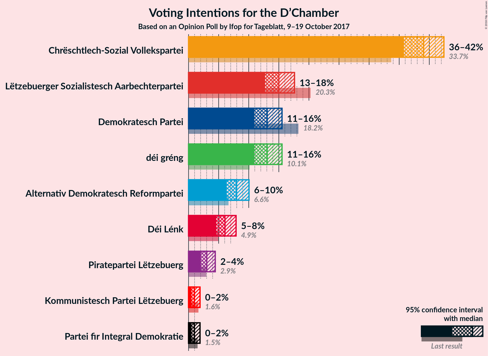
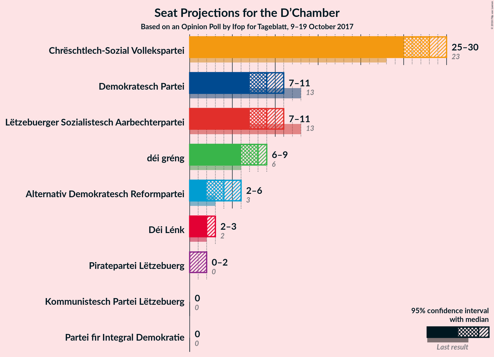
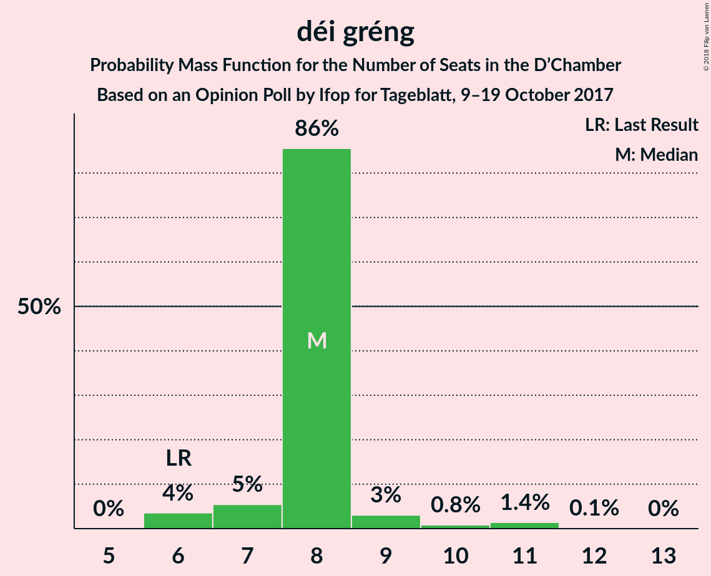
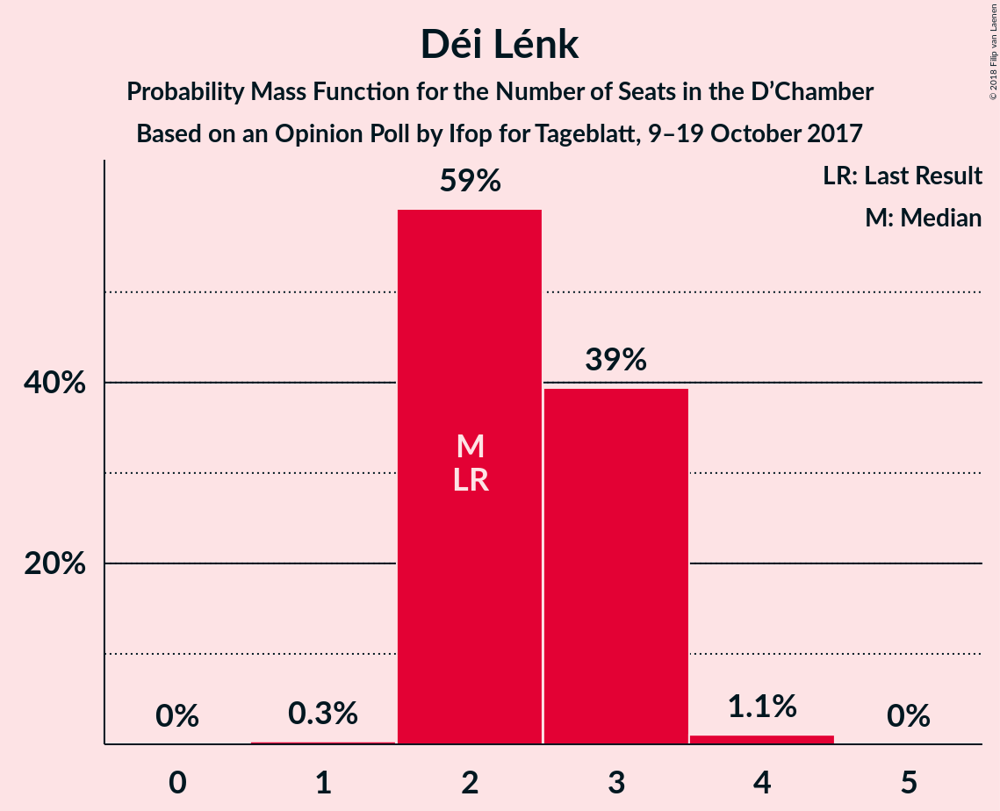
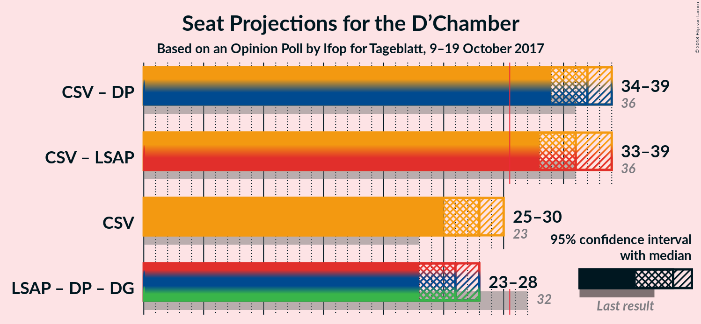

# Opinion Poll by Ifop for Tageblatt, 9–19 October 2017

<a href="#voting-intentions">Voting Intentions</a> | <a href="#seats">Seats</a> | <a href="#coalitions">Coalitions</a> | <a href="#technical-information">Technical Information</a>

## Voting Intentions

### Confidence Intervals

| Party | Last Result | Poll Result | 80% Confidence Interval | 90% Confidence Interval | 95% Confidence Interval | 99% Confidence Interval |
|:-----:|:-----------:|:-----------:|:-----------------------:|:-----------------------:|:-----------------------:|:-----------------------:|
| Chrëschtlech-Sozial Vollekspartei | 33.7% | 39.1% | 36.9–41.3% |36.3–41.9% |35.8–42.4% |34.8–43.5% |
| Lëtzebuerger Sozialistesch Aarbechterpartei | 20.3% | 15.0% | 13.5–16.7% |13.1–17.2% |12.7–17.6% |12.0–18.4% |
| Demokratesch Partei | 18.2% | 13.1% | 11.7–14.7% |11.3–15.1% |10.9–15.5% |10.3–16.3% |
| déi gréng | 10.1% | 13.1% | 11.7–14.7% |11.3–15.1% |10.9–15.5% |10.3–16.3% |
| Alternativ Demokratesch Reformpartei | 6.6% | 8.0% | 6.9–9.3% |6.6–9.7% |6.3–10.0% |5.8–10.7% |
| Déi Lénk | 4.9% | 6.0% | 5.1–7.3% |4.8–7.6% |4.6–7.9% |4.2–8.5% |
| Piratepartei Lëtzebuerg | 2.9% | 3.0% | 2.4–3.9% |2.2–4.2% |2.1–4.4% |1.8–4.9% |
| Partei fir Integral Demokratie | 1.5% | 1.0% | 0.7–1.6% |0.6–1.7% |0.5–1.9% |0.4–2.2% |
| Kommunistesch Partei Lëtzebuerg | 1.6% | 1.0% | 0.7–1.6% |0.6–1.7% |0.5–1.9% |0.4–2.2% |

*Note:* The poll result column reflects the actual value used in the calculations. Published results may vary slightly, and in addition be rounded to fewer digits.

## Seats

### Confidence Intervals

| Party | Last Result | Median | 80% Confidence Interval | 90% Confidence Interval | 95% Confidence Interval | 99% Confidence Interval |
|:-----:|:-----------:|:------:|:-----------------------:|:-----------------------:|:-----------------------:|:-----------------------:|
| <a href="#chrëschtlech-sozial-vollekspartei">Chrëschtlech-Sozial Vollekspartei</a> | 23 | 28 | 25–29 |25–31 |25–31 |25–31 |
| <a href="#lëtzebuerger-sozialistesch-aarbechterpartei">Lëtzebuerger Sozialistesch Aarbechterpartei</a> | 13 | 8 | 7–9 |7–10 |7–11 |7–12 |
| <a href="#demokratesch-partei">Demokratesch Partei</a> | 13 | 9 | 8–11 |7–11 |6–11 |5–11 |
| <a href="#déi-gréng">déi gréng</a> | 6 | 8 | 8 |7–9 |6–9 |6–11 |
| <a href="#alternativ-demokratesch-reformpartei">Alternativ Demokratesch Reformpartei</a> | 3 | 4 | 2–5 |2–6 |2–6 |2–7 |
| <a href="#déi-lénk">Déi Lénk</a> | 2 | 2 | 2–3 |2–3 |2–3 |1–4 |
| <a href="#piratepartei-lëtzebuerg">Piratepartei Lëtzebuerg</a> | 0 | 0 | 0–1 |0–1 |0–1 |0–2 |
| <a href="#partei-fir-integral-demokratie">Partei fir Integral Demokratie</a> | 0 | 0 | 0 |0 |0 |0 |
| <a href="#kommunistesch-partei-lëtzebuerg">Kommunistesch Partei Lëtzebuerg</a> | 0 | 0 | 0 |0 |0 |0 |

### Chrëschtlech-Sozial Vollekspartei

*For a full overview of the results for this party, see the [Chrëschtlech-Sozial Vollekspartei](party-chrëschtlech-sozialvollekspartei.html) page.*

| Number of Seats | Probability | Accumulated | Special Marks |
|:---------------:|:-----------:|:-----------:|:-------------:|
| 23 | 0.2% | 100% | Last Result |
| 24 | 0.3% | 99.8% |  |
| 25 | 17% | 99.5% |  |
| 26 | 7% | 83% |  |
| 27 | 20% | 76% |  |
| 28 | 11% | 56% | Median |
| 29 | 35% | 45% |  |
| 30 | 2% | 9% |  |
| 31 | 7% | 7% | Majority |
| 32 | 0.1% | 0.1% |  |
| 33 | 0% | 0% |  |

### Lëtzebuerger Sozialistesch Aarbechterpartei

*For a full overview of the results for this party, see the [Lëtzebuerger Sozialistesch Aarbechterpartei](party-lëtzebuergersozialisteschaarbechterpartei.html) page.*

| Number of Seats | Probability | Accumulated | Special Marks |
|:---------------:|:-----------:|:-----------:|:-------------:|
| 5 | 0.1% | 100% |  |
| 6 | 0.1% | 99.9% |  |
| 7 | 25% | 99.9% |  |
| 8 | 25% | 75% | Median |
| 9 | 40% | 50% |  |
| 10 | 5% | 10% |  |
| 11 | 4% | 5% |  |
| 12 | 0.8% | 0.8% |  |
| 13 | 0% | 0% | Last Result |

### Demokratesch Partei

*For a full overview of the results for this party, see the [Demokratesch Partei](party-demokrateschpartei.html) page.*

| Number of Seats | Probability | Accumulated | Special Marks |
|:---------------:|:-----------:|:-----------:|:-------------:|
| 5 | 1.1% | 100% |  |
| 6 | 3% | 98.9% |  |
| 7 | 5% | 96% |  |
| 8 | 7% | 91% |  |
| 9 | 58% | 84% | Median |
| 10 | 9% | 26% |  |
| 11 | 16% | 17% |  |
| 12 | 0.1% | 0.1% |  |
| 13 | 0% | 0% | Last Result |

### déi gréng

*For a full overview of the results for this party, see the [déi gréng](party-déigréng.html) page.*

| Number of Seats | Probability | Accumulated | Special Marks |
|:---------------:|:-----------:|:-----------:|:-------------:|
| 6 | 3% | 100% | Last Result |
| 7 | 5% | 97% |  |
| 8 | 83% | 92% | Median |
| 9 | 7% | 9% |  |
| 10 | 0.7% | 2% |  |
| 11 | 1.5% | 2% |  |
| 12 | 0.1% | 0.1% |  |
| 13 | 0% | 0% |  |

### Alternativ Demokratesch Reformpartei

*For a full overview of the results for this party, see the [Alternativ Demokratesch Reformpartei](party-alternativdemokrateschreformpartei.html) page.*

| Number of Seats | Probability | Accumulated | Special Marks |
|:---------------:|:-----------:|:-----------:|:-------------:|
| 1 | 0.2% | 100% |  |
| 2 | 11% | 99.8% |  |
| 3 | 29% | 89% | Last Result |
| 4 | 10% | 60% | Median |
| 5 | 43% | 50% |  |
| 6 | 4% | 6% |  |
| 7 | 2% | 2% |  |
| 8 | 0% | 0% |  |

### Déi Lénk

*For a full overview of the results for this party, see the [Déi Lénk](party-déilénk.html) page.*

| Number of Seats | Probability | Accumulated | Special Marks |
|:---------------:|:-----------:|:-----------:|:-------------:|
| 1 | 0.6% | 100% |  |
| 2 | 61% | 99.4% | Last Result, Median |
| 3 | 37% | 38% |  |
| 4 | 1.2% | 1.2% |  |
| 5 | 0% | 0% |  |

### Piratepartei Lëtzebuerg

*For a full overview of the results for this party, see the [Piratepartei Lëtzebuerg](party-pirateparteilëtzebuerg.html) page.*

| Number of Seats | Probability | Accumulated | Special Marks |
|:---------------:|:-----------:|:-----------:|:-------------:|
| 0 | 76% | 100% | Last Result, Median |
| 1 | 22% | 24% |  |
| 2 | 2% | 2% |  |
| 3 | 0% | 0% |  |

### Partei fir Integral Demokratie

*For a full overview of the results for this party, see the [Partei fir Integral Demokratie](party-parteifirintegraldemokratie.html) page.*

| Number of Seats | Probability | Accumulated | Special Marks |
|:---------------:|:-----------:|:-----------:|:-------------:|
| 0 | 100% | 100% | Last Result, Median |

### Kommunistesch Partei Lëtzebuerg

*For a full overview of the results for this party, see the [Kommunistesch Partei Lëtzebuerg](party-kommunisteschparteilëtzebuerg.html) page.*

| Number of Seats | Probability | Accumulated | Special Marks |
|:---------------:|:-----------:|:-----------:|:-------------:|
| 0 | 99.5% | 100% | Last Result, Median |
| 1 | 0.5% | 0.5% |  |
| 2 | 0% | 0% |  |

## Coalitions

### Confidence Intervals

| Coalition | Last Result | Median | Majority? | 80% Confidence Interval | 90% Confidence Interval | 95% Confidence Interval | 99% Confidence Interval |
|:---------:|:-----------:|:------:|:---------:|:-----------------------:|:-----------------------:|:-----------------------:|:-----------------------:|
| Chrëschtlech-Sozial Vollekspartei – Demokratesch Partei | 36 | 37 | 100% | 35–38 | 34–39 | 34–39 | 33–40 |
| Chrëschtlech-Sozial Vollekspartei – Lëtzebuerger Sozialistesch Aarbechterpartei | 36 | 36 | 100% | 34–39 | 34–39 | 33–39 | 32–40 |
| Chrëschtlech-Sozial Vollekspartei | 23 | 28 | 7% | 25–29 | 25–31 | 25–31 | 25–31 |
| Lëtzebuerger Sozialistesch Aarbechterpartei – Demokratesch Partei – déi gréng | 32 | 26 | 0% | 24–28 | 23–28 | 22–28 | 22–29 |

### Chrëschtlech-Sozial Vollekspartei – Demokratesch Partei

| Number of Seats | Probability | Accumulated | Special Marks |
|:---------------:|:-----------:|:-----------:|:-------------:|
| 32 | 0.1% | 100% |  |
| 33 | 0.4% | 99.9% |  |
| 34 | 7% | 99.4% |  |
| 35 | 9% | 93% |  |
| 36 | 26% | 83% | Last Result |
| 37 | 13% | 57% | Median |
| 38 | 34% | 44% |  |
| 39 | 9% | 10% |  |
| 40 | 0.9% | 1.0% |  |
| 41 | 0% | 0% |  |

### Chrëschtlech-Sozial Vollekspartei – Lëtzebuerger Sozialistesch Aarbechterpartei

| Number of Seats | Probability | Accumulated | Special Marks |
|:---------------:|:-----------:|:-----------:|:-------------:|
| 32 | 0.5% | 100% |  |
| 33 | 2% | 99.5% |  |
| 34 | 21% | 97% |  |
| 35 | 10% | 76% |  |
| 36 | 24% | 66% | Last Result, Median |
| 37 | 21% | 42% |  |
| 38 | 11% | 21% |  |
| 39 | 9% | 10% |  |
| 40 | 1.3% | 1.4% |  |
| 41 | 0.1% | 0.1% |  |
| 42 | 0% | 0% |  |

### Chrëschtlech-Sozial Vollekspartei

| Number of Seats | Probability | Accumulated | Special Marks |
|:---------------:|:-----------:|:-----------:|:-------------:|
| 23 | 0.2% | 100% | Last Result |
| 24 | 0.3% | 99.8% |  |
| 25 | 17% | 99.5% |  |
| 26 | 7% | 83% |  |
| 27 | 20% | 76% |  |
| 28 | 11% | 56% | Median |
| 29 | 35% | 45% |  |
| 30 | 2% | 9% |  |
| 31 | 7% | 7% | Majority |
| 32 | 0.1% | 0.1% |  |
| 33 | 0% | 0% |  |

### Lëtzebuerger Sozialistesch Aarbechterpartei – Demokratesch Partei – déi gréng

| Number of Seats | Probability | Accumulated | Special Marks |
|:---------------:|:-----------:|:-----------:|:-------------:|
| 21 | 0.4% | 100% |  |
| 22 | 3% | 99.5% |  |
| 23 | 3% | 96% |  |
| 24 | 22% | 94% |  |
| 25 | 20% | 72% | Median |
| 26 | 28% | 52% |  |
| 27 | 9% | 24% |  |
| 28 | 14% | 15% |  |
| 29 | 0.6% | 0.7% |  |
| 30 | 0% | 0.1% |  |
| 31 | 0% | 0% | Majority |
| 32 | 0% | 0% | Last Result |

## Technical Information

### Opinion Poll

+ **Polling firm:** Ifop
+ **Commissioner(s):** Tageblatt
+ **Fieldwork period:** 9–19 October 2017

### Calculations

+ **Sample size:** 827
+ **Simulations done:** 131,072
+ **Error estimate:** 5.29%

