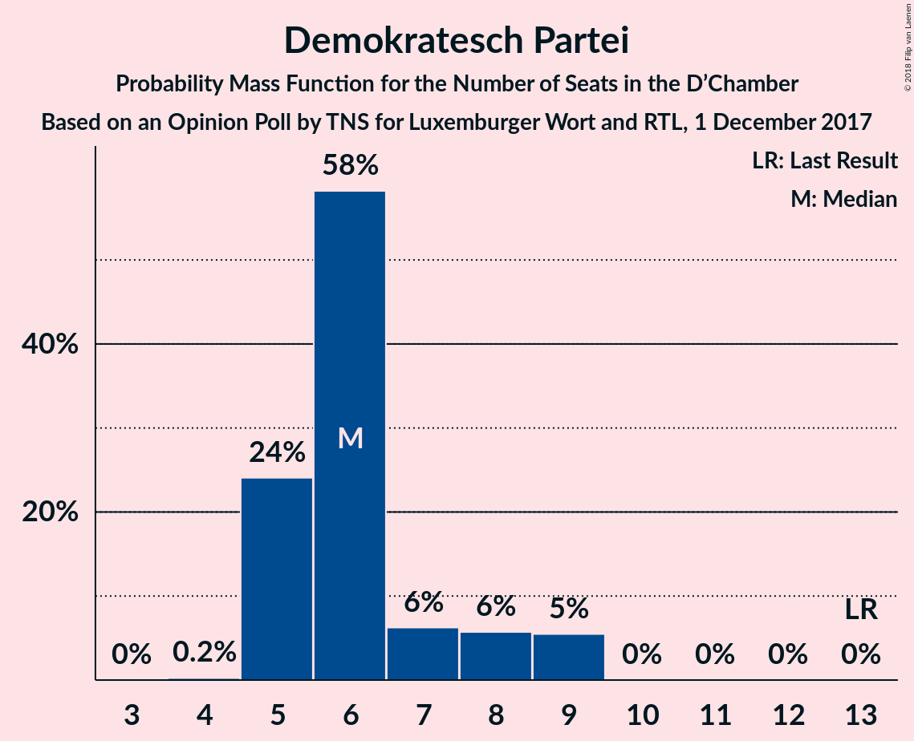
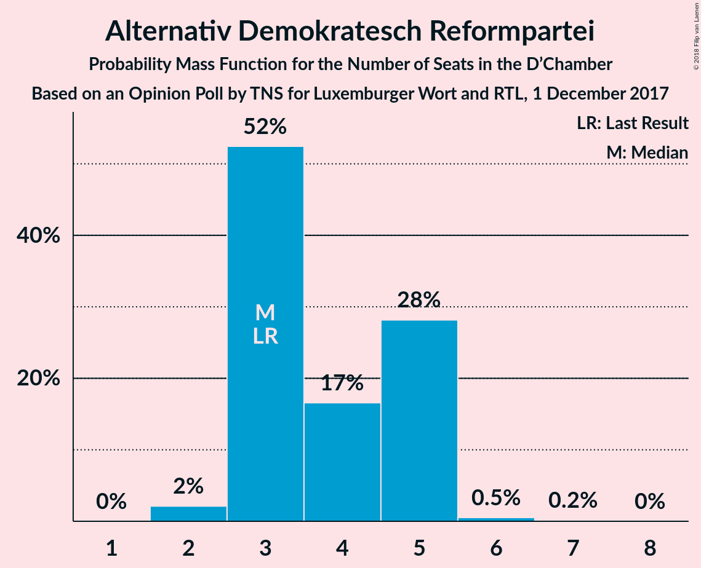
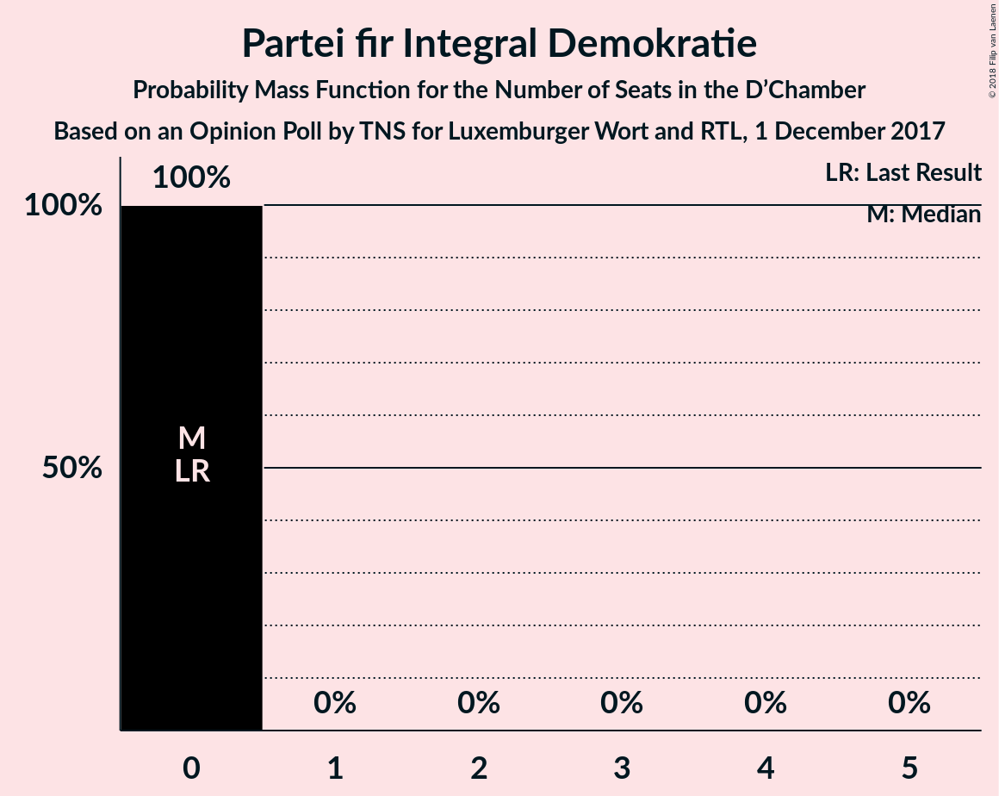
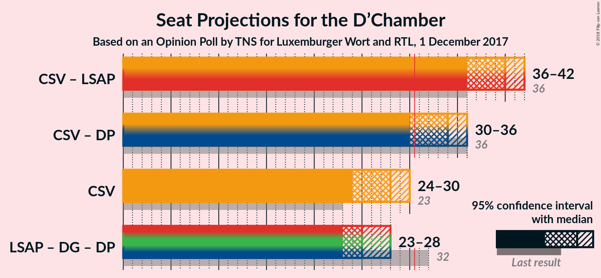

# Opinion Poll by TNS for Luxemburger Wort and RTL, 1 December 2017

<a href="#voting-intentions">Voting Intentions</a> | <a href="#seats">Seats</a> | <a href="#coalitions">Coalitions</a> | <a href="#technical-information">Technical Information</a>

## Voting Intentions

### Confidence Intervals

| Party | Last Result | Poll Result | 80% Confidence Interval | 90% Confidence Interval | 95% Confidence Interval | 99% Confidence Interval |
|:-----:|:-----------:|:-----------:|:-----------------------:|:-----------------------:|:-----------------------:|:-----------------------:|
| Chrëschtlech-Sozial Vollekspartei | 33.7% | 36.7% | 35.3–38.2% |34.8–38.6% |34.5–38.9% |33.8–39.7% |
| Lëtzebuerger Sozialistesch Aarbechterpartei | 20.3% | 20.6% | 19.4–21.9% |19.1–22.2% |18.8–22.5% |18.2–23.1% |
| déi gréng | 10.1% | 10.7% | 9.8–11.7% |9.5–11.9% |9.3–12.2% |8.9–12.7% |
| Demokratesch Partei | 18.2% | 10.0% | 9.2–11.0% |8.9–11.2% |8.7–11.5% |8.3–12.0% |
| Alternativ Demokratesch Reformpartei | 6.6% | 7.9% | 7.1–8.8% |6.9–9.0% |6.8–9.3% |6.4–9.7% |
| Déi Lénk | 4.9% | 7.7% | 6.9–8.6% |6.7–8.8% |6.5–9.0% |6.2–9.4% |
| Piratepartei Lëtzebuerg | 2.9% | 3.0% | 2.5–3.6% |2.4–3.7% |2.3–3.9% |2.1–4.2% |
| Kommunistesch Partei Lëtzebuerg | 1.6% | 2.2% | 1.8–2.7% |1.7–2.9% |1.6–3.0% |1.5–3.3% |
| Partei fir Integral Demokratie | 1.5% | 1.1% | 0.8–1.5% |0.8–1.6% |0.7–1.7% |0.6–1.9% |

*Note:* The poll result column reflects the actual value used in the calculations. Published results may vary slightly, and in addition be rounded to fewer digits.

## Seats

### Confidence Intervals

| Party | Last Result | Median | 80% Confidence Interval | 90% Confidence Interval | 95% Confidence Interval | 99% Confidence Interval |
|:-----:|:-----------:|:------:|:-----------------------:|:-----------------------:|:-----------------------:|:-----------------------:|
| <a href="#chrëschtlech-sozial-vollekspartei">Chrëschtlech-Sozial Vollekspartei</a> | 23 | 26 | 24–28 |24–28 |24–29 |24–30 |
| <a href="#lëtzebuerger-sozialistesch-aarbechterpartei">Lëtzebuerger Sozialistesch Aarbechterpartei</a> | 13 | 12 | 12–14 |12–14 |12–14 |11–14 |
| <a href="#déi-gréng">déi gréng</a> | 6 | 6 | 6–8 |6–8 |6–8 |6–8 |
| <a href="#demokratesch-partei">Demokratesch Partei</a> | 13 | 6 | 5–8 |5–8 |5–9 |5–9 |
| <a href="#alternativ-demokratesch-reformpartei">Alternativ Demokratesch Reformpartei</a> | 3 | 5 | 3–5 |3–5 |3–5 |2–6 |
| <a href="#déi-lénk">Déi Lénk</a> | 2 | 3 | 3–4 |2–4 |2–4 |2–4 |
| <a href="#piratepartei-lëtzebuerg">Piratepartei Lëtzebuerg</a> | 0 | 0 | 0 |0–1 |0–1 |0–2 |
| <a href="#kommunistesch-partei-lëtzebuerg">Kommunistesch Partei Lëtzebuerg</a> | 0 | 0 | 0–1 |0–1 |0–1 |0–1 |
| <a href="#partei-fir-integral-demokratie">Partei fir Integral Demokratie</a> | 0 | 0 | 0 |0 |0 |0 |

### Chrëschtlech-Sozial Vollekspartei

*For a full overview of the results for this party, see the [Chrëschtlech-Sozial Vollekspartei](party-chrëschtlech-sozialvollekspartei.html) page.*

| Number of Seats | Probability | Accumulated | Special Marks |
|:---------------:|:-----------:|:-----------:|:-------------:|
| 23 | 0% | 100% | Last Result |
| 24 | 12% | 100% |  |
| 25 | 12% | 88% |  |
| 26 | 28% | 77% | Median |
| 27 | 18% | 49% |  |
| 28 | 27% | 30% |  |
| 29 | 1.3% | 4% |  |
| 30 | 2% | 2% |  |
| 31 | 0% | 0% | Majority |

### Lëtzebuerger Sozialistesch Aarbechterpartei

*For a full overview of the results for this party, see the [Lëtzebuerger Sozialistesch Aarbechterpartei](party-lëtzebuergersozialisteschaarbechterpartei.html) page.*

| Number of Seats | Probability | Accumulated | Special Marks |
|:---------------:|:-----------:|:-----------:|:-------------:|
| 10 | 0.2% | 100% |  |
| 11 | 2% | 99.8% |  |
| 12 | 55% | 98% | Median |
| 13 | 25% | 44% | Last Result |
| 14 | 18% | 18% |  |
| 15 | 0.3% | 0.3% |  |
| 16 | 0% | 0% |  |

### déi gréng

*For a full overview of the results for this party, see the [déi gréng](party-déigréng.html) page.*

| Number of Seats | Probability | Accumulated | Special Marks |
|:---------------:|:-----------:|:-----------:|:-------------:|
| 5 | 0.2% | 100% |  |
| 6 | 51% | 99.8% | Last Result, Median |
| 7 | 21% | 49% |  |
| 8 | 28% | 28% |  |
| 9 | 0% | 0% |  |

### Demokratesch Partei

*For a full overview of the results for this party, see the [Demokratesch Partei](party-demokrateschpartei.html) page.*

| Number of Seats | Probability | Accumulated | Special Marks |
|:---------------:|:-----------:|:-----------:|:-------------:|
| 4 | 0.1% | 100% |  |
| 5 | 30% | 99.9% |  |
| 6 | 52% | 70% | Median |
| 7 | 8% | 18% |  |
| 8 | 6% | 10% |  |
| 9 | 4% | 4% |  |
| 10 | 0% | 0% |  |
| 11 | 0% | 0% |  |
| 12 | 0% | 0% |  |
| 13 | 0% | 0% | Last Result |

### Alternativ Demokratesch Reformpartei

*For a full overview of the results for this party, see the [Alternativ Demokratesch Reformpartei](party-alternativdemokrateschreformpartei.html) page.*

| Number of Seats | Probability | Accumulated | Special Marks |
|:---------------:|:-----------:|:-----------:|:-------------:|
| 2 | 1.4% | 100% |  |
| 3 | 29% | 98.6% | Last Result |
| 4 | 10% | 69% |  |
| 5 | 58% | 59% | Median |
| 6 | 0.9% | 1.1% |  |
| 7 | 0.3% | 0.3% |  |
| 8 | 0% | 0% |  |

### Déi Lénk

*For a full overview of the results for this party, see the [Déi Lénk](party-déilénk.html) page.*

| Number of Seats | Probability | Accumulated | Special Marks |
|:---------------:|:-----------:|:-----------:|:-------------:|
| 2 | 10% | 100% | Last Result |
| 3 | 57% | 90% | Median |
| 4 | 33% | 33% |  |
| 5 | 0.2% | 0.2% |  |
| 6 | 0% | 0% |  |

### Piratepartei Lëtzebuerg

*For a full overview of the results for this party, see the [Piratepartei Lëtzebuerg](party-pirateparteilëtzebuerg.html) page.*

| Number of Seats | Probability | Accumulated | Special Marks |
|:---------------:|:-----------:|:-----------:|:-------------:|
| 0 | 91% | 100% | Last Result, Median |
| 1 | 8% | 9% |  |
| 2 | 2% | 2% |  |
| 3 | 0% | 0% |  |

### Kommunistesch Partei Lëtzebuerg

*For a full overview of the results for this party, see the [Kommunistesch Partei Lëtzebuerg](party-kommunisteschparteilëtzebuerg.html) page.*

| Number of Seats | Probability | Accumulated | Special Marks |
|:---------------:|:-----------:|:-----------:|:-------------:|
| 0 | 52% | 100% | Last Result, Median |
| 1 | 48% | 48% |  |
| 2 | 0% | 0% |  |

### Partei fir Integral Demokratie

*For a full overview of the results for this party, see the [Partei fir Integral Demokratie](party-parteifirintegraldemokratie.html) page.*

| Number of Seats | Probability | Accumulated | Special Marks |
|:---------------:|:-----------:|:-----------:|:-------------:|
| 0 | 100% | 100% | Last Result, Median |

## Coalitions

### Confidence Intervals

| Coalition | Last Result | Median | Majority? | 80% Confidence Interval | 90% Confidence Interval | 95% Confidence Interval | 99% Confidence Interval |
|:---------:|:-----------:|:------:|:---------:|:-----------------------:|:-----------------------:|:-----------------------:|:-----------------------:|
| Chrëschtlech-Sozial Vollekspartei – Lëtzebuerger Sozialistesch Aarbechterpartei | 36 | 39 | 100% | 37–40 | 36–41 | 36–42 | 36–42 |
| Chrëschtlech-Sozial Vollekspartei – Demokratesch Partei | 36 | 32 | 92% | 31–34 | 30–35 | 30–36 | 30–36 |
| Chrëschtlech-Sozial Vollekspartei | 23 | 26 | 0% | 24–28 | 24–28 | 24–29 | 24–30 |
| Lëtzebuerger Sozialistesch Aarbechterpartei – déi gréng – Demokratesch Partei | 32 | 25 | 0% | 24–27 | 24–28 | 23–28 | 23–28 |

### Chrëschtlech-Sozial Vollekspartei – Lëtzebuerger Sozialistesch Aarbechterpartei

| Number of Seats | Probability | Accumulated | Special Marks |
|:---------------:|:-----------:|:-----------:|:-------------:|
| 36 | 8% | 100% | Last Result |
| 37 | 7% | 92% |  |
| 38 | 12% | 84% | Median |
| 39 | 26% | 73% |  |
| 40 | 37% | 47% |  |
| 41 | 6% | 10% |  |
| 42 | 4% | 4% |  |
| 43 | 0.3% | 0.3% |  |
| 44 | 0% | 0% |  |

### Chrëschtlech-Sozial Vollekspartei – Demokratesch Partei

| Number of Seats | Probability | Accumulated | Special Marks |
|:---------------:|:-----------:|:-----------:|:-------------:|
| 30 | 8% | 100% |  |
| 31 | 16% | 92% | Majority |
| 32 | 32% | 76% | Median |
| 33 | 14% | 44% |  |
| 34 | 23% | 31% |  |
| 35 | 5% | 8% |  |
| 36 | 3% | 3% | Last Result |
| 37 | 0% | 0% |  |

### Chrëschtlech-Sozial Vollekspartei

| Number of Seats | Probability | Accumulated | Special Marks |
|:---------------:|:-----------:|:-----------:|:-------------:|
| 23 | 0% | 100% | Last Result |
| 24 | 12% | 100% |  |
| 25 | 12% | 88% |  |
| 26 | 28% | 77% | Median |
| 27 | 18% | 49% |  |
| 28 | 27% | 30% |  |
| 29 | 1.3% | 4% |  |
| 30 | 2% | 2% |  |
| 31 | 0% | 0% | Majority |

### Lëtzebuerger Sozialistesch Aarbechterpartei – déi gréng – Demokratesch Partei

| Number of Seats | Probability | Accumulated | Special Marks |
|:---------------:|:-----------:|:-----------:|:-------------:|
| 22 | 0.2% | 100% |  |
| 23 | 3% | 99.8% |  |
| 24 | 20% | 96% | Median |
| 25 | 32% | 76% |  |
| 26 | 29% | 44% |  |
| 27 | 8% | 15% |  |
| 28 | 6% | 7% |  |
| 29 | 0.3% | 0.3% |  |
| 30 | 0% | 0% |  |
| 31 | 0% | 0% | Majority |
| 32 | 0% | 0% | Last Result |

## Technical Information

### Opinion Poll

+ **Polling firm:** TNS
+ **Commissioner(s):** Luxemburger Wort and RTL
+ **Fieldwork period:** 1 December 2017

### Calculations

+ **Sample size:** 1807
+ **Simulations done:** 262,144
+ **Error estimate:** 1.27%

