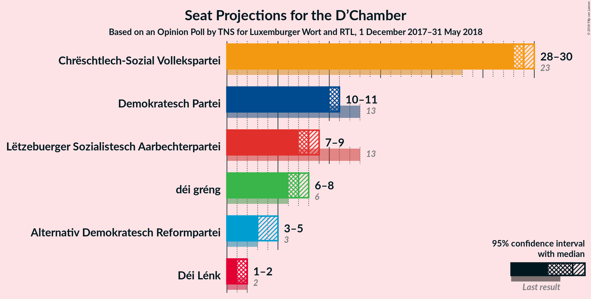
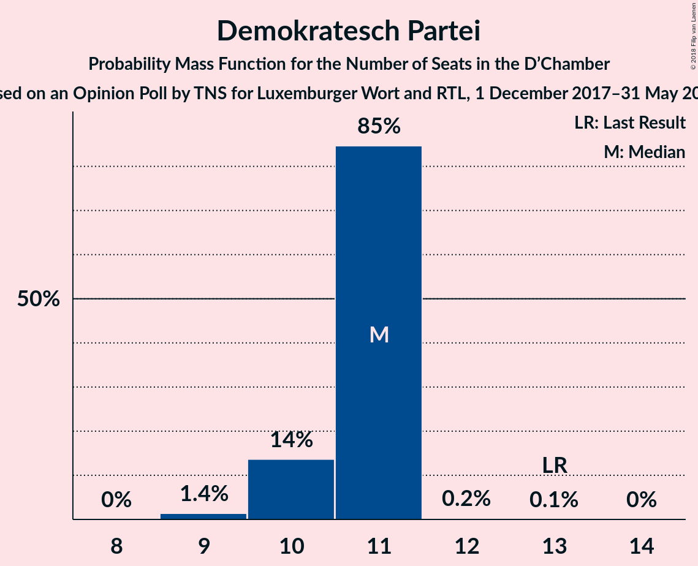
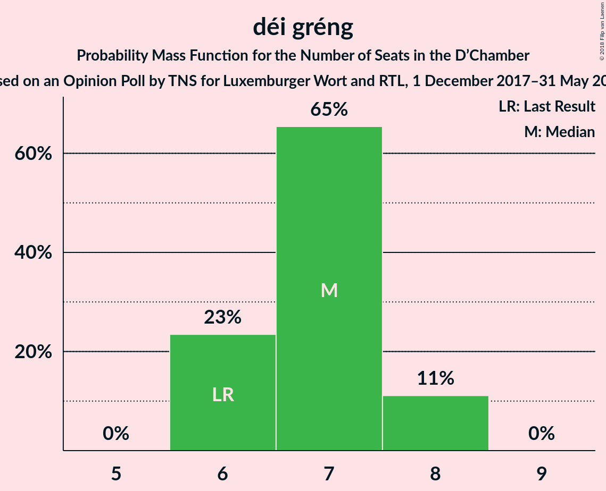
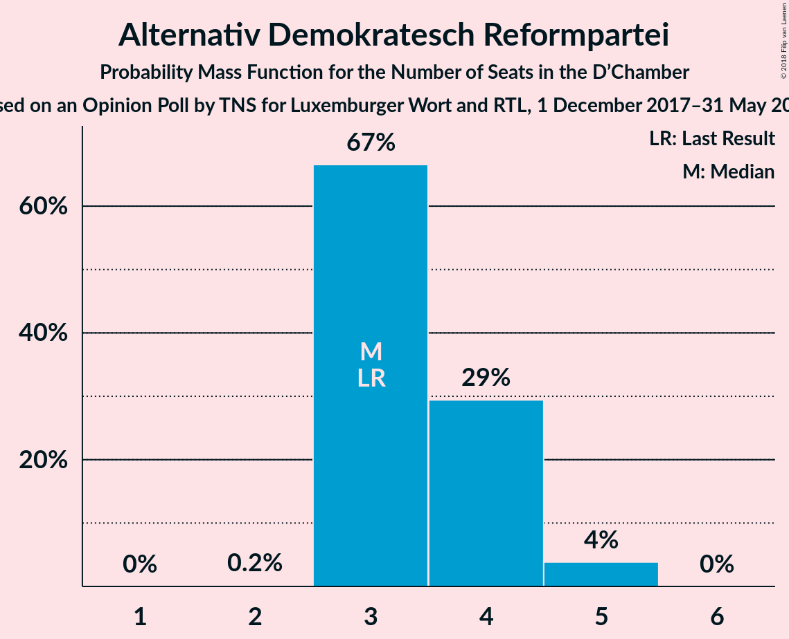
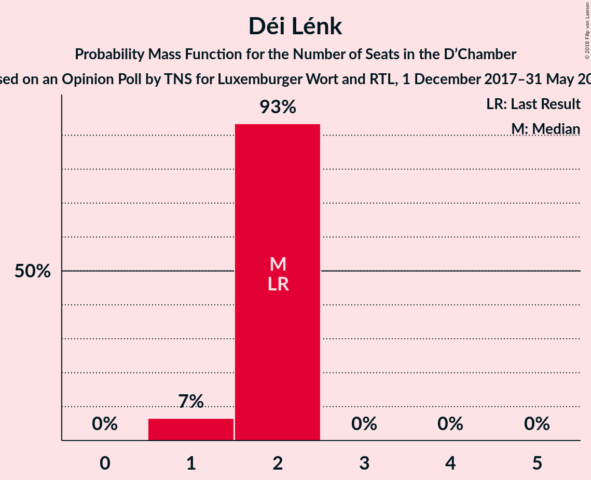
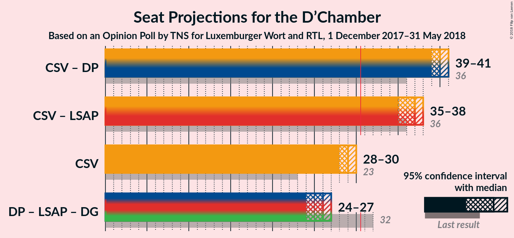

# Opinion Poll by TNS for Luxemburger Wort and RTL, 1 December 2017–31 May 2018

<a href="#voting-intentions">Voting Intentions</a> | <a href="#seats">Seats</a> | <a href="#coalitions">Coalitions</a> | <a href="#technical-information">Technical Information</a>

## Voting Intentions

### Confidence Intervals

| Party | Last Result | Poll Result | 80% Confidence Interval | 90% Confidence Interval | 95% Confidence Interval | 99% Confidence Interval |
|:-----:|:-----------:|:-----------:|:-----------------------:|:-----------------------:|:-----------------------:|:-----------------------:|
| Chrëschtlech-Sozial Vollekspartei | 33.7% | 43.0% | 41.9–44.1% |41.6–44.4% |41.4–44.6% |40.9–45.2% |
| Demokratesch Partei | 18.2% | 17.0% | 16.2–17.8% |16.0–18.1% |15.8–18.3% |15.4–18.7% |
| Lëtzebuerger Sozialistesch Aarbechterpartei | 20.3% | 15.0% | 14.2–15.8% |14.0–16.0% |13.9–16.2% |13.5–16.6% |
| déi gréng | 10.1% | 12.0% | 11.3–12.7% |11.1–13.0% |11.0–13.1% |10.7–13.5% |
| Alternativ Demokratesch Reformpartei | 6.6% | 8.0% | 7.4–8.6% |7.3–8.8% |7.1–9.0% |6.9–9.3% |
| Déi Lénk | 4.9% | 5.0% | 4.6–5.5% |4.4–5.7% |4.3–5.8% |4.1–6.0% |

*Note:* The poll result column reflects the actual value used in the calculations. Published results may vary slightly, and in addition be rounded to fewer digits.

## Seats

### Confidence Intervals

| Party | Last Result | Median | 80% Confidence Interval | 90% Confidence Interval | 95% Confidence Interval | 99% Confidence Interval |
|:-----:|:-----------:|:------:|:-----------------------:|:-----------------------:|:-----------------------:|:-----------------------:|
| <a href="#chrëschtlech-sozial-vollekspartei">Chrëschtlech-Sozial Vollekspartei</a> | 23 | 29 | 29–30 |28–30 |28–30 |27–31 |
| <a href="#demokratesch-partei">Demokratesch Partei</a> | 13 | 11 | 10–11 |10–11 |10–11 |9–11 |
| <a href="#lëtzebuerger-sozialistesch-aarbechterpartei">Lëtzebuerger Sozialistesch Aarbechterpartei</a> | 13 | 8 | 7–9 |7–9 |7–9 |7–9 |
| <a href="#déi-gréng">déi gréng</a> | 6 | 7 | 6–7 |6–8 |6–8 |6–8 |
| <a href="#alternativ-demokratesch-reformpartei">Alternativ Demokratesch Reformpartei</a> | 3 | 3 | 3–4 |3–4 |3–5 |3–5 |
| <a href="#déi-lénk">Déi Lénk</a> | 2 | 2 | 2 |2 |1–2 |1–2 |

### Chrëschtlech-Sozial Vollekspartei

*For a full overview of the results for this party, see the [Chrëschtlech-Sozial Vollekspartei](party-chrëschtlech-sozialvollekspartei.html) page.*

| Number of Seats | Probability | Accumulated | Special Marks |
|:---------------:|:-----------:|:-----------:|:-------------:|
| 23 | 0% | 100% | Last Result |
| 24 | 0% | 100% |  |
| 25 | 0% | 100% |  |
| 26 | 0% | 100% |  |
| 27 | 0.7% | 100% |  |
| 28 | 8% | 99.3% |  |
| 29 | 70% | 92% | Median |
| 30 | 20% | 21% |  |
| 31 | 1.0% | 1.0% | Majority |
| 32 | 0% | 0% |  |

### Demokratesch Partei

*For a full overview of the results for this party, see the [Demokratesch Partei](party-demokrateschpartei.html) page.*

| Number of Seats | Probability | Accumulated | Special Marks |
|:---------------:|:-----------:|:-----------:|:-------------:|
| 9 | 2% | 100% |  |
| 10 | 14% | 98% |  |
| 11 | 84% | 84% | Median |
| 12 | 0.3% | 0.3% |  |
| 13 | 0.1% | 0.1% | Last Result |
| 14 | 0% | 0% |  |

### Lëtzebuerger Sozialistesch Aarbechterpartei

*For a full overview of the results for this party, see the [Lëtzebuerger Sozialistesch Aarbechterpartei](party-lëtzebuergersozialisteschaarbechterpartei.html) page.*

| Number of Seats | Probability | Accumulated | Special Marks |
|:---------------:|:-----------:|:-----------:|:-------------:|
| 7 | 28% | 100% |  |
| 8 | 58% | 72% | Median |
| 9 | 14% | 14% |  |
| 10 | 0% | 0% |  |
| 11 | 0% | 0% |  |
| 12 | 0% | 0% |  |
| 13 | 0% | 0% | Last Result |

### déi gréng

*For a full overview of the results for this party, see the [déi gréng](party-déigréng.html) page.*

| Number of Seats | Probability | Accumulated | Special Marks |
|:---------------:|:-----------:|:-----------:|:-------------:|
| 6 | 24% | 100% | Last Result |
| 7 | 67% | 76% | Median |
| 8 | 10% | 10% |  |
| 9 | 0% | 0% |  |

### Alternativ Demokratesch Reformpartei

*For a full overview of the results for this party, see the [Alternativ Demokratesch Reformpartei](party-alternativdemokrateschreformpartei.html) page.*

| Number of Seats | Probability | Accumulated | Special Marks |
|:---------------:|:-----------:|:-----------:|:-------------:|
| 2 | 0.2% | 100% |  |
| 3 | 67% | 99.8% | Last Result, Median |
| 4 | 28% | 32% |  |
| 5 | 4% | 4% |  |
| 6 | 0% | 0% |  |

### Déi Lénk

*For a full overview of the results for this party, see the [Déi Lénk](party-déilénk.html) page.*

| Number of Seats | Probability | Accumulated | Special Marks |
|:---------------:|:-----------:|:-----------:|:-------------:|
| 1 | 5% | 100% |  |
| 2 | 95% | 95% | Last Result, Median |
| 3 | 0% | 0% |  |

## Coalitions

### Confidence Intervals

| Coalition | Last Result | Median | Majority? | 80% Confidence Interval | 90% Confidence Interval | 95% Confidence Interval | 99% Confidence Interval |
|:---------:|:-----------:|:------:|:---------:|:-----------------------:|:-----------------------:|:-----------------------:|:-----------------------:|
| Chrëschtlech-Sozial Vollekspartei – Demokratesch Partei | 36 | 40 | 100% | 39–41 | 39–41 | 39–41 | 38–42 |
| Chrëschtlech-Sozial Vollekspartei – Lëtzebuerger Sozialistesch Aarbechterpartei | 36 | 37 | 100% | 36–38 | 36–38 | 35–38 | 35–39 |
| Chrëschtlech-Sozial Vollekspartei | 23 | 29 | 1.0% | 29–30 | 28–30 | 28–30 | 27–31 |
| Demokratesch Partei – Lëtzebuerger Sozialistesch Aarbechterpartei – déi gréng | 32 | 26 | 0% | 24–26 | 24–26 | 24–27 | 24–27 |

### Chrëschtlech-Sozial Vollekspartei – Demokratesch Partei

| Number of Seats | Probability | Accumulated | Special Marks |
|:---------------:|:-----------:|:-----------:|:-------------:|
| 36 | 0% | 100% | Last Result |
| 37 | 0.1% | 100% |  |
| 38 | 1.5% | 99.9% |  |
| 39 | 16% | 98% |  |
| 40 | 69% | 83% | Median |
| 41 | 14% | 14% |  |
| 42 | 0.6% | 0.6% |  |
| 43 | 0% | 0% |  |

### Chrëschtlech-Sozial Vollekspartei – Lëtzebuerger Sozialistesch Aarbechterpartei

| Number of Seats | Probability | Accumulated | Special Marks |
|:---------------:|:-----------:|:-----------:|:-------------:|
| 34 | 0.3% | 100% |  |
| 35 | 3% | 99.7% |  |
| 36 | 17% | 97% | Last Result |
| 37 | 58% | 80% | Median |
| 38 | 21% | 22% |  |
| 39 | 1.0% | 1.1% |  |
| 40 | 0.1% | 0.1% |  |
| 41 | 0% | 0% |  |

### Chrëschtlech-Sozial Vollekspartei

| Number of Seats | Probability | Accumulated | Special Marks |
|:---------------:|:-----------:|:-----------:|:-------------:|
| 23 | 0% | 100% | Last Result |
| 24 | 0% | 100% |  |
| 25 | 0% | 100% |  |
| 26 | 0% | 100% |  |
| 27 | 0.7% | 100% |  |
| 28 | 8% | 99.3% |  |
| 29 | 70% | 92% | Median |
| 30 | 20% | 21% |  |
| 31 | 1.0% | 1.0% | Majority |
| 32 | 0% | 0% |  |

### Demokratesch Partei – Lëtzebuerger Sozialistesch Aarbechterpartei – déi gréng

| Number of Seats | Probability | Accumulated | Special Marks |
|:---------------:|:-----------:|:-----------:|:-------------:|
| 23 | 0.1% | 100% |  |
| 24 | 13% | 99.9% |  |
| 25 | 23% | 87% |  |
| 26 | 59% | 64% | Median |
| 27 | 4% | 5% |  |
| 28 | 0.2% | 0.2% |  |
| 29 | 0% | 0% |  |
| 30 | 0% | 0% |  |
| 31 | 0% | 0% | Majority |
| 32 | 0% | 0% | Last Result |

## Technical Information

### Opinion Poll

+ **Polling firm:** TNS
+ **Commissioner(s):** Luxemburger Wort and RTL
+ **Fieldwork period:** 1 December 2017–31 May 2018

### Calculations

+ **Sample size:** 3521
+ **Simulations done:** 524,288
+ **Error estimate:** 0.56%

