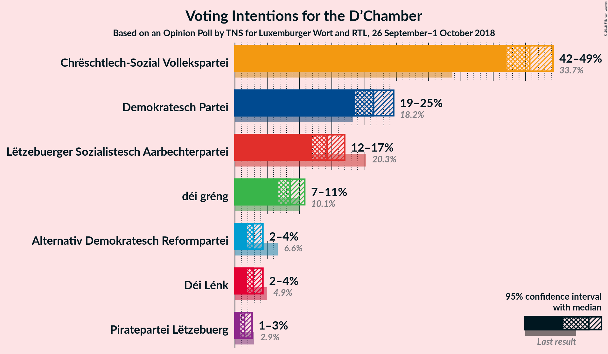
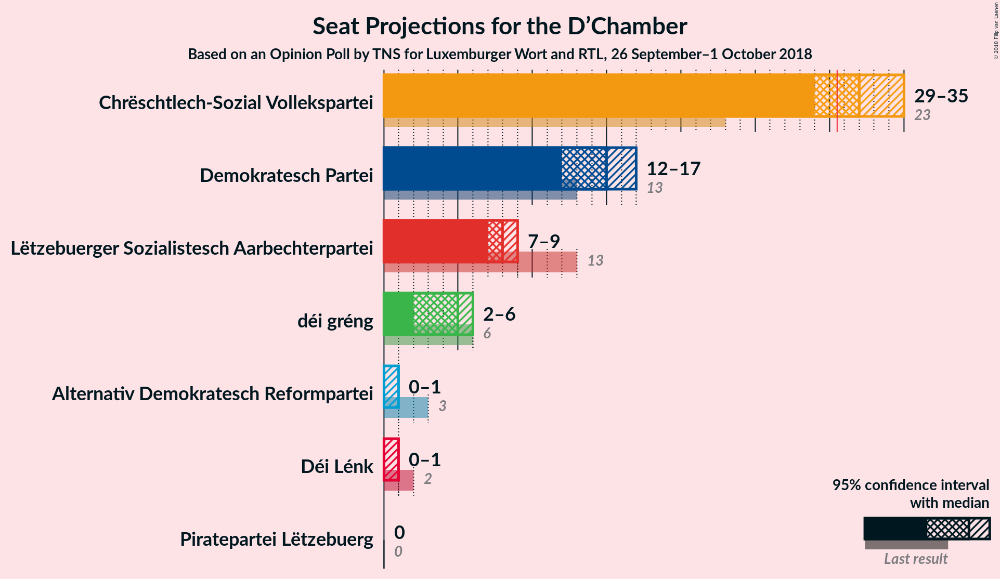
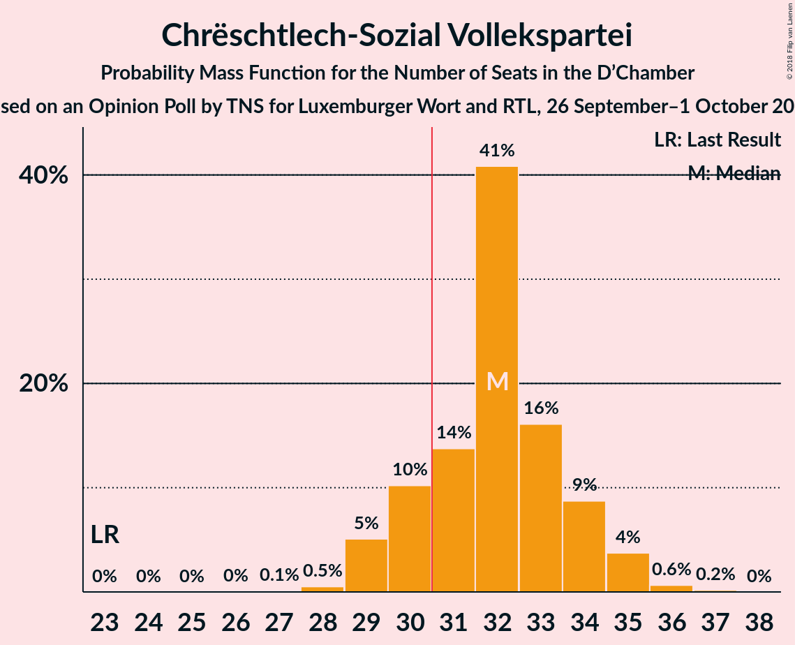
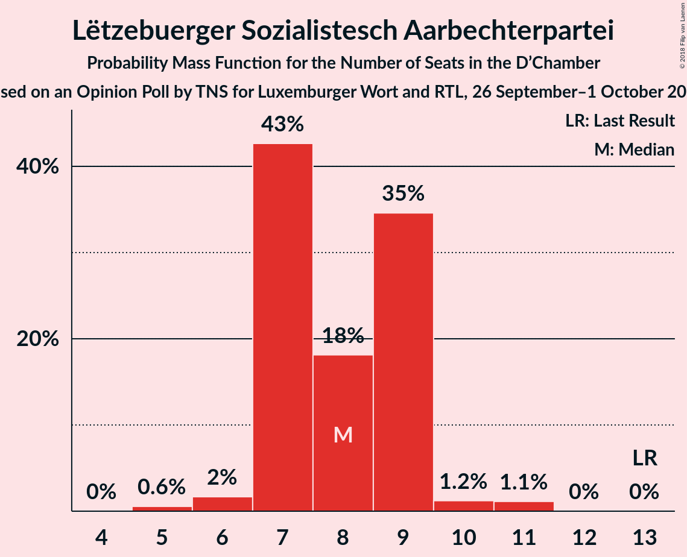
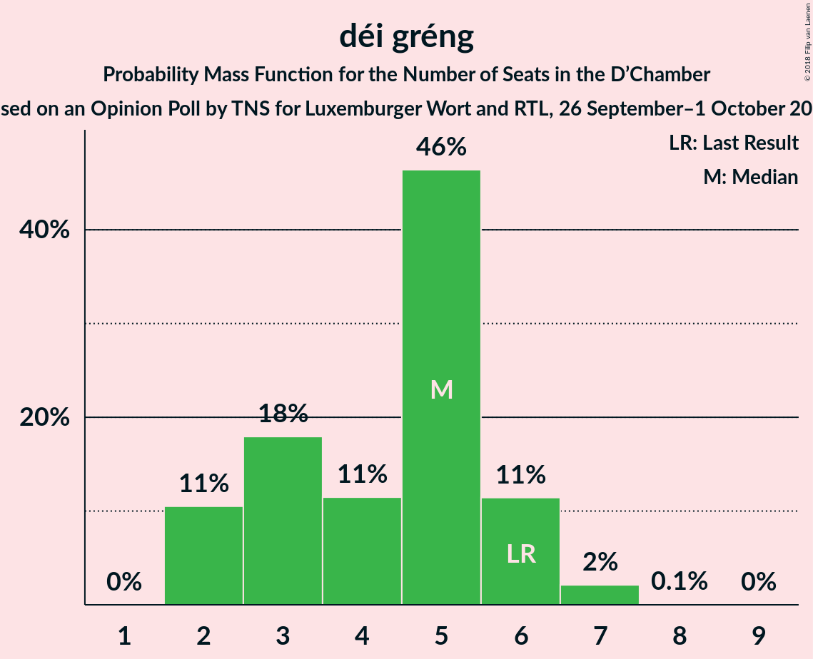
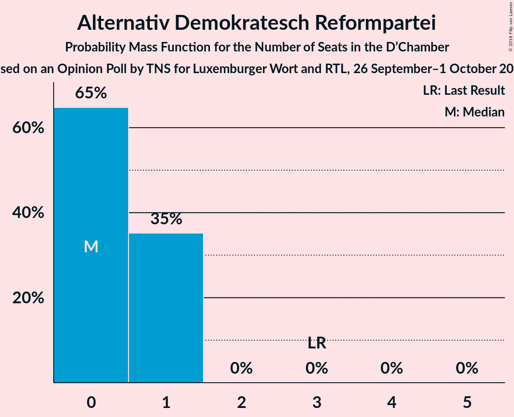
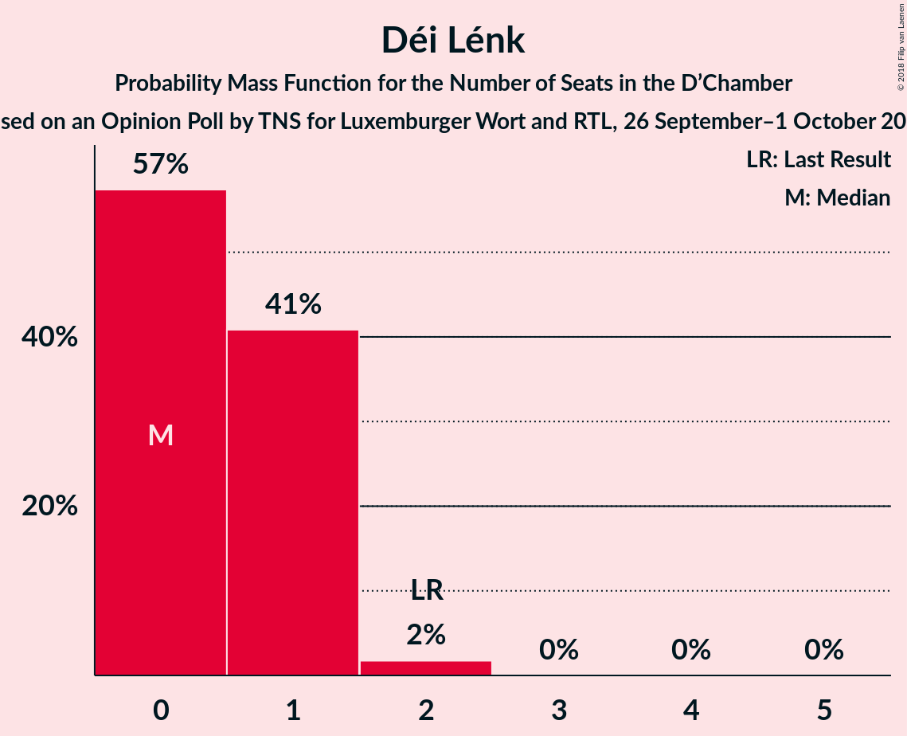
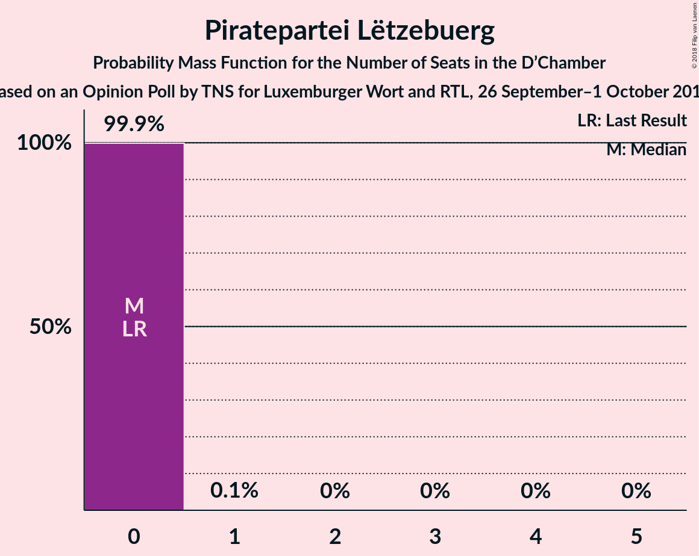
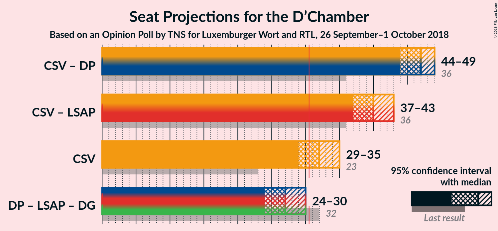

# Opinion Poll by TNS for Luxemburger Wort and RTL, 26 September–1 October 2018

<a href="#voting-intentions">Voting Intentions</a> | <a href="#seats">Seats</a> | <a href="#coalitions">Coalitions</a> | <a href="#technical-information">Technical Information</a>

## Voting Intentions

### Confidence Intervals

| Party | Last Result | Poll Result | 80% Confidence Interval | 90% Confidence Interval | 95% Confidence Interval | 99% Confidence Interval |
|:-----:|:-----------:|:-----------:|:-----------------------:|:-----------------------:|:-----------------------:|:-----------------------:|
| Chrëschtlech-Sozial Vollekspartei | 33.7% | 45.7% | 43.3–48.0% |42.6–48.7% |42.1–49.3% |41.0–50.4% |
| Demokratesch Partei | 18.2% | 21.5% | 19.6–23.5% |19.1–24.1% |18.6–24.6% |17.8–25.6% |
| Lëtzebuerger Sozialistesch Aarbechterpartei | 20.3% | 14.3% | 12.7–16.0% |12.3–16.6% |11.9–17.0% |11.2–17.9% |
| déi gréng | 10.1% | 8.6% | 7.4–10.0% |7.0–10.4% |6.7–10.8% |6.2–11.6% |
| Alternativ Demokratesch Reformpartei | 6.6% | 2.9% | 2.2–3.8% |2.0–4.1% |1.9–4.3% |1.6–4.8% |
| Déi Lénk | 4.9% | 2.9% | 2.2–3.8% |2.0–4.1% |1.9–4.3% |1.6–4.8% |
| Piratepartei Lëtzebuerg | 2.9% | 1.5% | 1.1–2.3% |0.9–2.5% |0.8–2.7% |0.7–3.1% |

*Note:* The poll result column reflects the actual value used in the calculations. Published results may vary slightly, and in addition be rounded to fewer digits.

## Seats

### Confidence Intervals

| Party | Last Result | Median | 80% Confidence Interval | 90% Confidence Interval | 95% Confidence Interval | 99% Confidence Interval |
|:-----:|:-----------:|:------:|:-----------------------:|:-----------------------:|:-----------------------:|:-----------------------:|
| <a href="#chrëschtlech-sozial-vollekspartei">Chrëschtlech-Sozial Vollekspartei</a> | 23 | 32 | 30–34 |29–34 |29–35 |28–36 |
| <a href="#demokratesch-partei">Demokratesch Partei</a> | 13 | 15 | 13–16 |12–16 |12–17 |11–18 |
| <a href="#lëtzebuerger-sozialistesch-aarbechterpartei">Lëtzebuerger Sozialistesch Aarbechterpartei</a> | 13 | 8 | 7–9 |7–9 |7–9 |5–11 |
| <a href="#déi-gréng">déi gréng</a> | 6 | 5 | 2–6 |2–6 |2–6 |2–7 |
| <a href="#alternativ-demokratesch-reformpartei">Alternativ Demokratesch Reformpartei</a> | 3 | 0 | 0–1 |0–1 |0–1 |0–1 |
| <a href="#déi-lénk">Déi Lénk</a> | 2 | 0 | 0–1 |0–1 |0–1 |0–2 |
| <a href="#piratepartei-lëtzebuerg">Piratepartei Lëtzebuerg</a> | 0 | 0 | 0 |0 |0 |0 |

### Chrëschtlech-Sozial Vollekspartei

*For a full overview of the results for this party, see the [Chrëschtlech-Sozial Vollekspartei](party-chrëschtlech-sozialvollekspartei.html) page.*

| Number of Seats | Probability | Accumulated | Special Marks |
|:---------------:|:-----------:|:-----------:|:-------------:|
| 23 | 0% | 100% | Last Result |
| 24 | 0% | 100% |  |
| 25 | 0% | 100% |  |
| 26 | 0% | 100% |  |
| 27 | 0.1% | 100% |  |
| 28 | 0.5% | 99.8% |  |
| 29 | 5% | 99.3% |  |
| 30 | 10% | 94% |  |
| 31 | 14% | 84% | Majority |
| 32 | 41% | 70% | Median |
| 33 | 16% | 29% |  |
| 34 | 9% | 13% |  |
| 35 | 4% | 5% |  |
| 36 | 0.6% | 0.8% |  |
| 37 | 0.2% | 0.2% |  |
| 38 | 0% | 0% |  |

### Demokratesch Partei

*For a full overview of the results for this party, see the [Demokratesch Partei](party-demokrateschpartei.html) page.*

| Number of Seats | Probability | Accumulated | Special Marks |
|:---------------:|:-----------:|:-----------:|:-------------:|
| 11 | 1.5% | 100% |  |
| 12 | 4% | 98.5% |  |
| 13 | 12% | 94% | Last Result |
| 14 | 11% | 82% |  |
| 15 | 26% | 71% | Median |
| 16 | 42% | 45% |  |
| 17 | 2% | 3% |  |
| 18 | 0.7% | 0.8% |  |
| 19 | 0.1% | 0.1% |  |
| 20 | 0% | 0% |  |

### Lëtzebuerger Sozialistesch Aarbechterpartei

*For a full overview of the results for this party, see the [Lëtzebuerger Sozialistesch Aarbechterpartei](party-lëtzebuergersozialisteschaarbechterpartei.html) page.*

| Number of Seats | Probability | Accumulated | Special Marks |
|:---------------:|:-----------:|:-----------:|:-------------:|
| 5 | 0.6% | 100% |  |
| 6 | 2% | 99.4% |  |
| 7 | 43% | 98% |  |
| 8 | 18% | 55% | Median |
| 9 | 35% | 37% |  |
| 10 | 1.2% | 2% |  |
| 11 | 1.1% | 1.1% |  |
| 12 | 0% | 0% |  |
| 13 | 0% | 0% | Last Result |

### déi gréng

*For a full overview of the results for this party, see the [déi gréng](party-déigréng.html) page.*

| Number of Seats | Probability | Accumulated | Special Marks |
|:---------------:|:-----------:|:-----------:|:-------------:|
| 2 | 11% | 100% |  |
| 3 | 18% | 89% |  |
| 4 | 11% | 72% |  |
| 5 | 46% | 60% | Median |
| 6 | 11% | 14% | Last Result |
| 7 | 2% | 2% |  |
| 8 | 0.1% | 0.1% |  |
| 9 | 0% | 0% |  |

### Alternativ Demokratesch Reformpartei

*For a full overview of the results for this party, see the [Alternativ Demokratesch Reformpartei](party-alternativdemokrateschreformpartei.html) page.*

| Number of Seats | Probability | Accumulated | Special Marks |
|:---------------:|:-----------:|:-----------:|:-------------:|
| 0 | 65% | 100% | Median |
| 1 | 35% | 35% |  |
| 2 | 0% | 0% |  |
| 3 | 0% | 0% | Last Result |

### Déi Lénk

*For a full overview of the results for this party, see the [Déi Lénk](party-déilénk.html) page.*

| Number of Seats | Probability | Accumulated | Special Marks |
|:---------------:|:-----------:|:-----------:|:-------------:|
| 0 | 57% | 100% | Median |
| 1 | 41% | 43% |  |
| 2 | 2% | 2% | Last Result |
| 3 | 0% | 0% |  |

### Piratepartei Lëtzebuerg

*For a full overview of the results for this party, see the [Piratepartei Lëtzebuerg](party-pirateparteilëtzebuerg.html) page.*

| Number of Seats | Probability | Accumulated | Special Marks |
|:---------------:|:-----------:|:-----------:|:-------------:|
| 0 | 99.9% | 100% | Last Result, Median |
| 1 | 0.1% | 0.1% |  |
| 2 | 0% | 0% |  |

## Coalitions

### Confidence Intervals

| Coalition | Last Result | Median | Majority? | 80% Confidence Interval | 90% Confidence Interval | 95% Confidence Interval | 99% Confidence Interval |
|:---------:|:-----------:|:------:|:---------:|:-----------------------:|:-----------------------:|:-----------------------:|:-----------------------:|
| Chrëschtlech-Sozial Vollekspartei – Demokratesch Partei | 36 | 47 | 100% | 45–49 | 44–49 | 44–49 | 43–50 |
| Chrëschtlech-Sozial Vollekspartei – Lëtzebuerger Sozialistesch Aarbechterpartei | 36 | 40 | 100% | 38–42 | 37–42 | 37–43 | 36–44 |
| Chrëschtlech-Sozial Vollekspartei | 23 | 32 | 84% | 30–34 | 29–34 | 29–35 | 28–36 |
| Demokratesch Partei – Lëtzebuerger Sozialistesch Aarbechterpartei – déi gréng | 32 | 27 | 0.9% | 25–29 | 25–30 | 24–30 | 23–31 |

### Chrëschtlech-Sozial Vollekspartei – Demokratesch Partei

| Number of Seats | Probability | Accumulated | Special Marks |
|:---------------:|:-----------:|:-----------:|:-------------:|
| 36 | 0% | 100% | Last Result |
| 37 | 0% | 100% |  |
| 38 | 0% | 100% |  |
| 39 | 0% | 100% |  |
| 40 | 0% | 100% |  |
| 41 | 0% | 100% |  |
| 42 | 0.2% | 100% |  |
| 43 | 1.4% | 99.8% |  |
| 44 | 5% | 98% |  |
| 45 | 12% | 94% |  |
| 46 | 18% | 82% |  |
| 47 | 26% | 64% | Median |
| 48 | 28% | 39% |  |
| 49 | 9% | 11% |  |
| 50 | 2% | 2% |  |
| 51 | 0.2% | 0.3% |  |
| 52 | 0% | 0% |  |

### Chrëschtlech-Sozial Vollekspartei – Lëtzebuerger Sozialistesch Aarbechterpartei

| Number of Seats | Probability | Accumulated | Special Marks |
|:---------------:|:-----------:|:-----------:|:-------------:|
| 35 | 0.1% | 100% |  |
| 36 | 1.4% | 99.8% | Last Result |
| 37 | 6% | 98% |  |
| 38 | 11% | 93% |  |
| 39 | 21% | 82% |  |
| 40 | 24% | 61% | Median |
| 41 | 26% | 37% |  |
| 42 | 6% | 11% |  |
| 43 | 3% | 4% |  |
| 44 | 2% | 2% |  |
| 45 | 0.2% | 0.2% |  |
| 46 | 0.1% | 0.1% |  |
| 47 | 0% | 0% |  |

### Chrëschtlech-Sozial Vollekspartei

| Number of Seats | Probability | Accumulated | Special Marks |
|:---------------:|:-----------:|:-----------:|:-------------:|
| 23 | 0% | 100% | Last Result |
| 24 | 0% | 100% |  |
| 25 | 0% | 100% |  |
| 26 | 0% | 100% |  |
| 27 | 0.1% | 100% |  |
| 28 | 0.5% | 99.8% |  |
| 29 | 5% | 99.3% |  |
| 30 | 10% | 94% |  |
| 31 | 14% | 84% | Majority |
| 32 | 41% | 70% | Median |
| 33 | 16% | 29% |  |
| 34 | 9% | 13% |  |
| 35 | 4% | 5% |  |
| 36 | 0.6% | 0.8% |  |
| 37 | 0.2% | 0.2% |  |
| 38 | 0% | 0% |  |

### Demokratesch Partei – Lëtzebuerger Sozialistesch Aarbechterpartei – déi gréng

| Number of Seats | Probability | Accumulated | Special Marks |
|:---------------:|:-----------:|:-----------:|:-------------:|
| 22 | 0.1% | 100% |  |
| 23 | 0.8% | 99.9% |  |
| 24 | 3% | 99.1% |  |
| 25 | 9% | 96% |  |
| 26 | 10% | 87% |  |
| 27 | 35% | 77% |  |
| 28 | 25% | 42% | Median |
| 29 | 11% | 17% |  |
| 30 | 5% | 6% |  |
| 31 | 0.7% | 0.9% | Majority |
| 32 | 0.2% | 0.2% | Last Result |
| 33 | 0% | 0% |  |

## Technical Information

### Opinion Poll

+ **Polling firm:** TNS
+ **Commissioner(s):** Luxemburger Wort and RTL
+ **Fieldwork period:** 26 September–1 October 2018

### Calculations

+ **Sample size:** 736
+ **Simulations done:** 1,048,576
+ **Error estimate:** 1.40%

