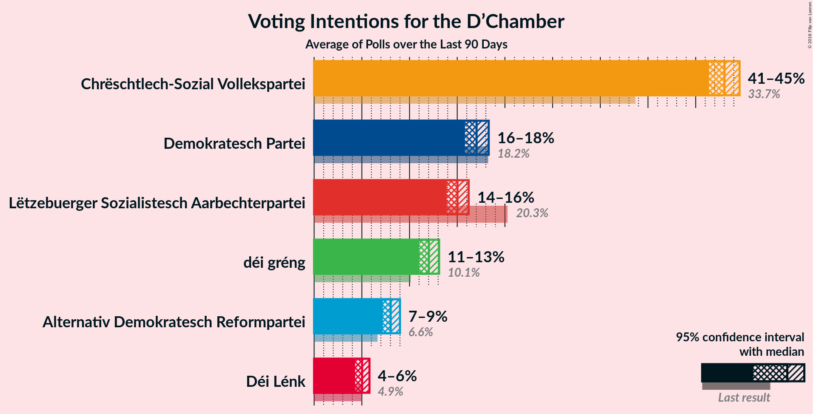
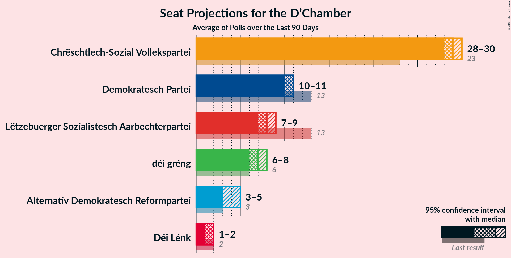
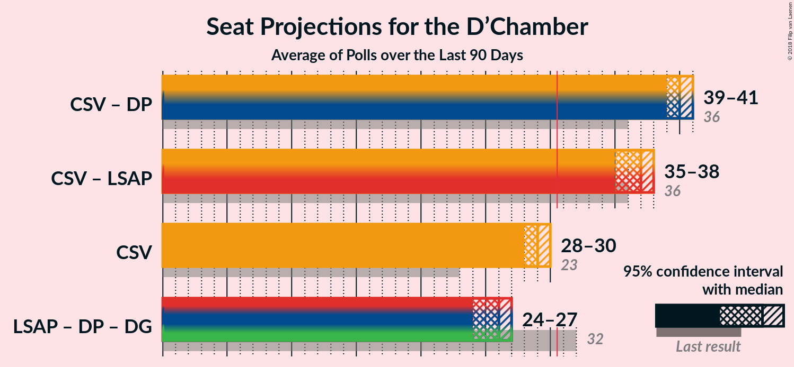

# Overview

The table below lists the most recent polls (less than 90 days old) registered and analyzed so far.

| Period     | Polling firm/Commissioner(s) | CSV | LSAP | DP | DG | ADR | DL | PPLU | KPL | PID |
|:----------:|:----------------------------:|:--:|:--:|:--:|:--:|:--:|:--:|:--:|:--:|:--:|
| 20 October 2013 | General Election | 33.7%   23 | 20.3%   13 | 18.2%   13 | 10.1%   6 | 6.6%   3 | 4.9%   2 | 2.9%   0 | 1.6%   0 | 1.5%   0 |
| N/A | [Poll Average](average.html) | 41–45%   28–30 | 14–16%   7–9 | 16–18%   10–11 | 11–13%   6–8 | 7–9%   3–5 | 4–6%   1–2 | N/A   N/A | N/A   N/A | N/A   N/A |
| [1 December 2017–31 May 2018](2018-05-31-TNS.html) | TNS   Luxemburger Wort and RTL | 41–45%   28–30 | 14–16%   7–9 | 16–18%   10–11 | 11–13%   6–8 | 7–9%   3–5 | 4–6%   1–2 | N/A   N/A | N/A   N/A | N/A   N/A |
| 20 October 2013 | General Election | 33.7%   23 | 20.3%   13 | 18.2%   13 | 10.1%   6 | 6.6%   3 | 4.9%   2 | 2.9%   0 | 1.6%   0 | 1.5%   0 |

Only polls for which at least the sample size has been published are included in the table above.

**Legend:**
+ **Top half of each row:** Voting intentions (95% confidence interval)
+ **Bottom half of each row:** Seat projections for the D’Chamber (95% confidence interval)
+ **CSV:** Chrëschtlech-Sozial Vollekspartei
+ **LSAP:** Lëtzebuerger Sozialistesch Aarbechterpartei
+ **DP:** Demokratesch Partei
+ **DG:** déi gréng
+ **ADR:** Alternativ Demokratesch Reformpartei
+ **DL:** Déi Lénk
+ **PPLU:** Piratepartei Lëtzebuerg
+ **KPL:** Kommunistesch Partei Lëtzebuerg
+ **PID:** Partei fir Integral Demokratie
+ **N/A (single party):** Party not included the published results
+ **N/A (entire row):** Calculation for this opinion poll not started yet

