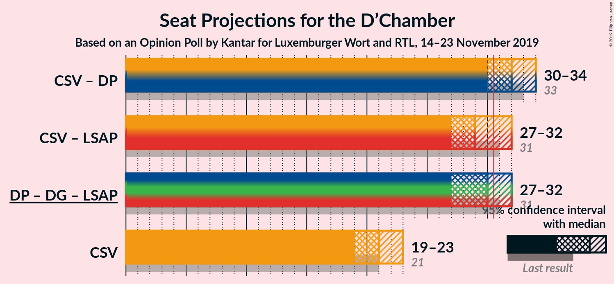

# Opinion Poll by Kantar for Luxemburger Wort and RTL, 14–23 November 2019

<a href="#voting-intentions">Voting Intentions</a> | <a href="#seats">Seats</a> | <a href="#coalitions">Coalitions</a> | <a href="#technical-information">Technical Information</a>

## Voting Intentions

### Confidence Intervals

| Party | Last Result | Poll Result | 80% Confidence Interval | 90% Confidence Interval | 95% Confidence Interval | 99% Confidence Interval |
|:-----:|:-----------:|:-----------:|:-----------------------:|:-----------------------:|:-----------------------:|:-----------------------:|
| Chrëschtlech-Sozial Vollekspartei | 28.3% | 30.1% | 28.8–31.5% |28.4–31.9% |28.1–32.3% |27.4–32.9% |
| Demokratesch Partei | 16.9% | 16.6% | 15.5–17.8% |15.3–18.1% |15.0–18.4% |14.5–19.0% |
| déi gréng | 15.1% | 15.9% | 14.9–17.1% |14.6–17.4% |14.3–17.7% |13.8–18.2% |
| Lëtzebuerger Sozialistesch Aarbechterpartei | 17.6% | 15.0% | 14.0–16.1% |13.7–16.4% |13.4–16.7% |13.0–17.3% |
| Alternativ Demokratesch Reformpartei | 8.3% | 10.4% | 9.5–11.4% |9.3–11.6% |9.1–11.9% |8.7–12.3% |
| déi Lénk | 5.5% | 5.5% | 4.9–6.2% |4.7–6.4% |4.5–6.6% |4.3–7.0% |
| Piratepartei Lëtzebuerg | 6.4% | 5.4% | 4.8–6.1% |4.6–6.3% |4.4–6.5% |4.2–6.9% |

*Note:* The poll result column reflects the actual value used in the calculations. Published results may vary slightly, and in addition be rounded to fewer digits.

## Seats

### Confidence Intervals

| Party | Last Result | Median | 80% Confidence Interval | 90% Confidence Interval | 95% Confidence Interval | 99% Confidence Interval |
|:-----:|:-----------:|:------:|:-----------------------:|:-----------------------:|:-----------------------:|:-----------------------:|
| <a href="#chrëschtlech-sozial-vollekspartei">Chrëschtlech-Sozial Vollekspartei</a> | 21 | 21 | 20–22 |19–22 |19–23 |18–23 |
| <a href="#demokratesch-partei">Demokratesch Partei</a> | 12 | 11 | 10–13 |10–13 |10–13 |9–13 |
| <a href="#déi-gréng">déi gréng</a> | 9 | 10 | 8–10 |8–10 |8–10 |8–11 |
| <a href="#lëtzebuerger-sozialistesch-aarbechterpartei">Lëtzebuerger Sozialistesch Aarbechterpartei</a> | 10 | 9 | 8–9 |7–9 |7–9 |7–9 |
| <a href="#alternativ-demokratesch-reformpartei">Alternativ Demokratesch Reformpartei</a> | 4 | 6 | 5–7 |5–7 |5–7 |4–7 |
| <a href="#déi-lénk">déi Lénk</a> | 2 | 2 | 2 |2 |2 |2–3 |
| <a href="#piratepartei-lëtzebuerg">Piratepartei Lëtzebuerg</a> | 2 | 2 | 1–2 |1–2 |1–2 |1–3 |

### Chrëschtlech-Sozial Vollekspartei

*For a full overview of the results for this party, see the [Chrëschtlech-Sozial Vollekspartei](party-chrëschtlech-sozialvollekspartei.html) page.*

| Number of Seats | Probability | Accumulated | Special Marks |
|:---------------:|:-----------:|:-----------:|:-------------:|
| 17 | 0.1% | 100% |  |
| 18 | 0.7% | 99.9% |  |
| 19 | 7% | 99.2% |  |
| 20 | 29% | 92% |  |
| 21 | 42% | 63% | Last Result, Median |
| 22 | 17% | 21% |  |
| 23 | 4% | 4% |  |
| 24 | 0.1% | 0.1% |  |
| 25 | 0% | 0% |  |

### Demokratesch Partei

*For a full overview of the results for this party, see the [Demokratesch Partei](party-demokrateschpartei.html) page.*

| Number of Seats | Probability | Accumulated | Special Marks |
|:---------------:|:-----------:|:-----------:|:-------------:|
| 8 | 0.4% | 100% |  |
| 9 | 2% | 99.6% |  |
| 10 | 17% | 98% |  |
| 11 | 37% | 81% | Median |
| 12 | 30% | 44% | Last Result |
| 13 | 14% | 14% |  |
| 14 | 0% | 0% |  |

### déi gréng

*For a full overview of the results for this party, see the [déi gréng](party-déigréng.html) page.*

| Number of Seats | Probability | Accumulated | Special Marks |
|:---------------:|:-----------:|:-----------:|:-------------:|
| 8 | 12% | 100% |  |
| 9 | 22% | 88% | Last Result |
| 10 | 65% | 66% | Median |
| 11 | 0.5% | 0.7% |  |
| 12 | 0.1% | 0.1% |  |
| 13 | 0% | 0% |  |

### Lëtzebuerger Sozialistesch Aarbechterpartei

*For a full overview of the results for this party, see the [Lëtzebuerger Sozialistesch Aarbechterpartei](party-lëtzebuergersozialisteschaarbechterpartei.html) page.*

| Number of Seats | Probability | Accumulated | Special Marks |
|:---------------:|:-----------:|:-----------:|:-------------:|
| 6 | 0.2% | 100% |  |
| 7 | 8% | 99.8% |  |
| 8 | 22% | 92% |  |
| 9 | 70% | 70% | Median |
| 10 | 0.3% | 0.4% | Last Result |
| 11 | 0.1% | 0.1% |  |
| 12 | 0% | 0% |  |

### Alternativ Demokratesch Reformpartei

*For a full overview of the results for this party, see the [Alternativ Demokratesch Reformpartei](party-alternativdemokrateschreformpartei.html) page.*

| Number of Seats | Probability | Accumulated | Special Marks |
|:---------------:|:-----------:|:-----------:|:-------------:|
| 4 | 0.8% | 100% | Last Result |
| 5 | 32% | 99.2% |  |
| 6 | 30% | 67% | Median |
| 7 | 37% | 37% |  |
| 8 | 0% | 0% |  |

### déi Lénk

*For a full overview of the results for this party, see the [déi Lénk](party-déilénk.html) page.*

| Number of Seats | Probability | Accumulated | Special Marks |
|:---------------:|:-----------:|:-----------:|:-------------:|
| 1 | 0.1% | 100% |  |
| 2 | 98.7% | 99.9% | Last Result, Median |
| 3 | 1.2% | 1.2% |  |
| 4 | 0% | 0% |  |

### Piratepartei Lëtzebuerg

*For a full overview of the results for this party, see the [Piratepartei Lëtzebuerg](party-pirateparteilëtzebuerg.html) page.*

| Number of Seats | Probability | Accumulated | Special Marks |
|:---------------:|:-----------:|:-----------:|:-------------:|
| 1 | 39% | 100% |  |
| 2 | 60% | 61% | Last Result, Median |
| 3 | 0.8% | 1.3% |  |
| 4 | 0.5% | 0.5% |  |
| 5 | 0% | 0% |  |

## Coalitions

### Confidence Intervals

| Coalition | Last Result | Median | Majority? | 80% Confidence Interval | 90% Confidence Interval | 95% Confidence Interval | 99% Confidence Interval |
|:---------:|:-----------:|:------:|:---------:|:-----------------------:|:-----------------------:|:-----------------------:|:-----------------------:|
| Chrëschtlech-Sozial Vollekspartei – Demokratesch Partei | 33 | 32 | 96% | 31–33 | 31–34 | 30–34 | 30–35 |
| Chrëschtlech-Sozial Vollekspartei – Lëtzebuerger Sozialistesch Aarbechterpartei | 31 | 29 | 12% | 28–31 | 28–31 | 27–32 | 27–32 |
| Demokratesch Partei – déi gréng – Lëtzebuerger Sozialistesch Aarbechterpartei | 31 | 30 | 21% | 28–31 | 28–31 | 27–32 | 27–32 |
| Chrëschtlech-Sozial Vollekspartei | 21 | 21 | 0% | 20–22 | 19–22 | 19–23 | 18–23 |

### Chrëschtlech-Sozial Vollekspartei – Demokratesch Partei

| Number of Seats | Probability | Accumulated | Special Marks |
|:---------------:|:-----------:|:-----------:|:-------------:|
| 29 | 0.4% | 100% |  |
| 30 | 4% | 99.6% |  |
| 31 | 13% | 96% | Majority |
| 32 | 56% | 83% | Median |
| 33 | 17% | 26% | Last Result |
| 34 | 7% | 9% |  |
| 35 | 2% | 2% |  |
| 36 | 0.1% | 0.1% |  |
| 37 | 0% | 0% |  |

### Chrëschtlech-Sozial Vollekspartei – Lëtzebuerger Sozialistesch Aarbechterpartei

| Number of Seats | Probability | Accumulated | Special Marks |
|:---------------:|:-----------:|:-----------:|:-------------:|
| 26 | 0.1% | 100% |  |
| 27 | 4% | 99.8% |  |
| 28 | 15% | 96% |  |
| 29 | 32% | 81% |  |
| 30 | 38% | 50% | Median |
| 31 | 9% | 12% | Last Result, Majority |
| 32 | 3% | 3% |  |
| 33 | 0.1% | 0.1% |  |
| 34 | 0% | 0% |  |

### Demokratesch Partei – déi gréng – Lëtzebuerger Sozialistesch Aarbechterpartei

| Number of Seats | Probability | Accumulated | Special Marks |
|:---------------:|:-----------:|:-----------:|:-------------:|
| 26 | 0.2% | 100% |  |
| 27 | 3% | 99.8% |  |
| 28 | 16% | 97% |  |
| 29 | 31% | 81% |  |
| 30 | 29% | 50% | Median |
| 31 | 18% | 21% | Last Result, Majority |
| 32 | 4% | 4% |  |
| 33 | 0% | 0% |  |

### Chrëschtlech-Sozial Vollekspartei

| Number of Seats | Probability | Accumulated | Special Marks |
|:---------------:|:-----------:|:-----------:|:-------------:|
| 17 | 0.1% | 100% |  |
| 18 | 0.7% | 99.9% |  |
| 19 | 7% | 99.2% |  |
| 20 | 29% | 92% |  |
| 21 | 42% | 63% | Last Result, Median |
| 22 | 17% | 21% |  |
| 23 | 4% | 4% |  |
| 24 | 0.1% | 0.1% |  |
| 25 | 0% | 0% |  |

## Technical Information

### Opinion Poll

+ **Polling firm:** Kantar
+ **Commissioner(s):** Luxemburger Wort and RTL
+ **Fieldwork period:** 14–23 November 2019

### Calculations

+ **Sample size:** 1859
+ **Simulations done:** 1,048,576
+ **Error estimate:** 0.82%

