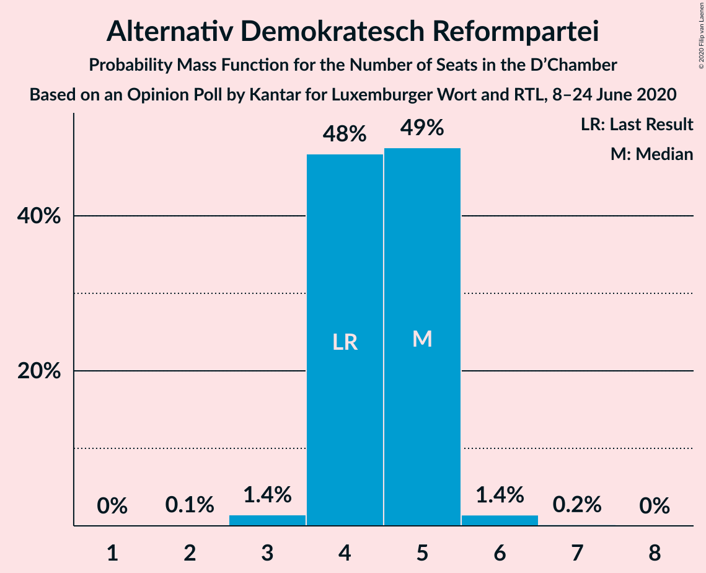
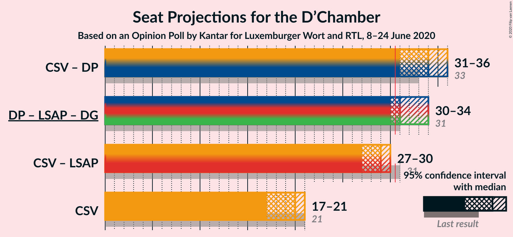
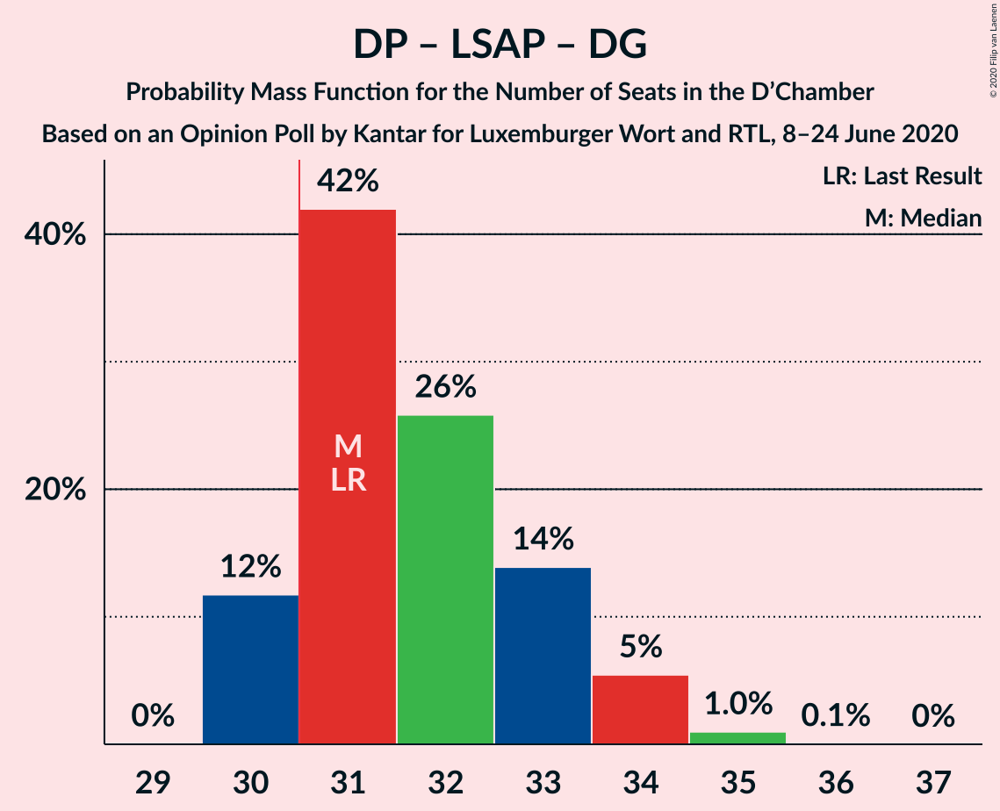
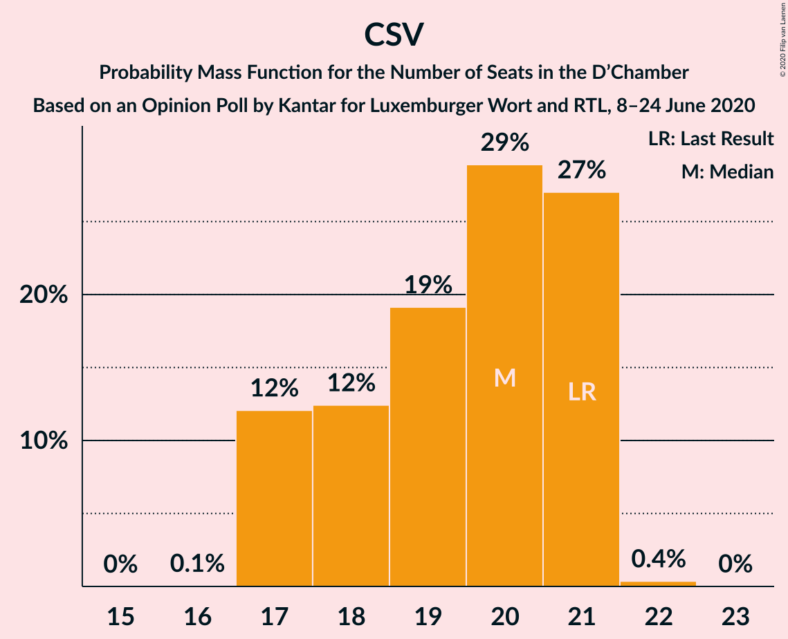

# Opinion Poll by Kantar for Luxemburger Wort and RTL, 8–24 June 2020

<a href="#voting-intentions">Voting Intentions</a> | <a href="#seats">Seats</a> | <a href="#coalitions">Coalitions</a> | <a href="#technical-information">Technical Information</a>

## Voting Intentions

### Confidence Intervals

| Party | Last Result | Poll Result | 80% Confidence Interval | 90% Confidence Interval | 95% Confidence Interval | 99% Confidence Interval |
|:-----:|:-----------:|:-----------:|:-----------------------:|:-----------------------:|:-----------------------:|:-----------------------:|
| Chrëschtlech-Sozial Vollekspartei | 28.3% | 27.5% | 26.2–28.9% |25.8–29.3% |25.5–29.6% |24.9–30.3% |
| Demokratesch Partei | 16.9% | 20.6% | 19.4–21.9% |19.1–22.2% |18.8–22.5% |18.2–23.1% |
| Lëtzebuerger Sozialistesch Aarbechterpartei | 17.6% | 16.4% | 15.3–17.6% |15.0–17.9% |14.8–18.2% |14.3–18.7% |
| déi gréng | 15.1% | 13.4% | 12.4–14.5% |12.2–14.8% |11.9–15.1% |11.5–15.6% |
| Alternativ Demokratesch Reformpartei | 8.3% | 8.2% | 7.5–9.1% |7.2–9.4% |7.0–9.6% |6.7–10.0% |
| déi Lénk | 5.5% | 7.3% | 6.6–8.1% |6.4–8.4% |6.2–8.6% |5.8–9.0% |
| Piratepartei Lëtzebuerg | 6.4% | 4.8% | 4.2–5.5% |4.0–5.7% |3.9–5.9% |3.6–6.2% |

*Note:* The poll result column reflects the actual value used in the calculations. Published results may vary slightly, and in addition be rounded to fewer digits.

## Seats

### Confidence Intervals

| Party | Last Result | Median | 80% Confidence Interval | 90% Confidence Interval | 95% Confidence Interval | 99% Confidence Interval |
|:-----:|:-----------:|:------:|:-----------------------:|:-----------------------:|:-----------------------:|:-----------------------:|
| <a href="#chrëschtlech-sozial-vollekspartei">Chrëschtlech-Sozial Vollekspartei</a> | 21 | 20 | 17–21 |17–21 |17–21 |17–21 |
| <a href="#demokratesch-partei">Demokratesch Partei</a> | 12 | 14 | 13–15 |13–15 |13–16 |13–17 |
| <a href="#lëtzebuerger-sozialistesch-aarbechterpartei">Lëtzebuerger Sozialistesch Aarbechterpartei</a> | 10 | 9 | 9–11 |9–11 |9–12 |8–12 |
| <a href="#déi-gréng">déi gréng</a> | 9 | 8 | 8 |8 |8–9 |7–10 |
| <a href="#alternativ-demokratesch-reformpartei">Alternativ Demokratesch Reformpartei</a> | 4 | 5 | 4–5 |4–5 |4–5 |3–6 |
| <a href="#déi-lénk">déi Lénk</a> | 2 | 3 | 2–4 |2–4 |2–4 |2–4 |
| <a href="#piratepartei-lëtzebuerg">Piratepartei Lëtzebuerg</a> | 2 | 1 | 1–2 |1–2 |1–2 |1–2 |

### Chrëschtlech-Sozial Vollekspartei

*For a full overview of the results for this party, see the [Chrëschtlech-Sozial Vollekspartei](party-chrëschtlech-sozialvollekspartei.html) page.*

| Number of Seats | Probability | Accumulated | Special Marks |
|:---------------:|:-----------:|:-----------:|:-------------:|
| 16 | 0.1% | 100% |  |
| 17 | 12% | 99.9% |  |
| 18 | 12% | 88% |  |
| 19 | 19% | 75% |  |
| 20 | 29% | 56% | Median |
| 21 | 27% | 27% | Last Result |
| 22 | 0.4% | 0.4% |  |
| 23 | 0% | 0% |  |

### Demokratesch Partei

*For a full overview of the results for this party, see the [Demokratesch Partei](party-demokrateschpartei.html) page.*

| Number of Seats | Probability | Accumulated | Special Marks |
|:---------------:|:-----------:|:-----------:|:-------------:|
| 12 | 0% | 100% | Last Result |
| 13 | 17% | 100% |  |
| 14 | 53% | 83% | Median |
| 15 | 27% | 31% |  |
| 16 | 2% | 4% |  |
| 17 | 0.9% | 1.3% |  |
| 18 | 0.4% | 0.4% |  |
| 19 | 0% | 0% |  |

### Lëtzebuerger Sozialistesch Aarbechterpartei

*For a full overview of the results for this party, see the [Lëtzebuerger Sozialistesch Aarbechterpartei](party-lëtzebuergersozialisteschaarbechterpartei.html) page.*

| Number of Seats | Probability | Accumulated | Special Marks |
|:---------------:|:-----------:|:-----------:|:-------------:|
| 8 | 1.3% | 100% |  |
| 9 | 75% | 98.7% | Median |
| 10 | 13% | 24% | Last Result |
| 11 | 8% | 12% |  |
| 12 | 3% | 3% |  |
| 13 | 0% | 0% |  |

### déi gréng

*For a full overview of the results for this party, see the [déi gréng](party-déigréng.html) page.*

| Number of Seats | Probability | Accumulated | Special Marks |
|:---------------:|:-----------:|:-----------:|:-------------:|
| 6 | 0.3% | 100% |  |
| 7 | 0.5% | 99.7% |  |
| 8 | 95% | 99.3% | Median |
| 9 | 3% | 4% | Last Result |
| 10 | 2% | 2% |  |
| 11 | 0% | 0% |  |

### Alternativ Demokratesch Reformpartei

*For a full overview of the results for this party, see the [Alternativ Demokratesch Reformpartei](party-alternativdemokrateschreformpartei.html) page.*

| Number of Seats | Probability | Accumulated | Special Marks |
|:---------------:|:-----------:|:-----------:|:-------------:|
| 2 | 0.1% | 100% |  |
| 3 | 1.4% | 99.9% |  |
| 4 | 48% | 98% | Last Result |
| 5 | 49% | 50% | Median |
| 6 | 1.4% | 2% |  |
| 7 | 0.2% | 0.2% |  |
| 8 | 0% | 0% |  |

### déi Lénk

*For a full overview of the results for this party, see the [déi Lénk](party-déilénk.html) page.*

| Number of Seats | Probability | Accumulated | Special Marks |
|:---------------:|:-----------:|:-----------:|:-------------:|
| 2 | 15% | 100% | Last Result |
| 3 | 62% | 85% | Median |
| 4 | 24% | 24% |  |
| 5 | 0% | 0% |  |

### Piratepartei Lëtzebuerg

*For a full overview of the results for this party, see the [Piratepartei Lëtzebuerg](party-pirateparteilëtzebuerg.html) page.*

| Number of Seats | Probability | Accumulated | Special Marks |
|:---------------:|:-----------:|:-----------:|:-------------:|
| 0 | 0.1% | 100% |  |
| 1 | 69% | 99.9% | Median |
| 2 | 30% | 30% | Last Result |
| 3 | 0.2% | 0.2% |  |
| 4 | 0% | 0% |  |

## Coalitions

### Confidence Intervals

| Coalition | Last Result | Median | Majority? | 80% Confidence Interval | 90% Confidence Interval | 95% Confidence Interval | 99% Confidence Interval |
|:---------:|:-----------:|:------:|:---------:|:-----------------------:|:-----------------------:|:-----------------------:|:-----------------------:|
| Chrëschtlech-Sozial Vollekspartei – Demokratesch Partei | 33 | 34 | 98.9% | 32–35 | 31–35 | 31–36 | 30–36 |
| Demokratesch Partei – Lëtzebuerger Sozialistesch Aarbechterpartei – déi gréng | 31 | 31 | 88% | 30–33 | 30–34 | 30–34 | 30–35 |
| Chrëschtlech-Sozial Vollekspartei – Lëtzebuerger Sozialistesch Aarbechterpartei | 31 | 29 | 2% | 27–30 | 27–30 | 27–30 | 26–31 |
| Chrëschtlech-Sozial Vollekspartei | 21 | 20 | 0% | 17–21 | 17–21 | 17–21 | 17–21 |

### Chrëschtlech-Sozial Vollekspartei – Demokratesch Partei

| Number of Seats | Probability | Accumulated | Special Marks |
|:---------------:|:-----------:|:-----------:|:-------------:|
| 30 | 1.1% | 100% |  |
| 31 | 5% | 98.9% | Majority |
| 32 | 11% | 94% |  |
| 33 | 24% | 82% | Last Result |
| 34 | 28% | 58% | Median |
| 35 | 27% | 30% |  |
| 36 | 3% | 3% |  |
| 37 | 0% | 0% |  |

### Demokratesch Partei – Lëtzebuerger Sozialistesch Aarbechterpartei – déi gréng

| Number of Seats | Probability | Accumulated | Special Marks |
|:---------------:|:-----------:|:-----------:|:-------------:|
| 30 | 12% | 100% |  |
| 31 | 42% | 88% | Last Result, Median, Majority |
| 32 | 26% | 46% |  |
| 33 | 14% | 20% |  |
| 34 | 5% | 6% |  |
| 35 | 1.0% | 1.0% |  |
| 36 | 0.1% | 0.1% |  |
| 37 | 0% | 0% |  |

### Chrëschtlech-Sozial Vollekspartei – Lëtzebuerger Sozialistesch Aarbechterpartei

| Number of Seats | Probability | Accumulated | Special Marks |
|:---------------:|:-----------:|:-----------:|:-------------:|
| 26 | 2% | 100% |  |
| 27 | 11% | 98% |  |
| 28 | 23% | 87% |  |
| 29 | 31% | 64% | Median |
| 30 | 31% | 33% |  |
| 31 | 2% | 2% | Last Result, Majority |
| 32 | 0.3% | 0.3% |  |
| 33 | 0% | 0% |  |

### Chrëschtlech-Sozial Vollekspartei

| Number of Seats | Probability | Accumulated | Special Marks |
|:---------------:|:-----------:|:-----------:|:-------------:|
| 16 | 0.1% | 100% |  |
| 17 | 12% | 99.9% |  |
| 18 | 12% | 88% |  |
| 19 | 19% | 75% |  |
| 20 | 29% | 56% | Median |
| 21 | 27% | 27% | Last Result |
| 22 | 0.4% | 0.4% |  |
| 23 | 0% | 0% |  |

## Technical Information

### Opinion Poll

+ **Polling firm:** Kantar
+ **Commissioner(s):** Luxemburger Wort and RTL
+ **Fieldwork period:** 8–24 June 2020

### Calculations

+ **Sample size:** 1811
+ **Simulations done:** 1,048,576
+ **Error estimate:** 0.41%

