# Opinion Poll by TNS Ilres and Kantar Public for Luxemburger Wort and RTL, 10–24 November 2020

<a href="#voting-intentions">Voting Intentions</a> | <a href="#seats">Seats</a> | <a href="#coalitions">Coalitions</a> | <a href="#technical-information">Technical Information</a>

## Voting Intentions

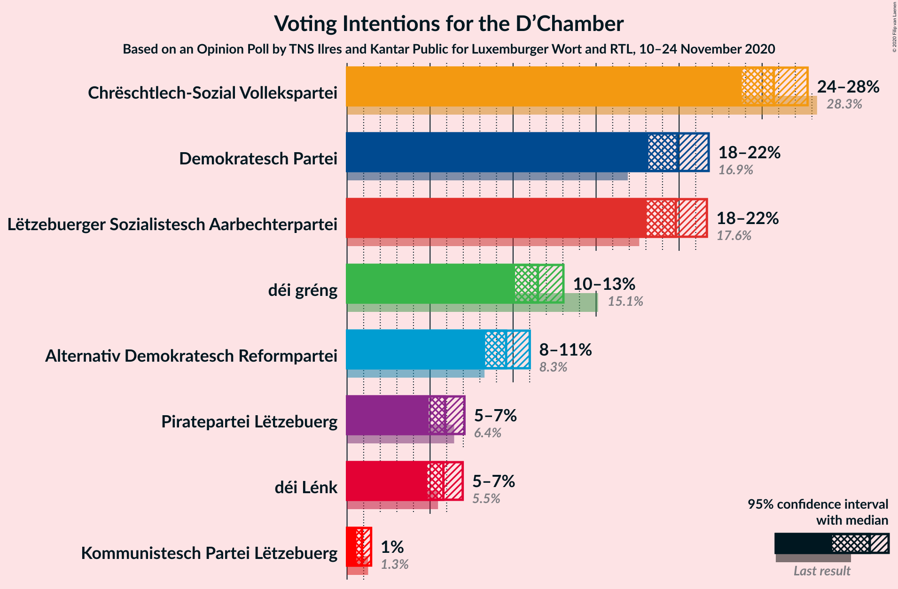

### Confidence Intervals

| Party | Last Result | Poll Result | 80% Confidence Interval | 90% Confidence Interval | 95% Confidence Interval | 99% Confidence Interval |
|:-----:|:-----------:|:-----------:|:-----------------------:|:-----------------------:|:-----------------------:|:-----------------------:|
| Chrëschtlech-Sozial Vollekspartei | 28.3% | 25.7% | 24.4–27.0% |24.1–27.4% |23.8–27.7% |23.2–28.4% |
| Demokratesch Partei | 16.9% | 19.9% | 18.8–21.1% |18.4–21.5% |18.2–21.8% |17.6–22.4% |
| Lëtzebuerger Sozialistesch Aarbechterpartei | 17.6% | 19.8% | 18.7–21.0% |18.3–21.4% |18.0–21.7% |17.5–22.3% |
| déi gréng | 15.1% | 11.5% | 10.6–12.5% |10.3–12.8% |10.1–13.0% |9.7–13.5% |
| Alternativ Demokratesch Reformpartei | 8.3% | 9.6% | 8.7–10.5% |8.5–10.8% |8.3–11.0% |7.9–11.5% |
| Piratepartei Lëtzebuerg | 6.4% | 5.9% | 5.3–6.7% |5.1–6.9% |4.9–7.1% |4.6–7.5% |
| déi Lénk | 5.5% | 5.8% | 5.2–6.6% |5.0–6.8% |4.8–7.0% |4.5–7.3% |
| Kommunistesch Partei Lëtzebuerg | 1.3% | 0.9% | 0.7–1.3% |0.6–1.4% |0.6–1.4% |0.5–1.6% |

*Note:* The poll result column reflects the actual value used in the calculations. Published results may vary slightly, and in addition be rounded to fewer digits.

## Seats

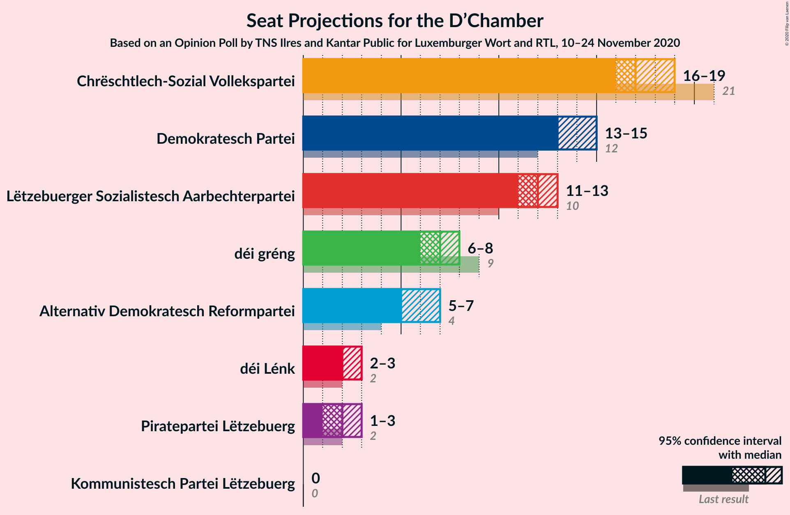

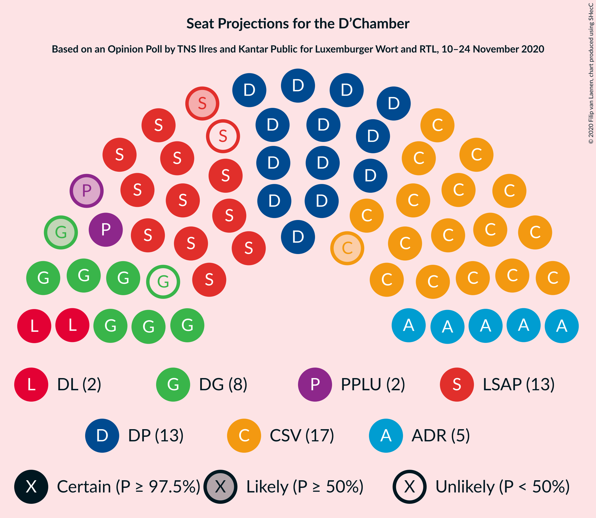

### Confidence Intervals

| Party | Last Result | Median | 80% Confidence Interval | 90% Confidence Interval | 95% Confidence Interval | 99% Confidence Interval |
|:-----:|:-----------:|:------:|:-----------------------:|:-----------------------:|:-----------------------:|:-----------------------:|
| <a href="#chrëschtlech-sozial-vollekspartei">Chrëschtlech-Sozial Vollekspartei</a> | 21 | 17 | 17–18 |16–19 |16–19 |16–19 |
| <a href="#demokratesch-partei">Demokratesch Partei</a> | 12 | 13 | 13–15 |13–15 |13–15 |13–15 |
| <a href="#lëtzebuerger-sozialistesch-aarbechterpartei">Lëtzebuerger Sozialistesch Aarbechterpartei</a> | 10 | 12 | 11–13 |11–13 |11–13 |10–13 |
| <a href="#déi-gréng">déi gréng</a> | 9 | 7 | 6–8 |6–8 |6–8 |6–8 |
| <a href="#alternativ-demokratesch-reformpartei">Alternativ Demokratesch Reformpartei</a> | 4 | 5 | 5–7 |5–7 |5–7 |4–7 |
| <a href="#piratepartei-lëtzebuerg">Piratepartei Lëtzebuerg</a> | 2 | 2 | 2 |1–3 |1–3 |1–4 |
| <a href="#déi-lénk">déi Lénk</a> | 2 | 2 | 2 |2–3 |2–3 |2–3 |
| <a href="#kommunistesch-partei-lëtzebuerg">Kommunistesch Partei Lëtzebuerg</a> | 0 | 0 | 0 |0 |0 |0 |

### Chrëschtlech-Sozial Vollekspartei

*For a full overview of the results for this party, see the [Chrëschtlech-Sozial Vollekspartei](party-chrëschtlech-sozialvollekspartei.html) page.*

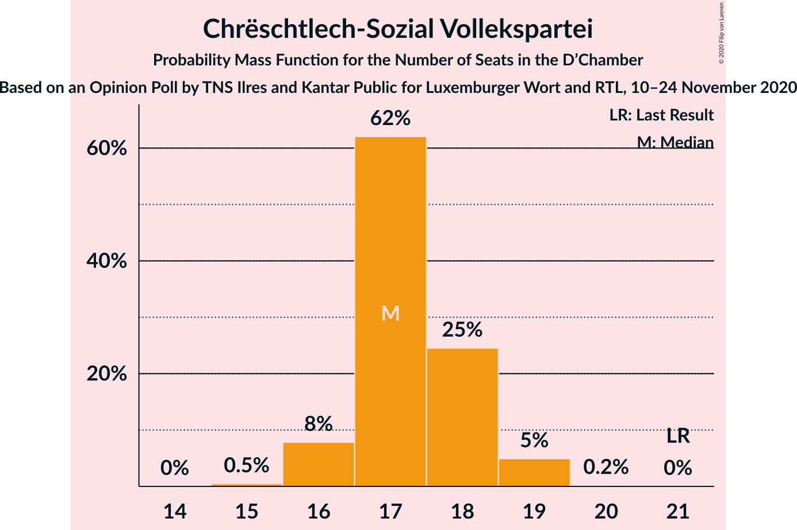

| Number of Seats | Probability | Accumulated | Special Marks |
|:---------------:|:-----------:|:-----------:|:-------------:|
| 15 | 0.5% | 100% |  |
| 16 | 8% | 99.5% |  |
| 17 | 62% | 92% | Median |
| 18 | 25% | 30% |  |
| 19 | 5% | 5% |  |
| 20 | 0.2% | 0.2% |  |
| 21 | 0% | 0% | Last Result |

### Demokratesch Partei

*For a full overview of the results for this party, see the [Demokratesch Partei](party-demokrateschpartei.html) page.*

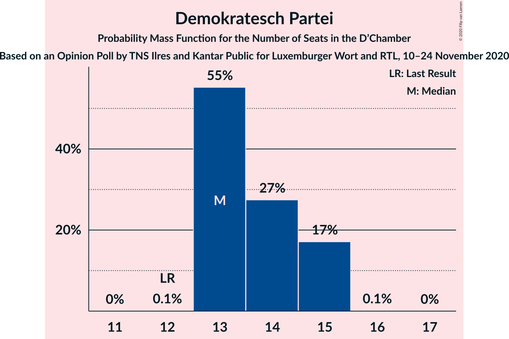

| Number of Seats | Probability | Accumulated | Special Marks |
|:---------------:|:-----------:|:-----------:|:-------------:|
| 12 | 0.1% | 100% | Last Result |
| 13 | 55% | 99.9% | Median |
| 14 | 27% | 45% |  |
| 15 | 17% | 17% |  |
| 16 | 0.1% | 0.1% |  |
| 17 | 0% | 0% |  |

### Lëtzebuerger Sozialistesch Aarbechterpartei

*For a full overview of the results for this party, see the [Lëtzebuerger Sozialistesch Aarbechterpartei](party-lëtzebuergersozialisteschaarbechterpartei.html) page.*

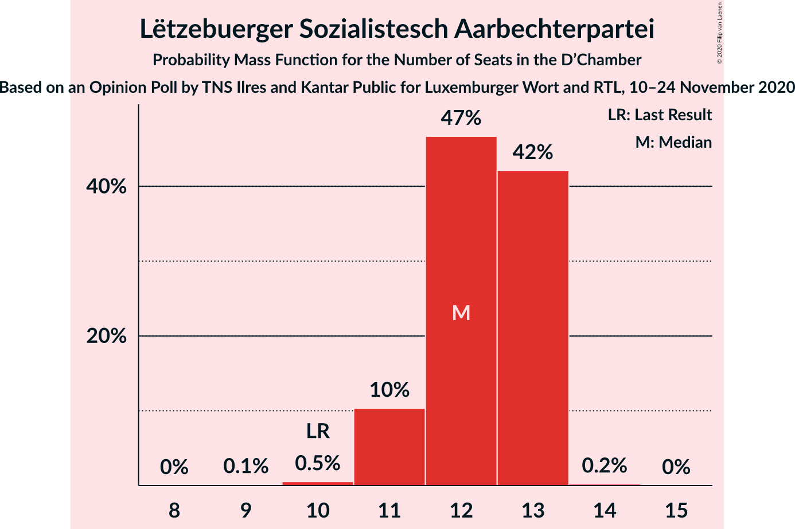

| Number of Seats | Probability | Accumulated | Special Marks |
|:---------------:|:-----------:|:-----------:|:-------------:|
| 9 | 0.1% | 100% |  |
| 10 | 0.5% | 99.9% | Last Result |
| 11 | 10% | 99.3% |  |
| 12 | 47% | 89% | Median |
| 13 | 42% | 42% |  |
| 14 | 0.2% | 0.2% |  |
| 15 | 0% | 0% |  |

### déi gréng

*For a full overview of the results for this party, see the [déi gréng](party-déigréng.html) page.*

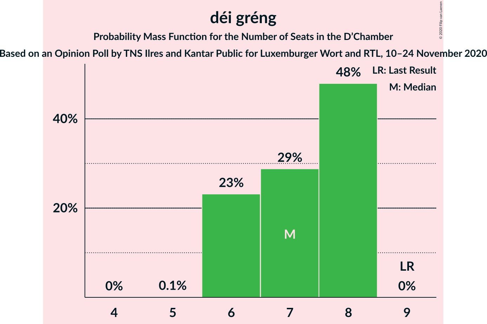

| Number of Seats | Probability | Accumulated | Special Marks |
|:---------------:|:-----------:|:-----------:|:-------------:|
| 5 | 0.1% | 100% |  |
| 6 | 23% | 99.9% |  |
| 7 | 29% | 77% | Median |
| 8 | 48% | 48% |  |
| 9 | 0% | 0% | Last Result |

### Alternativ Demokratesch Reformpartei

*For a full overview of the results for this party, see the [Alternativ Demokratesch Reformpartei](party-alternativdemokrateschreformpartei.html) page.*

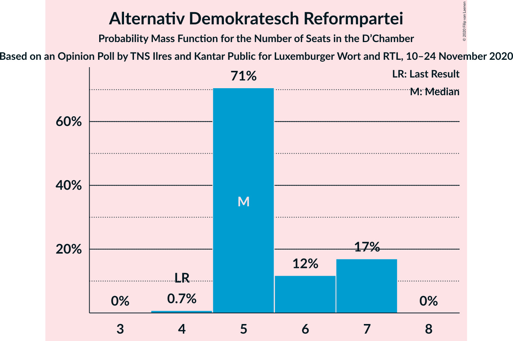

| Number of Seats | Probability | Accumulated | Special Marks |
|:---------------:|:-----------:|:-----------:|:-------------:|
| 4 | 0.7% | 100% | Last Result |
| 5 | 71% | 99.2% | Median |
| 6 | 12% | 29% |  |
| 7 | 17% | 17% |  |
| 8 | 0% | 0% |  |

### Piratepartei Lëtzebuerg

*For a full overview of the results for this party, see the [Piratepartei Lëtzebuerg](party-pirateparteilëtzebuerg.html) page.*

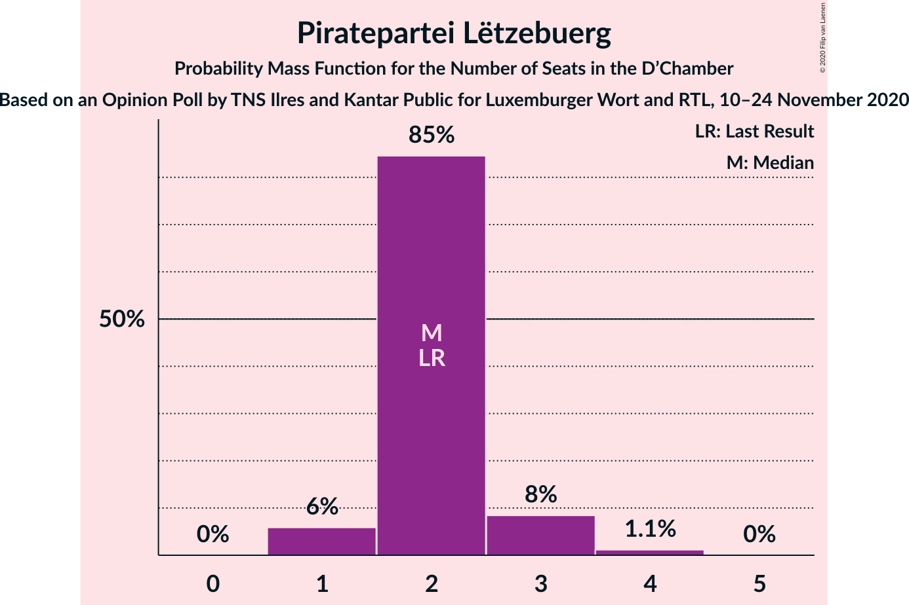

| Number of Seats | Probability | Accumulated | Special Marks |
|:---------------:|:-----------:|:-----------:|:-------------:|
| 1 | 6% | 100% |  |
| 2 | 85% | 94% | Last Result, Median |
| 3 | 8% | 10% |  |
| 4 | 1.1% | 1.1% |  |
| 5 | 0% | 0% |  |

### déi Lénk

*For a full overview of the results for this party, see the [déi Lénk](party-déilénk.html) page.*

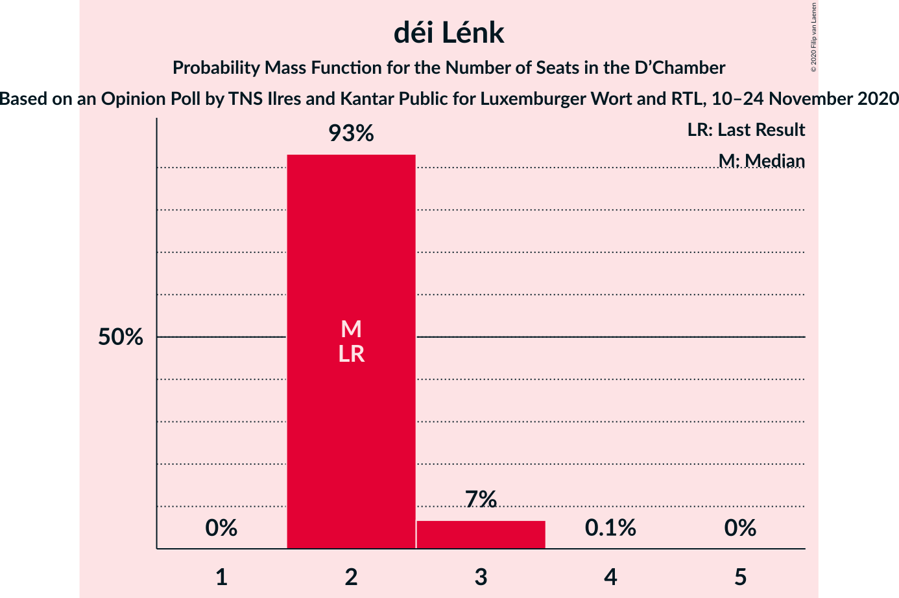

| Number of Seats | Probability | Accumulated | Special Marks |
|:---------------:|:-----------:|:-----------:|:-------------:|
| 2 | 93% | 100% | Last Result, Median |
| 3 | 7% | 7% |  |
| 4 | 0.1% | 0.1% |  |
| 5 | 0% | 0% |  |

### Kommunistesch Partei Lëtzebuerg

*For a full overview of the results for this party, see the [Kommunistesch Partei Lëtzebuerg](party-kommunisteschparteilëtzebuerg.html) page.*

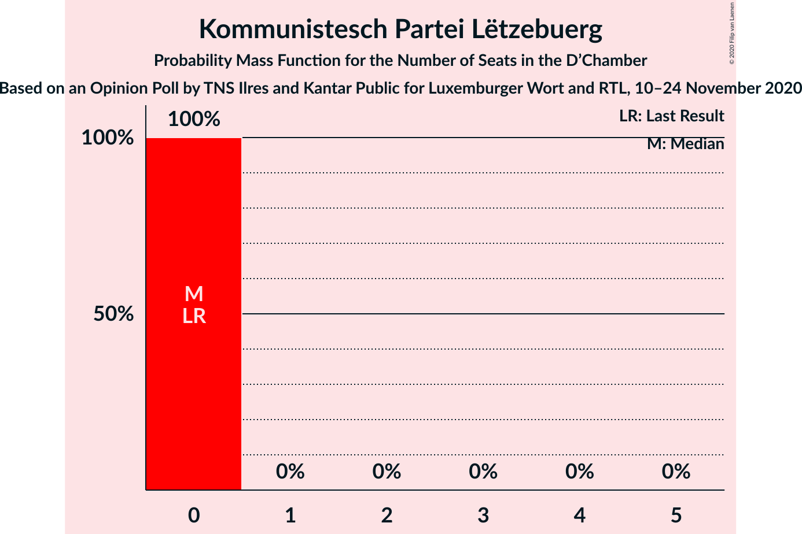

| Number of Seats | Probability | Accumulated | Special Marks |
|:---------------:|:-----------:|:-----------:|:-------------:|
| 0 | 100% | 100% | Last Result, Median |

## Coalitions

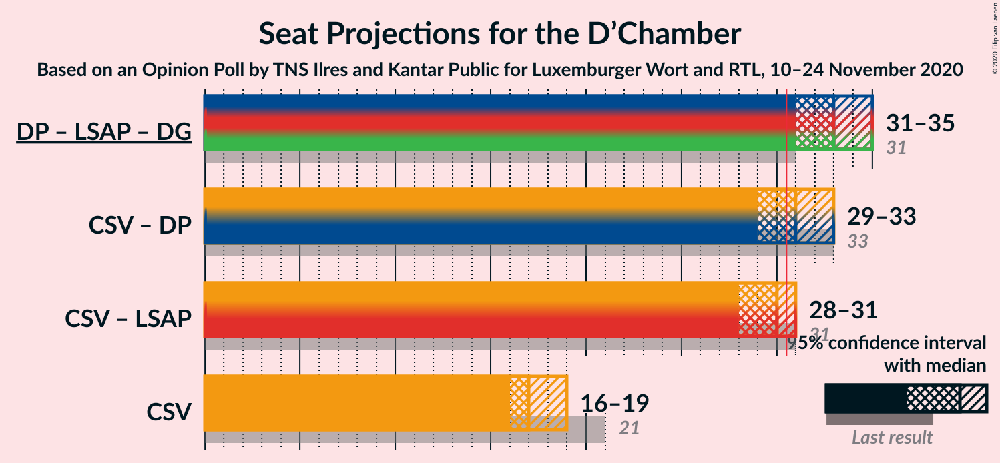

### Confidence Intervals

| Coalition | Last Result | Median | Majority? | 80% Confidence Interval | 90% Confidence Interval | 95% Confidence Interval | 99% Confidence Interval |
|:---------:|:-----------:|:------:|:---------:|:-----------------------:|:-----------------------:|:-----------------------:|:-----------------------:|
| Demokratesch Partei – Lëtzebuerger Sozialistesch Aarbechterpartei – déi gréng | 31 | 33 | 99.6% | 32–34 | 32–34 | 31–35 | 31–35 |
| Chrëschtlech-Sozial Vollekspartei – Demokratesch Partei | 33 | 31 | 60% | 30–32 | 30–32 | 29–33 | 29–33 |
| Chrëschtlech-Sozial Vollekspartei – Lëtzebuerger Sozialistesch Aarbechterpartei | 31 | 30 | 7% | 28–30 | 28–31 | 28–31 | 27–32 |
| Chrëschtlech-Sozial Vollekspartei | 21 | 17 | 0% | 17–18 | 16–19 | 16–19 | 16–19 |

### Demokratesch Partei – Lëtzebuerger Sozialistesch Aarbechterpartei – déi gréng

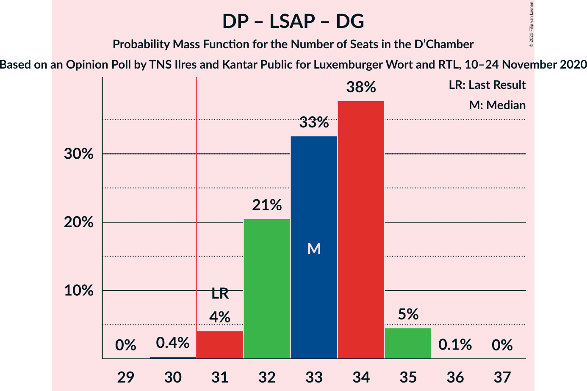

| Number of Seats | Probability | Accumulated | Special Marks |
|:---------------:|:-----------:|:-----------:|:-------------:|
| 30 | 0.4% | 100% |  |
| 31 | 4% | 99.6% | Last Result, Majority |
| 32 | 21% | 96% | Median |
| 33 | 33% | 75% |  |
| 34 | 38% | 42% |  |
| 35 | 5% | 5% |  |
| 36 | 0.1% | 0.1% |  |
| 37 | 0% | 0% |  |

### Chrëschtlech-Sozial Vollekspartei – Demokratesch Partei

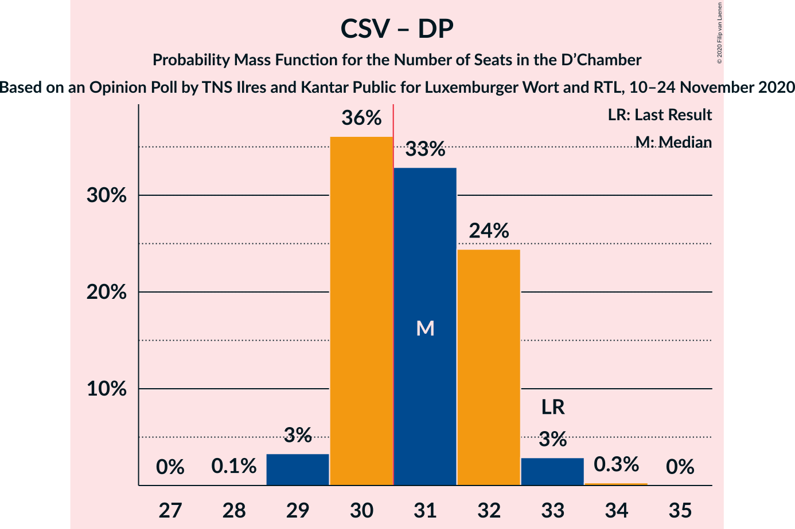

| Number of Seats | Probability | Accumulated | Special Marks |
|:---------------:|:-----------:|:-----------:|:-------------:|
| 28 | 0.1% | 100% |  |
| 29 | 3% | 99.9% |  |
| 30 | 36% | 97% | Median |
| 31 | 33% | 60% | Majority |
| 32 | 24% | 28% |  |
| 33 | 3% | 3% | Last Result |
| 34 | 0.3% | 0.3% |  |
| 35 | 0% | 0% |  |

### Chrëschtlech-Sozial Vollekspartei – Lëtzebuerger Sozialistesch Aarbechterpartei

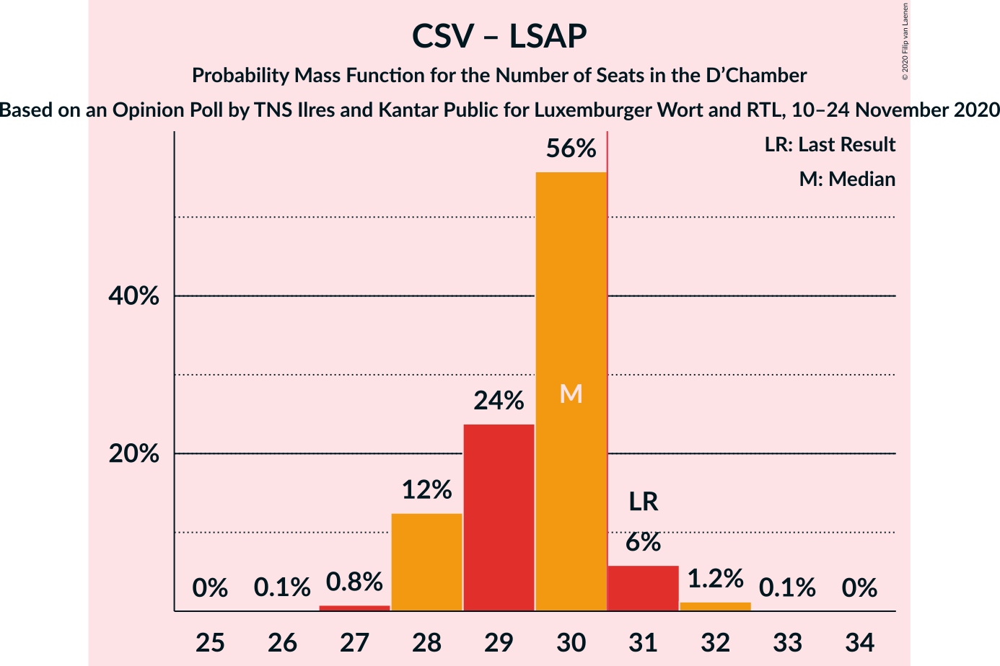

| Number of Seats | Probability | Accumulated | Special Marks |
|:---------------:|:-----------:|:-----------:|:-------------:|
| 26 | 0.1% | 100% |  |
| 27 | 0.8% | 99.9% |  |
| 28 | 12% | 99.1% |  |
| 29 | 24% | 87% | Median |
| 30 | 56% | 63% |  |
| 31 | 6% | 7% | Last Result, Majority |
| 32 | 1.2% | 1.3% |  |
| 33 | 0.1% | 0.1% |  |
| 34 | 0% | 0% |  |

### Chrëschtlech-Sozial Vollekspartei

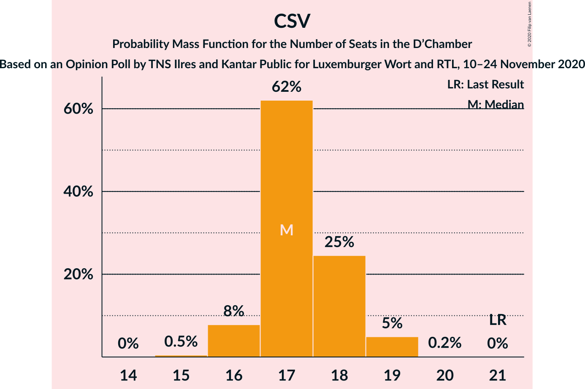

| Number of Seats | Probability | Accumulated | Special Marks |
|:---------------:|:-----------:|:-----------:|:-------------:|
| 15 | 0.5% | 100% |  |
| 16 | 8% | 99.5% |  |
| 17 | 62% | 92% | Median |
| 18 | 25% | 30% |  |
| 19 | 5% | 5% |  |
| 20 | 0.2% | 0.2% |  |
| 21 | 0% | 0% | Last Result |

## Technical Information

### Opinion Poll

+ **Polling firm:** TNS Ilres and Kantar Public
+ **Commissioner(s):** Luxemburger Wort and RTL
+ **Fieldwork period:** 10–24 November 2020

### Calculations

+ **Sample size:** 1879
+ **Simulations done:** 1,048,576
+ **Error estimate:** 1.45%

