# Poll Average

<a href="#voting-intentions">Voting Intentions</a> | <a href="#seats">Seats</a> | <a href="#coalitions">Coalitions</a> | <a href="#technical-information">Technical Information</a>

## Summary

The table below lists the polls on which the average is based. They are the most recent polls (less than 90 days old) registered and analyzed so far.

| Period     | Polling firm/Commissioner(s) | CSV | LSAP | DP | DG | ADR | DL | PPLU | KPL | PID |
|:----------:|:----------------------------:|:--:|:--:|:--:|:--:|:--:|:--:|:--:|:--:|:--:|
| 20 October 2013 | General Election | 33.7%   23 | 20.3%   13 | 18.2%   13 | 10.1%   6 | 6.6%   3 | 4.9%   2 | 2.9%   0 | 1.6%   0 | 1.5%   0 |
| N/A | Poll Average | 41–45%   28–30 | 14–16%   7–9 | 16–18%   10–11 | 11–13%   6–8 | 7–9%   3–5 | 4–6%   1–2 | N/A   N/A | N/A   N/A | N/A   N/A |
| [1 December 2017–31 May 2018](2018-05-31-TNS.html) | TNS   Luxemburger Wort and RTL | 41–45%   28–30 | 14–16%   7–9 | 16–18%   10–11 | 11–13%   6–8 | 7–9%   3–5 | 4–6%   1–2 | N/A   N/A | N/A   N/A | N/A   N/A |
| 20 October 2013 | General Election | 33.7%   23 | 20.3%   13 | 18.2%   13 | 10.1%   6 | 6.6%   3 | 4.9%   2 | 2.9%   0 | 1.6%   0 | 1.5%   0 |

Only polls for which at least the sample size has been published are included in the table above.

**Legend:**
+ **Top half of each row:** Voting intentions (95% confidence interval)
+ **Bottom half of each row:** Seat projections for the D’Chamber (95% confidence interval)
+ **CSV:** Chrëschtlech-Sozial Vollekspartei
+ **LSAP:** Lëtzebuerger Sozialistesch Aarbechterpartei
+ **DP:** Demokratesch Partei
+ **DG:** déi gréng
+ **ADR:** Alternativ Demokratesch Reformpartei
+ **DL:** Déi Lénk
+ **PPLU:** Piratepartei Lëtzebuerg
+ **KPL:** Kommunistesch Partei Lëtzebuerg
+ **PID:** Partei fir Integral Demokratie
+ **N/A (single party):** Party not included the published results
+ **N/A (entire row):** Calculation for this opinion poll not started yet

## Voting Intentions

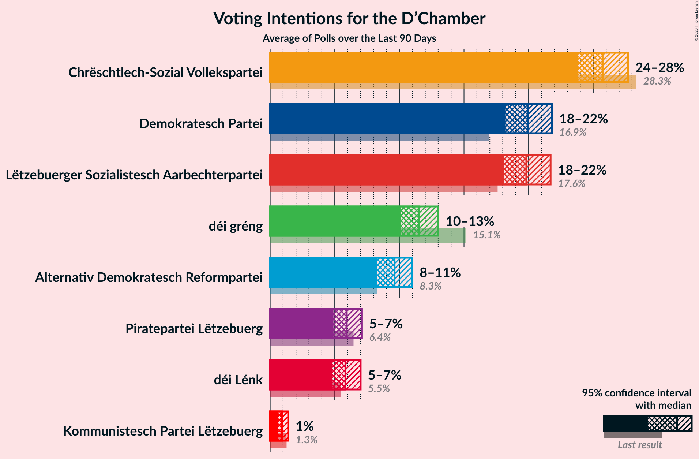

### Confidence Intervals

| Party | Last Result | Median | 80% Confidence Interval | 90% Confidence Interval | 95% Confidence Interval | 99% Confidence Interval |
|:-----:|:-----------:|:------:|:-----------------------:|:-----------------------:|:-----------------------:|:-----------------------:|
| <a href="#chrëschtlech-sozial-vollekspartei">Chrëschtlech-Sozial Vollekspartei</a> | 33.7% | 43.0% | 41.9–44.1% |41.6–44.4% | 41.4–44.6% | 40.9–45.2% |
| <a href="#lëtzebuerger-sozialistesch-aarbechterpartei">Lëtzebuerger Sozialistesch Aarbechterpartei</a> | 20.3% | 15.0% | 14.2–15.8% |14.0–16.0% | 13.9–16.2% | 13.5–16.6% |
| <a href="#demokratesch-partei">Demokratesch Partei</a> | 18.2% | 17.0% | 16.2–17.8% |16.0–18.1% | 15.8–18.3% | 15.4–18.7% |
| <a href="#déi-gréng">déi gréng</a> | 10.1% | 12.0% | 11.3–12.7% |11.1–12.9% | 11.0–13.1% | 10.7–13.5% |
| <a href="#alternativ-demokratesch-reformpartei">Alternativ Demokratesch Reformpartei</a> | 6.6% | 8.0% | 7.4–8.6% |7.3–8.8% | 7.2–9.0% | 6.9–9.3% |
| <a href="#déi-lénk">Déi Lénk</a> | 4.9% | 5.0% | 4.6–5.5% |4.4–5.6% | 4.3–5.8% | 4.1–6.0% |
| <a href="#piratepartei-lëtzebuerg">Piratepartei Lëtzebuerg</a> | 2.9% | N/A | N/A |N/A | N/A | N/A |
| <a href="#kommunistesch-partei-lëtzebuerg">Kommunistesch Partei Lëtzebuerg</a> | 1.6% | N/A | N/A |N/A | N/A | N/A |
| <a href="#partei-fir-integral-demokratie">Partei fir Integral Demokratie</a> | 1.5% | N/A | N/A |N/A | N/A | N/A |

### Chrëschtlech-Sozial Vollekspartei

*For a full overview of the results for this party, see the [Chrëschtlech-Sozial Vollekspartei](party-chrëschtlech-sozialvollekspartei.html) page.*

| Voting Intentions | Probability | Accumulated | Special Marks |
|:-----------------:|:-----------:|:-----------:|:-------------:|
| 33.5–34.5% | 0% | 100% | Last Result |
| 34.5–35.5% | 0% | 100% |  |
| 35.5–36.5% | 0% | 100% |  |
| 36.5–37.5% | 0% | 100% |  |
| 37.5–38.5% | 0% | 100% |  |
| 38.5–39.5% | 0% | 100% |  |
| 39.5–40.5% | 0.1% | 100% |  |
| 40.5–41.5% | 4% | 99.8% |  |
| 41.5–42.5% | 26% | 96% |  |
| 42.5–43.5% | 45% | 70% | Median |
| 43.5–44.5% | 23% | 26% |  |
| 44.5–45.5% | 3% | 3% |  |
| 45.5–46.5% | 0.1% | 0.1% |  |
| 46.5–47.5% | 0% | 0% |  |

### Lëtzebuerger Sozialistesch Aarbechterpartei

*For a full overview of the results for this party, see the [Lëtzebuerger Sozialistesch Aarbechterpartei](party-lëtzebuergersozialisteschaarbechterpartei.html) page.*

| Voting Intentions | Probability | Accumulated | Special Marks |
|:-----------------:|:-----------:|:-----------:|:-------------:|
| 11.5–12.5% | 0% | 100% |  |
| 12.5–13.5% | 0.6% | 100% |  |
| 13.5–14.5% | 22% | 99.4% |  |
| 14.5–15.5% | 59% | 78% | Median |
| 15.5–16.5% | 18% | 19% |  |
| 16.5–17.5% | 0.6% | 0.6% |  |
| 17.5–18.5% | 0% | 0% |  |
| 18.5–19.5% | 0% | 0% |  |
| 19.5–20.5% | 0% | 0% | Last Result |

### Demokratesch Partei

*For a full overview of the results for this party, see the [Demokratesch Partei](party-demokrateschpartei.html) page.*

| Voting Intentions | Probability | Accumulated | Special Marks |
|:-----------------:|:-----------:|:-----------:|:-------------:|
| 13.5–14.5% | 0% | 100% |  |
| 14.5–15.5% | 0.8% | 100% |  |
| 15.5–16.5% | 22% | 99.2% |  |
| 16.5–17.5% | 57% | 77% | Median |
| 17.5–18.5% | 20% | 21% | Last Result |
| 18.5–19.5% | 0.9% | 0.9% |  |
| 19.5–20.5% | 0% | 0% |  |

### déi gréng

*For a full overview of the results for this party, see the [déi gréng](party-déigréng.html) page.*

| Voting Intentions | Probability | Accumulated | Special Marks |
|:-----------------:|:-----------:|:-----------:|:-------------:|
| 8.5–9.5% | 0% | 100% |  |
| 9.5–10.5% | 0.2% | 100% | Last Result |
| 10.5–11.5% | 19% | 99.8% |  |
| 11.5–12.5% | 63% | 81% | Median |
| 12.5–13.5% | 17% | 18% |  |
| 13.5–14.5% | 0.4% | 0.4% |  |
| 14.5–15.5% | 0% | 0% |  |

### Alternativ Demokratesch Reformpartei

*For a full overview of the results for this party, see the [Alternativ Demokratesch Reformpartei](party-alternativdemokrateschreformpartei.html) page.*

| Voting Intentions | Probability | Accumulated | Special Marks |
|:-----------------:|:-----------:|:-----------:|:-------------:|
| 5.5–6.5% | 0% | 100% |  |
| 6.5–7.5% | 14% | 100% | Last Result |
| 7.5–8.5% | 73% | 86% | Median |
| 8.5–9.5% | 13% | 13% |  |
| 9.5–10.5% | 0.1% | 0.1% |  |
| 10.5–11.5% | 0% | 0% |  |

### Déi Lénk

*For a full overview of the results for this party, see the [Déi Lénk](party-déilénk.html) page.*

| Voting Intentions | Probability | Accumulated | Special Marks |
|:-----------------:|:-----------:|:-----------:|:-------------:|
| 2.5–3.5% | 0% | 100% |  |
| 3.5–4.5% | 10% | 100% |  |
| 4.5–5.5% | 82% | 90% | Last Result, Median |
| 5.5–6.5% | 8% | 8% |  |
| 6.5–7.5% | 0% | 0% |  |

## Seats

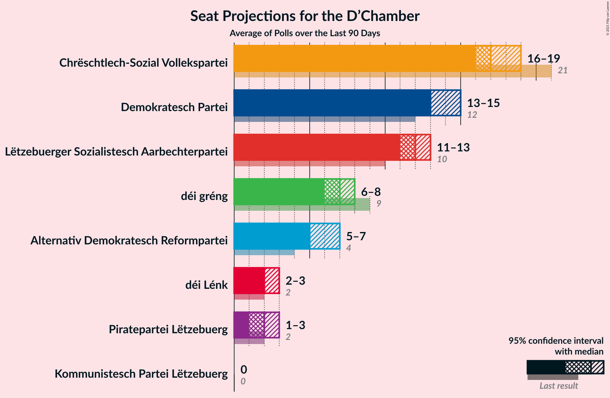

### Confidence Intervals

| Party | Last Result | Median | 80% Confidence Interval | 90% Confidence Interval | 95% Confidence Interval | 99% Confidence Interval |
|:-----:|:-----------:|:------:|:-----------------------:|:-----------------------:|:-----------------------:|:-----------------------:|
| <a href="#chrëschtlech-sozial-vollekspartei">Chrëschtlech-Sozial Vollekspartei</a> | 23 | 29 | 28–30 |28–30 | 28–30 | 27–31 |
| <a href="#lëtzebuerger-sozialistesch-aarbechterpartei">Lëtzebuerger Sozialistesch Aarbechterpartei</a> | 13 | 8 | 7–9 |7–9 | 7–9 | 7–9 |
| <a href="#demokratesch-partei">Demokratesch Partei</a> | 13 | 11 | 10–11 |10–11 | 10–11 | 9–11 |
| <a href="#déi-gréng">déi gréng</a> | 6 | 7 | 6–8 |6–8 | 6–8 | 6–8 |
| <a href="#alternativ-demokratesch-reformpartei">Alternativ Demokratesch Reformpartei</a> | 3 | 3 | 3–4 |3–5 | 3–5 | 3–5 |
| <a href="#déi-lénk">Déi Lénk</a> | 2 | 2 | 2 |1–2 | 1–2 | 1–2 |
| <a href="#piratepartei-lëtzebuerg">Piratepartei Lëtzebuerg</a> | 0 | N/A | N/A |N/A | N/A | N/A |
| <a href="#kommunistesch-partei-lëtzebuerg">Kommunistesch Partei Lëtzebuerg</a> | 0 | N/A | N/A |N/A | N/A | N/A |
| <a href="#partei-fir-integral-demokratie">Partei fir Integral Demokratie</a> | 0 | N/A | N/A |N/A | N/A | N/A |

### Chrëschtlech-Sozial Vollekspartei

*For a full overview of the results for this party, see the [Chrëschtlech-Sozial Vollekspartei](party-chrëschtlech-sozialvollekspartei.html) page.*

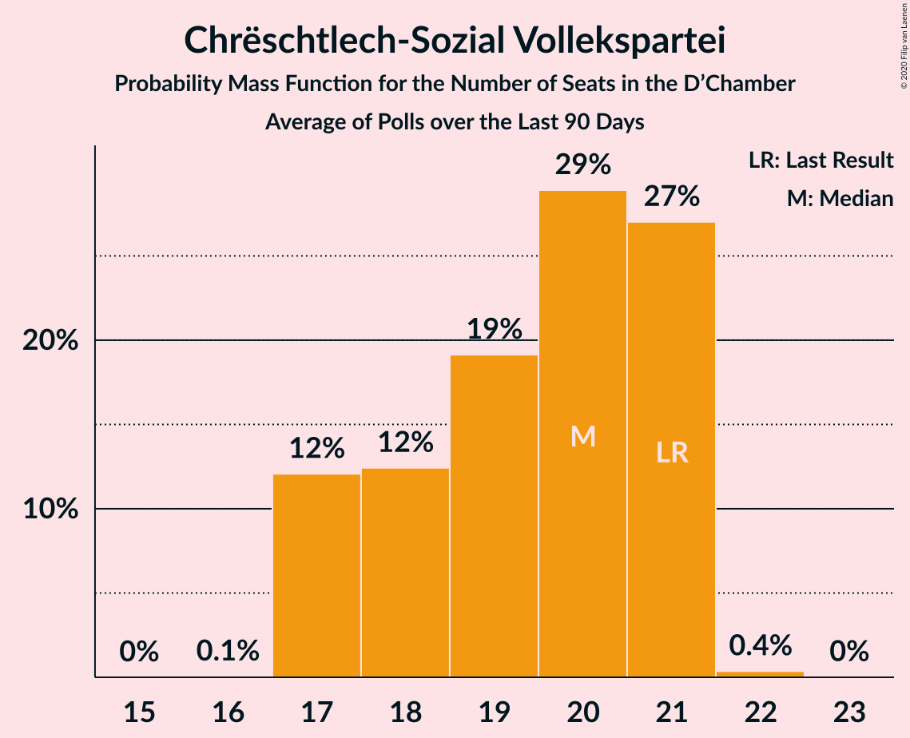

| Number of Seats | Probability | Accumulated | Special Marks |
|:---------------:|:-----------:|:-----------:|:-------------:|
| 23 | 0% | 100% | Last Result |
| 24 | 0% | 100% |  |
| 25 | 0% | 100% |  |
| 26 | 0% | 100% |  |
| 27 | 0.5% | 100% |  |
| 28 | 14% | 99.5% |  |
| 29 | 57% | 86% | Median |
| 30 | 27% | 29% |  |
| 31 | 2% | 2% | Majority |
| 32 | 0% | 0% |  |

### Lëtzebuerger Sozialistesch Aarbechterpartei

*For a full overview of the results for this party, see the [Lëtzebuerger Sozialistesch Aarbechterpartei](party-lëtzebuergersozialisteschaarbechterpartei.html) page.*

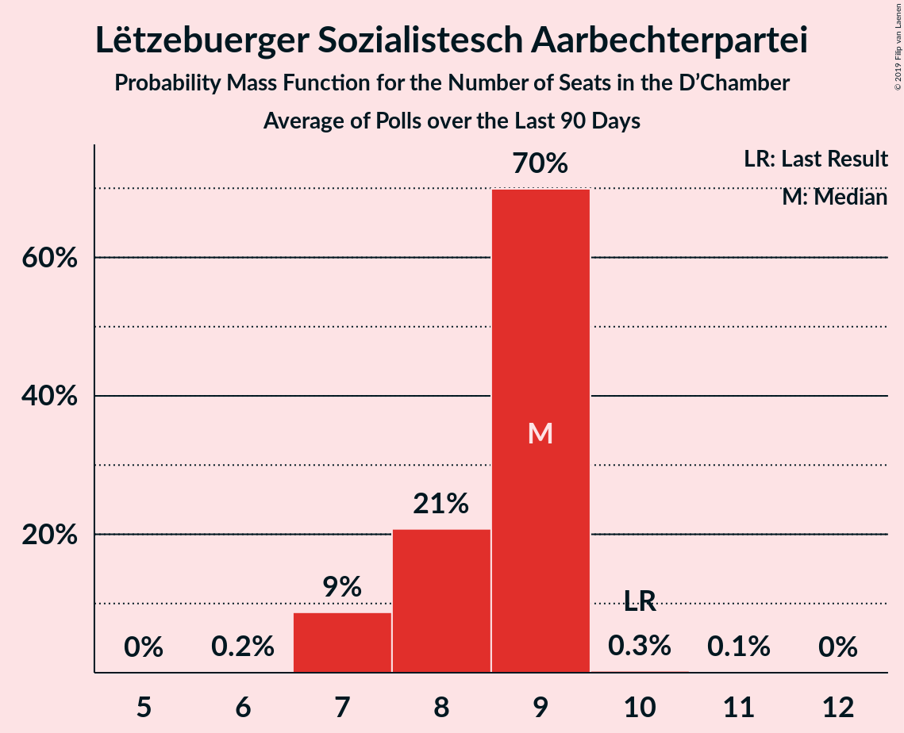

| Number of Seats | Probability | Accumulated | Special Marks |
|:---------------:|:-----------:|:-----------:|:-------------:|
| 7 | 28% | 100% |  |
| 8 | 58% | 72% | Median |
| 9 | 14% | 14% |  |
| 10 | 0% | 0% |  |
| 11 | 0% | 0% |  |
| 12 | 0% | 0% |  |
| 13 | 0% | 0% | Last Result |

### Demokratesch Partei

*For a full overview of the results for this party, see the [Demokratesch Partei](party-demokrateschpartei.html) page.*

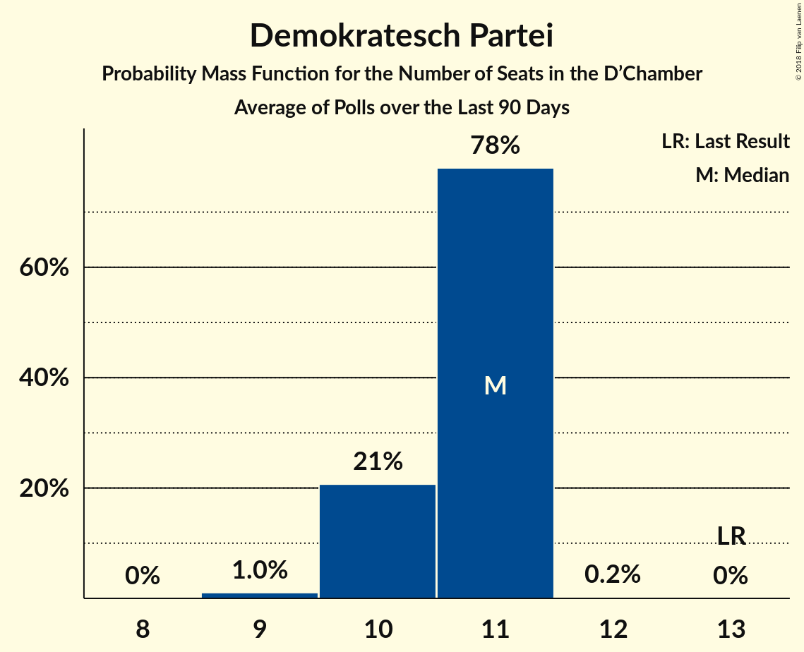

| Number of Seats | Probability | Accumulated | Special Marks |
|:---------------:|:-----------:|:-----------:|:-------------:|
| 9 | 1.0% | 100% |  |
| 10 | 21% | 99.0% |  |
| 11 | 78% | 78% | Median |
| 12 | 0.2% | 0.3% |  |
| 13 | 0% | 0% | Last Result |

### déi gréng

*For a full overview of the results for this party, see the [déi gréng](party-déigréng.html) page.*

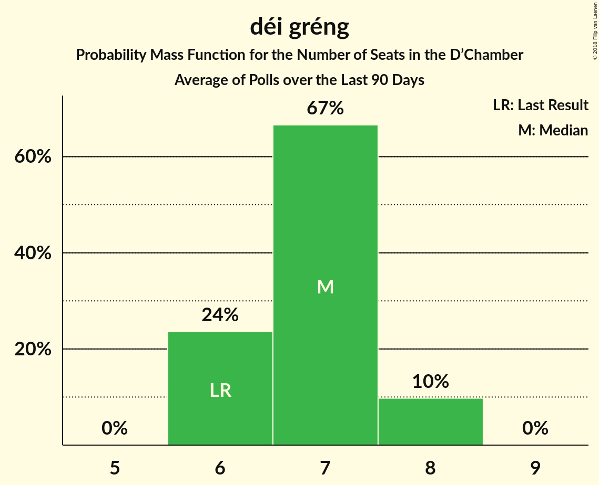

| Number of Seats | Probability | Accumulated | Special Marks |
|:---------------:|:-----------:|:-----------:|:-------------:|
| 6 | 29% | 100% | Last Result |
| 7 | 56% | 71% | Median |
| 8 | 15% | 15% |  |
| 9 | 0% | 0% |  |

### Alternativ Demokratesch Reformpartei

*For a full overview of the results for this party, see the [Alternativ Demokratesch Reformpartei](party-alternativdemokrateschreformpartei.html) page.*

| Number of Seats | Probability | Accumulated | Special Marks |
|:---------------:|:-----------:|:-----------:|:-------------:|
| 2 | 0.3% | 100% |  |
| 3 | 62% | 99.7% | Last Result, Median |
| 4 | 33% | 38% |  |
| 5 | 5% | 5% |  |
| 6 | 0% | 0% |  |

### Déi Lénk

*For a full overview of the results for this party, see the [Déi Lénk](party-déilénk.html) page.*

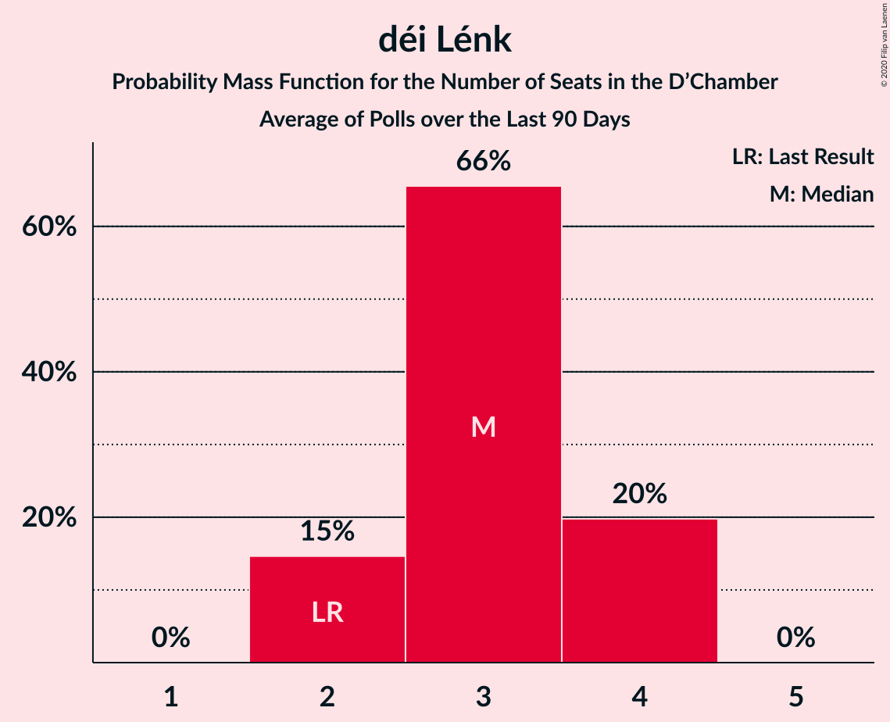

| Number of Seats | Probability | Accumulated | Special Marks |
|:---------------:|:-----------:|:-----------:|:-------------:|
| 1 | 8% | 100% |  |
| 2 | 92% | 92% | Last Result, Median |
| 3 | 0% | 0% |  |

## Coalitions

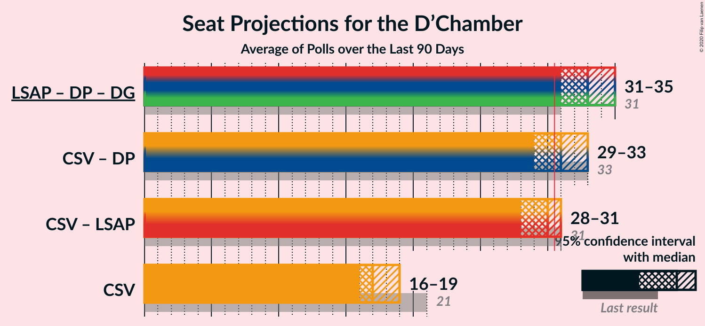

### Confidence Intervals

| Coalition | Last Result | Median | Majority? | 80% Confidence Interval | 90% Confidence Interval | 95% Confidence Interval | 99% Confidence Interval |
|:---------:|:-----------:|:------:|:---------:|:-----------------------:|:-----------------------:|:-----------------------:|:-----------------------:|
| Chrëschtlech-Sozial Vollekspartei – Demokratesch Partei | 36 | 40 | 100% | 39–41 | 39–41 | 39–41 | 38–42 |
| Chrëschtlech-Sozial Vollekspartei – Lëtzebuerger Sozialistesch Aarbechterpartei | 36 | 37 | 100% | 36–38 | 36–38 | 35–38 | 35–39 |
| Chrëschtlech-Sozial Vollekspartei | 23 | 29 | 2% | 28–30 | 28–30 | 28–30 | 27–31 |
| Lëtzebuerger Sozialistesch Aarbechterpartei – Demokratesch Partei – déi gréng | 32 | 26 | 0% | 24–26 | 24–27 | 24–27 | 24–27 |

### Chrëschtlech-Sozial Vollekspartei – Demokratesch Partei

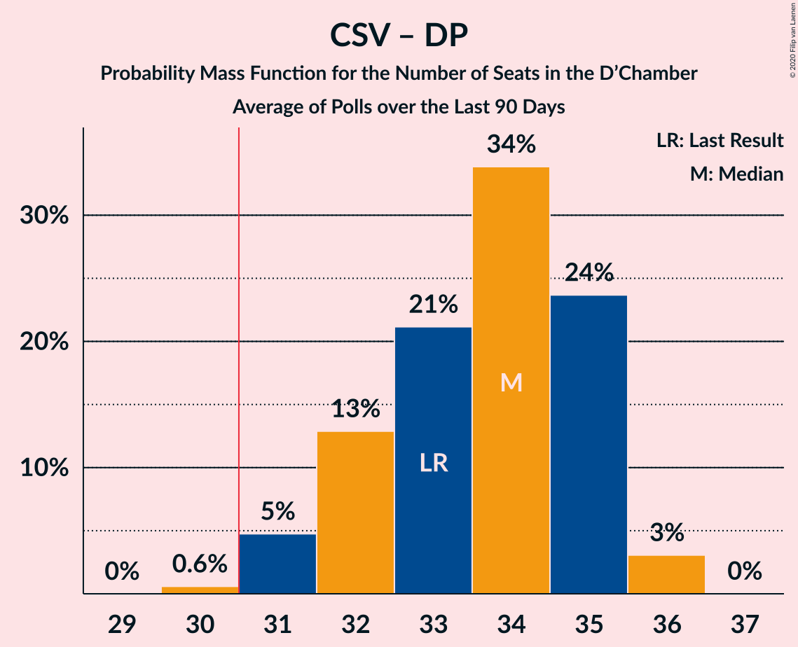

| Number of Seats | Probability | Accumulated | Special Marks |
|:---------------:|:-----------:|:-----------:|:-------------:|
| 36 | 0% | 100% | Last Result |
| 37 | 0.1% | 100% |  |
| 38 | 1.0% | 99.9% |  |
| 39 | 25% | 98.9% |  |
| 40 | 54% | 73% | Median |
| 41 | 18% | 19% |  |
| 42 | 1.3% | 1.4% |  |
| 43 | 0% | 0% |  |

### Chrëschtlech-Sozial Vollekspartei – Lëtzebuerger Sozialistesch Aarbechterpartei

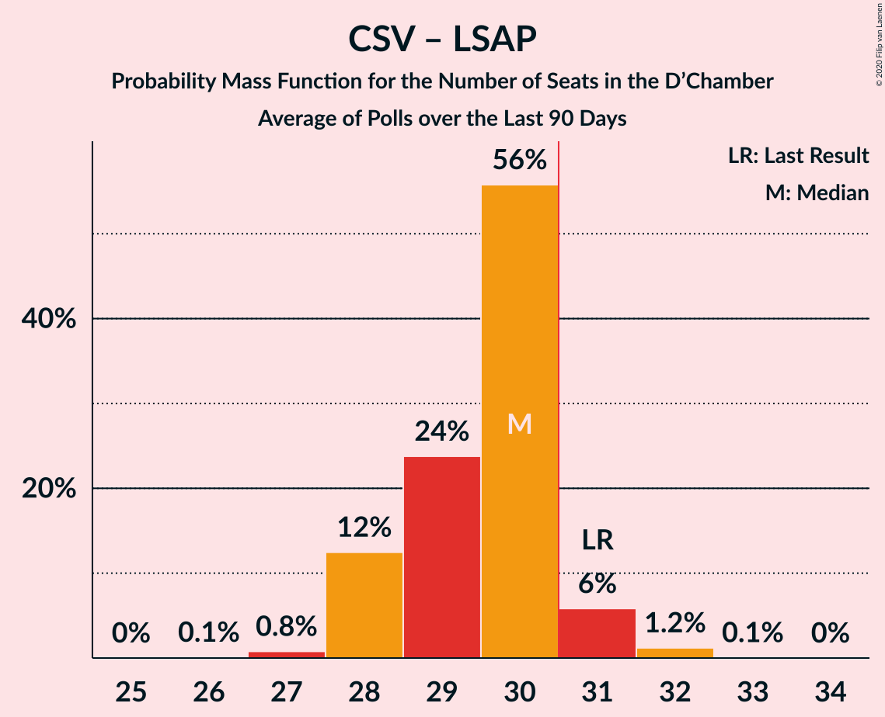

| Number of Seats | Probability | Accumulated | Special Marks |
|:---------------:|:-----------:|:-----------:|:-------------:|
| 34 | 0.3% | 100% |  |
| 35 | 5% | 99.7% |  |
| 36 | 13% | 95% | Last Result |
| 37 | 57% | 82% | Median |
| 38 | 23% | 24% |  |
| 39 | 1.0% | 1.1% |  |
| 40 | 0.1% | 0.1% |  |
| 41 | 0% | 0% |  |

### Chrëschtlech-Sozial Vollekspartei

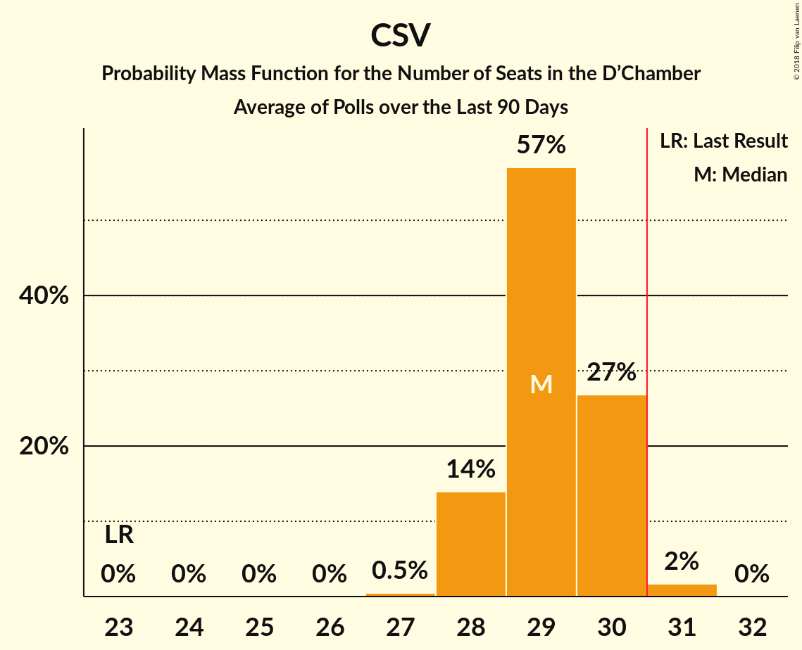

| Number of Seats | Probability | Accumulated | Special Marks |
|:---------------:|:-----------:|:-----------:|:-------------:|
| 23 | 0% | 100% | Last Result |
| 24 | 0% | 100% |  |
| 25 | 0% | 100% |  |
| 26 | 0% | 100% |  |
| 27 | 0.5% | 100% |  |
| 28 | 14% | 99.5% |  |
| 29 | 57% | 86% | Median |
| 30 | 27% | 29% |  |
| 31 | 2% | 2% | Majority |
| 32 | 0% | 0% |  |

### Lëtzebuerger Sozialistesch Aarbechterpartei – Demokratesch Partei – déi gréng

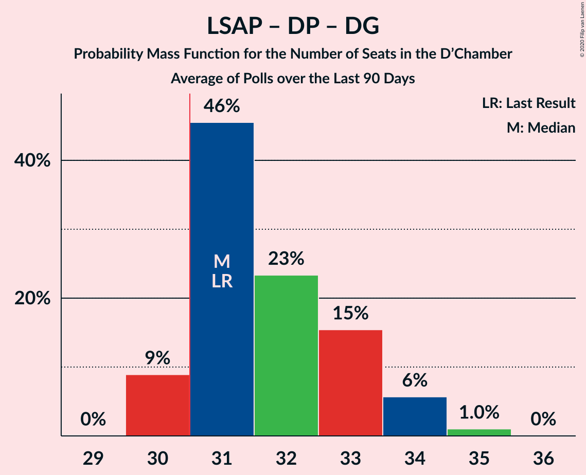

| Number of Seats | Probability | Accumulated | Special Marks |
|:---------------:|:-----------:|:-----------:|:-------------:|
| 23 | 0.1% | 100% |  |
| 24 | 18% | 99.9% |  |
| 25 | 22% | 82% |  |
| 26 | 52% | 60% | Median |
| 27 | 7% | 8% |  |
| 28 | 0.2% | 0.2% |  |
| 29 | 0% | 0% |  |
| 30 | 0% | 0% |  |
| 31 | 0% | 0% | Majority |
| 32 | 0% | 0% | Last Result |

## Technical Information

+ **Number of polls included in this average:** 1
+ **Lowest number of simulations done in a poll included in this average:** 131,072
+ **Total number of simulations done in the polls included in this average:** 131,072
+ **Error estimate:** 1.55%
