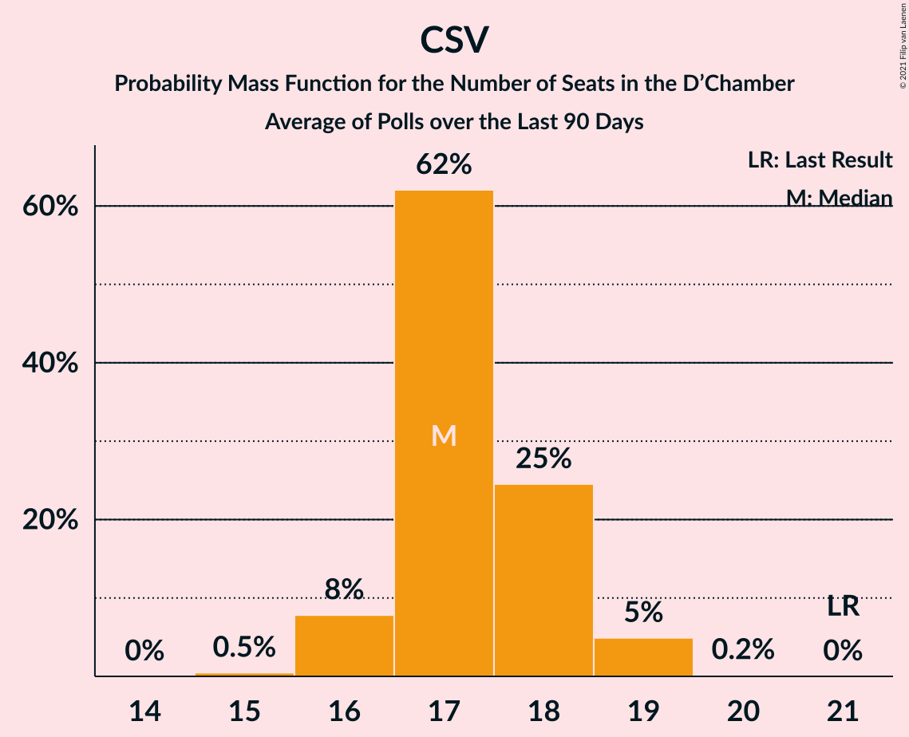

# Poll Average

<a href="#voting-intentions">Voting Intentions</a> | <a href="#seats">Seats</a> | <a href="#coalitions">Coalitions</a> | <a href="#technical-information">Technical Information</a>

## Summary

The table below lists the polls on which the average is based. They are the most recent polls (less than 90 days old) registered and analyzed so far.

| Period     | Polling firm/Commissioner(s) | CSV | LSAP | DP | DG | ADR | DL | PPLU | KPL | PID |
|:----------:|:----------------------------:|:--:|:--:|:--:|:--:|:--:|:--:|:--:|:--:|:--:|
| 14 October 2018 | General Election | 28.3%   21 | 17.6%   10 | 16.9%   12 | 15.1%   9 | 8.3%   4 | 5.5%   2 | 6.4%   2 | 1.3%   0 | 0.0%   0 |
| N/A | Poll Average | 24–28%   16–19 | 18–22%   11–13 | 18–22%   13–15 | 10–13%   6–8 | 8–11%   5–7 | 5–7%   2–3 | 5–7%   1–3 | 1%   0 | N/A   N/A |
| [10–24 November 2020](2020-11-24-TNSIlresandKantarPublic.html) | TNS Ilres and Kantar Public   Luxemburger Wort and RTL | 24–28%   16–19 | 18–22%   11–13 | 18–22%   13–15 | 10–13%   6–8 | 8–11%   5–7 | 5–7%   2–3 | 5–7%   1–3 | 1%   0 | N/A   N/A |
| 14 October 2018 | General Election | 28.3%   21 | 17.6%   10 | 16.9%   12 | 15.1%   9 | 8.3%   4 | 5.5%   2 | 6.4%   2 | 1.3%   0 | 0.0%   0 |

Only polls for which at least the sample size has been published are included in the table above.

**Legend:**
+ **Top half of each row:** Voting intentions (95% confidence interval)
+ **Bottom half of each row:** Seat projections for the D’Chamber (95% confidence interval)
+ **CSV:** Chrëschtlech-Sozial Vollekspartei
+ **LSAP:** Lëtzebuerger Sozialistesch Aarbechterpartei
+ **DP:** Demokratesch Partei
+ **DG:** déi gréng
+ **ADR:** Alternativ Demokratesch Reformpartei
+ **DL:** déi Lénk
+ **PPLU:** Piratepartei Lëtzebuerg
+ **KPL:** Kommunistesch Partei Lëtzebuerg
+ **PID:** Partei fir Integral Demokratie
+ **N/A (single party):** Party not included the published results
+ **N/A (entire row):** Calculation for this opinion poll not started yet

## Voting Intentions

### Confidence Intervals

| Party | Last Result | Median | 80% Confidence Interval | 90% Confidence Interval | 95% Confidence Interval | 99% Confidence Interval |
|:-----:|:-----------:|:------:|:-----------------------:|:-----------------------:|:-----------------------:|:-----------------------:|
| <a href="#chrëschtlech-sozial-vollekspartei">Chrëschtlech-Sozial Vollekspartei</a> | 28.3% | 25.7% | 24.4–27.0% |24.1–27.4% | 23.8–27.7% | 23.2–28.4% |
| <a href="#lëtzebuerger-sozialistesch-aarbechterpartei">Lëtzebuerger Sozialistesch Aarbechterpartei</a> | 17.6% | 19.8% | 18.7–21.0% |18.3–21.4% | 18.1–21.7% | 17.5–22.3% |
| <a href="#demokratesch-partei">Demokratesch Partei</a> | 16.9% | 19.9% | 18.8–21.1% |18.4–21.5% | 18.2–21.8% | 17.6–22.4% |
| <a href="#déi-gréng">déi gréng</a> | 15.1% | 11.5% | 10.6–12.5% |10.4–12.8% | 10.1–13.0% | 9.7–13.5% |
| <a href="#alternativ-demokratesch-reformpartei">Alternativ Demokratesch Reformpartei</a> | 8.3% | 9.6% | 8.8–10.5% |8.5–10.8% | 8.3–11.0% | 7.9–11.5% |
| <a href="#piratepartei-lëtzebuerg">Piratepartei Lëtzebuerg</a> | 6.4% | 5.9% | 5.3–6.7% |5.1–6.9% | 4.9–7.1% | 4.6–7.4% |
| <a href="#déi-lénk">déi Lénk</a> | 5.5% | 5.8% | 5.2–6.5% |5.0–6.8% | 4.8–7.0% | 4.5–7.3% |
| <a href="#kommunistesch-partei-lëtzebuerg">Kommunistesch Partei Lëtzebuerg</a> | 1.3% | 0.9% | 0.7–1.3% |0.6–1.3% | 0.6–1.4% | 0.5–1.6% |
| <a href="#partei-fir-integral-demokratie">Partei fir Integral Demokratie</a> | 0.0% | N/A | N/A |N/A | N/A | N/A |

### Chrëschtlech-Sozial Vollekspartei

*For a full overview of the results for this party, see the [Chrëschtlech-Sozial Vollekspartei](party-chrëschtlech-sozialvollekspartei.html) page.*

| Voting Intentions | Probability | Accumulated | Special Marks |
|:-----------------:|:-----------:|:-----------:|:-------------:|
| 21.5–22.5% | 0.1% | 100% |  |
| 22.5–23.5% | 1.3% | 99.9% |  |
| 23.5–24.5% | 11% | 98.6% |  |
| 24.5–25.5% | 31% | 88% |  |
| 25.5–26.5% | 36% | 57% | Median |
| 26.5–27.5% | 17% | 21% |  |
| 27.5–28.5% | 3% | 4% | Last Result |
| 28.5–29.5% | 0.3% | 0.3% |  |
| 29.5–30.5% | 0% | 0% |  |

### Lëtzebuerger Sozialistesch Aarbechterpartei

*For a full overview of the results for this party, see the [Lëtzebuerger Sozialistesch Aarbechterpartei](party-lëtzebuergersozialisteschaarbechterpartei.html) page.*

| Voting Intentions | Probability | Accumulated | Special Marks |
|:-----------------:|:-----------:|:-----------:|:-------------:|
| 15.5–16.5% | 0% | 100% |  |
| 16.5–17.5% | 0.5% | 100% |  |
| 17.5–18.5% | 7% | 99.5% | Last Result |
| 18.5–19.5% | 31% | 92% |  |
| 19.5–20.5% | 40% | 61% | Median |
| 20.5–21.5% | 18% | 22% |  |
| 21.5–22.5% | 3% | 3% |  |
| 22.5–23.5% | 0.2% | 0.2% |  |
| 23.5–24.5% | 0% | 0% |  |

### Demokratesch Partei

*For a full overview of the results for this party, see the [Demokratesch Partei](party-demokrateschpartei.html) page.*

| Voting Intentions | Probability | Accumulated | Special Marks |
|:-----------------:|:-----------:|:-----------:|:-------------:|
| 15.5–16.5% | 0% | 100% |  |
| 16.5–17.5% | 0.4% | 100% | Last Result |
| 17.5–18.5% | 6% | 99.6% |  |
| 18.5–19.5% | 28% | 94% |  |
| 19.5–20.5% | 41% | 66% | Median |
| 20.5–21.5% | 21% | 25% |  |
| 21.5–22.5% | 4% | 4% |  |
| 22.5–23.5% | 0.3% | 0.3% |  |
| 23.5–24.5% | 0% | 0% |  |

### déi gréng

*For a full overview of the results for this party, see the [déi gréng](party-déigréng.html) page.*

| Voting Intentions | Probability | Accumulated | Special Marks |
|:-----------------:|:-----------:|:-----------:|:-------------:|
| 7.5–8.5% | 0% | 100% |  |
| 8.5–9.5% | 0.2% | 100% |  |
| 9.5–10.5% | 8% | 99.8% |  |
| 10.5–11.5% | 43% | 91% |  |
| 11.5–12.5% | 40% | 48% | Median |
| 12.5–13.5% | 8% | 9% |  |
| 13.5–14.5% | 0.4% | 0.4% |  |
| 14.5–15.5% | 0% | 0% | Last Result |

### Alternativ Demokratesch Reformpartei

*For a full overview of the results for this party, see the [Alternativ Demokratesch Reformpartei](party-alternativdemokrateschreformpartei.html) page.*

| Voting Intentions | Probability | Accumulated | Special Marks |
|:-----------------:|:-----------:|:-----------:|:-------------:|
| 6.5–7.5% | 0.1% | 100% |  |
| 7.5–8.5% | 5% | 99.9% | Last Result |
| 8.5–9.5% | 42% | 95% |  |
| 9.5–10.5% | 44% | 53% | Median |
| 10.5–11.5% | 9% | 9% |  |
| 11.5–12.5% | 0.3% | 0.3% |  |
| 12.5–13.5% | 0% | 0% |  |

### Piratepartei Lëtzebuerg

*For a full overview of the results for this party, see the [Piratepartei Lëtzebuerg](party-pirateparteilëtzebuerg.html) page.*

| Voting Intentions | Probability | Accumulated | Special Marks |
|:-----------------:|:-----------:|:-----------:|:-------------:|
| 2.5–3.5% | 0% | 100% |  |
| 3.5–4.5% | 0.3% | 100% |  |
| 4.5–5.5% | 23% | 99.7% |  |
| 5.5–6.5% | 63% | 77% | Last Result, Median |
| 6.5–7.5% | 13% | 14% |  |
| 7.5–8.5% | 0.3% | 0.3% |  |
| 8.5–9.5% | 0% | 0% |  |

### déi Lénk

*For a full overview of the results for this party, see the [déi Lénk](party-déilénk.html) page.*

| Voting Intentions | Probability | Accumulated | Special Marks |
|:-----------------:|:-----------:|:-----------:|:-------------:|
| 2.5–3.5% | 0% | 100% |  |
| 3.5–4.5% | 0.5% | 100% |  |
| 4.5–5.5% | 29% | 99.5% | Last Result |
| 5.5–6.5% | 60% | 70% | Median |
| 6.5–7.5% | 10% | 10% |  |
| 7.5–8.5% | 0.2% | 0.2% |  |
| 8.5–9.5% | 0% | 0% |  |

### Kommunistesch Partei Lëtzebuerg

*For a full overview of the results for this party, see the [Kommunistesch Partei Lëtzebuerg](party-kommunisteschparteilëtzebuerg.html) page.*

| Voting Intentions | Probability | Accumulated | Special Marks |
|:-----------------:|:-----------:|:-----------:|:-------------:|
| 0.0–0.5% | 2% | 100% |  |
| 0.5–1.5% | 97% | 98% | Last Result, Median |
| 1.5–2.5% | 1.0% | 1.0% |  |
| 2.5–3.5% | 0% | 0% |  |

## Seats

### Confidence Intervals

| Party | Last Result | Median | 80% Confidence Interval | 90% Confidence Interval | 95% Confidence Interval | 99% Confidence Interval |
|:-----:|:-----------:|:------:|:-----------------------:|:-----------------------:|:-----------------------:|:-----------------------:|
| <a href="#chrëschtlech-sozial-vollekspartei">Chrëschtlech-Sozial Vollekspartei</a> | 21 | 17 | 17–18 |16–19 | 16–19 | 16–19 |
| <a href="#lëtzebuerger-sozialistesch-aarbechterpartei">Lëtzebuerger Sozialistesch Aarbechterpartei</a> | 10 | 12 | 11–13 |11–13 | 11–13 | 10–13 |
| <a href="#demokratesch-partei">Demokratesch Partei</a> | 12 | 13 | 13–15 |13–15 | 13–15 | 13–15 |
| <a href="#déi-gréng">déi gréng</a> | 9 | 7 | 6–8 |6–8 | 6–8 | 6–8 |
| <a href="#alternativ-demokratesch-reformpartei">Alternativ Demokratesch Reformpartei</a> | 4 | 5 | 5–7 |5–7 | 5–7 | 4–7 |
| <a href="#piratepartei-lëtzebuerg">Piratepartei Lëtzebuerg</a> | 2 | 2 | 2 |1–3 | 1–3 | 1–4 |
| <a href="#déi-lénk">déi Lénk</a> | 2 | 2 | 2 |2–3 | 2–3 | 2–3 |
| <a href="#kommunistesch-partei-lëtzebuerg">Kommunistesch Partei Lëtzebuerg</a> | 0 | 0 | 0 |0 | 0 | 0 |
| <a href="#partei-fir-integral-demokratie">Partei fir Integral Demokratie</a> | 0 | N/A | N/A |N/A | N/A | N/A |

### Chrëschtlech-Sozial Vollekspartei

*For a full overview of the results for this party, see the [Chrëschtlech-Sozial Vollekspartei](party-chrëschtlech-sozialvollekspartei.html) page.*

| Number of Seats | Probability | Accumulated | Special Marks |
|:---------------:|:-----------:|:-----------:|:-------------:|
| 15 | 0.5% | 100% |  |
| 16 | 8% | 99.5% |  |
| 17 | 62% | 92% | Median |
| 18 | 25% | 30% |  |
| 19 | 5% | 5% |  |
| 20 | 0.2% | 0.2% |  |
| 21 | 0% | 0% | Last Result |

### Lëtzebuerger Sozialistesch Aarbechterpartei

*For a full overview of the results for this party, see the [Lëtzebuerger Sozialistesch Aarbechterpartei](party-lëtzebuergersozialisteschaarbechterpartei.html) page.*

| Number of Seats | Probability | Accumulated | Special Marks |
|:---------------:|:-----------:|:-----------:|:-------------:|
| 9 | 0.1% | 100% |  |
| 10 | 0.5% | 99.9% | Last Result |
| 11 | 10% | 99.3% |  |
| 12 | 47% | 89% | Median |
| 13 | 42% | 42% |  |
| 14 | 0.2% | 0.2% |  |
| 15 | 0% | 0% |  |

### Demokratesch Partei

*For a full overview of the results for this party, see the [Demokratesch Partei](party-demokrateschpartei.html) page.*

| Number of Seats | Probability | Accumulated | Special Marks |
|:---------------:|:-----------:|:-----------:|:-------------:|
| 12 | 0.1% | 100% | Last Result |
| 13 | 55% | 99.9% | Median |
| 14 | 27% | 45% |  |
| 15 | 17% | 17% |  |
| 16 | 0.1% | 0.1% |  |
| 17 | 0% | 0% |  |

### déi gréng

*For a full overview of the results for this party, see the [déi gréng](party-déigréng.html) page.*

| Number of Seats | Probability | Accumulated | Special Marks |
|:---------------:|:-----------:|:-----------:|:-------------:|
| 5 | 0.1% | 100% |  |
| 6 | 23% | 99.9% |  |
| 7 | 29% | 77% | Median |
| 8 | 48% | 48% |  |
| 9 | 0% | 0% | Last Result |

### Alternativ Demokratesch Reformpartei

*For a full overview of the results for this party, see the [Alternativ Demokratesch Reformpartei](party-alternativdemokrateschreformpartei.html) page.*

| Number of Seats | Probability | Accumulated | Special Marks |
|:---------------:|:-----------:|:-----------:|:-------------:|
| 4 | 0.7% | 100% | Last Result |
| 5 | 71% | 99.2% | Median |
| 6 | 12% | 29% |  |
| 7 | 17% | 17% |  |
| 8 | 0% | 0% |  |

### Piratepartei Lëtzebuerg

*For a full overview of the results for this party, see the [Piratepartei Lëtzebuerg](party-pirateparteilëtzebuerg.html) page.*

| Number of Seats | Probability | Accumulated | Special Marks |
|:---------------:|:-----------:|:-----------:|:-------------:|
| 1 | 6% | 100% |  |
| 2 | 85% | 94% | Last Result, Median |
| 3 | 8% | 10% |  |
| 4 | 1.1% | 1.1% |  |
| 5 | 0% | 0% |  |

### déi Lénk

*For a full overview of the results for this party, see the [déi Lénk](party-déilénk.html) page.*

| Number of Seats | Probability | Accumulated | Special Marks |
|:---------------:|:-----------:|:-----------:|:-------------:|
| 2 | 93% | 100% | Last Result, Median |
| 3 | 7% | 7% |  |
| 4 | 0.1% | 0.1% |  |
| 5 | 0% | 0% |  |

### Kommunistesch Partei Lëtzebuerg

*For a full overview of the results for this party, see the [Kommunistesch Partei Lëtzebuerg](party-kommunisteschparteilëtzebuerg.html) page.*

| Number of Seats | Probability | Accumulated | Special Marks |
|:---------------:|:-----------:|:-----------:|:-------------:|
| 0 | 100% | 100% | Last Result, Median |

### Partei fir Integral Demokratie

*For a full overview of the results for this party, see the [Partei fir Integral Demokratie](party-parteifirintegraldemokratie.html) page.*

## Coalitions

### Confidence Intervals

| Coalition | Last Result | Median | Majority? | 80% Confidence Interval | 90% Confidence Interval | 95% Confidence Interval | 99% Confidence Interval |
|:---------:|:-----------:|:------:|:---------:|:-----------------------:|:-----------------------:|:-----------------------:|:-----------------------:|
| Lëtzebuerger Sozialistesch Aarbechterpartei – Demokratesch Partei – déi gréng | 31 | 33 | 99.6% | 32–34 | 32–34 | 31–35 | 31–35 |
| Chrëschtlech-Sozial Vollekspartei – Demokratesch Partei | 33 | 31 | 60% | 30–32 | 30–32 | 29–33 | 29–33 |
| Chrëschtlech-Sozial Vollekspartei – Lëtzebuerger Sozialistesch Aarbechterpartei | 31 | 30 | 7% | 28–30 | 28–31 | 28–31 | 27–32 |
| Chrëschtlech-Sozial Vollekspartei | 21 | 17 | 0% | 17–18 | 16–19 | 16–19 | 16–19 |

### Lëtzebuerger Sozialistesch Aarbechterpartei – Demokratesch Partei – déi gréng

| Number of Seats | Probability | Accumulated | Special Marks |
|:---------------:|:-----------:|:-----------:|:-------------:|
| 30 | 0.4% | 100% |  |
| 31 | 4% | 99.6% | Last Result, Majority |
| 32 | 21% | 96% | Median |
| 33 | 33% | 75% |  |
| 34 | 38% | 42% |  |
| 35 | 5% | 5% |  |
| 36 | 0.1% | 0.1% |  |
| 37 | 0% | 0% |  |

### Chrëschtlech-Sozial Vollekspartei – Demokratesch Partei

| Number of Seats | Probability | Accumulated | Special Marks |
|:---------------:|:-----------:|:-----------:|:-------------:|
| 28 | 0.1% | 100% |  |
| 29 | 3% | 99.9% |  |
| 30 | 36% | 97% | Median |
| 31 | 33% | 60% | Majority |
| 32 | 24% | 28% |  |
| 33 | 3% | 3% | Last Result |
| 34 | 0.3% | 0.3% |  |
| 35 | 0% | 0% |  |

### Chrëschtlech-Sozial Vollekspartei – Lëtzebuerger Sozialistesch Aarbechterpartei

| Number of Seats | Probability | Accumulated | Special Marks |
|:---------------:|:-----------:|:-----------:|:-------------:|
| 26 | 0.1% | 100% |  |
| 27 | 0.8% | 99.9% |  |
| 28 | 12% | 99.1% |  |
| 29 | 24% | 87% | Median |
| 30 | 56% | 63% |  |
| 31 | 6% | 7% | Last Result, Majority |
| 32 | 1.2% | 1.3% |  |
| 33 | 0.1% | 0.1% |  |
| 34 | 0% | 0% |  |

### Chrëschtlech-Sozial Vollekspartei

| Number of Seats | Probability | Accumulated | Special Marks |
|:---------------:|:-----------:|:-----------:|:-------------:|
| 15 | 0.5% | 100% |  |
| 16 | 8% | 99.5% |  |
| 17 | 62% | 92% | Median |
| 18 | 25% | 30% |  |
| 19 | 5% | 5% |  |
| 20 | 0.2% | 0.2% |  |
| 21 | 0% | 0% | Last Result |

## Technical Information

+ **Number of polls included in this average:** 1
+ **Lowest number of simulations done in a poll included in this average:** 1,048,576
+ **Total number of simulations done in the polls included in this average:** 1,048,576
+ **Error estimate:** 1.45%
