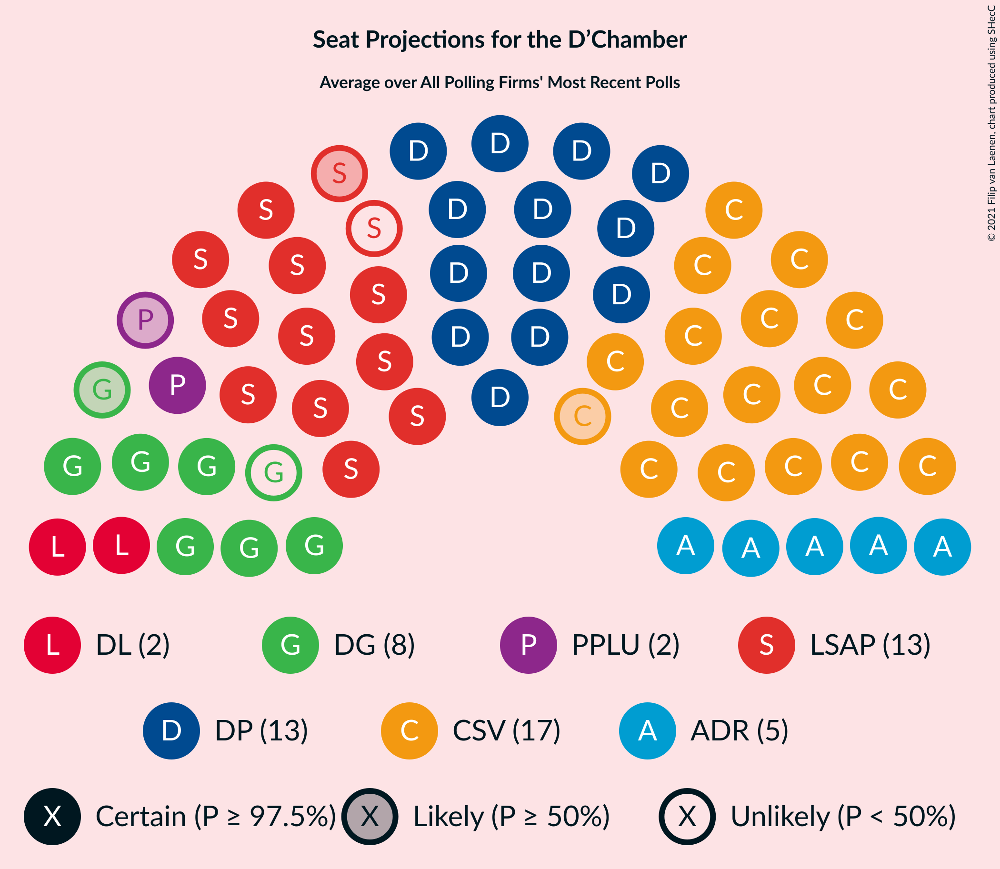

# Poll Average

<a href="#voting-intentions">Voting Intentions</a> | <a href="#seats">Seats</a> | <a href="#coalitions">Coalitions</a> | <a href="#technical-information">Technical Information</a>

## Summary

The table below lists the polls on which the average is based. They are the most recent polls (less than 90 days old) registered and analyzed so far.

| Period     | Polling firm/Commissioner(s) | CSV | LSAP | DP | DG | ADR | DL | PPLU | KPL | PID |
|:----------:|:----------------------------:|:--:|:--:|:--:|:--:|:--:|:--:|:--:|:--:|:--:|
| 14 October 2018 | General Election | 28.3%   21 | 17.6%   10 | 16.9%   12 | 15.1%   9 | 8.3%   4 | 5.5%   2 | 6.4%   2 | 1.3%   0 | 0.0%   0 |
| N/A | Poll Average | 28–32%   19–23 | 14–17%   7–9 | 15–18%   10–13 | 14–18%   8–10 | 9–12%   5–7 | 4–7%   2 | 4–6%   1–2 | N/A   N/A | N/A   N/A |
| [14–23 November 2019](2019-11-23-Kantar.html) | Kantar   Luxemburger Wort and RTL | 28–32%   19–23 | 13–17%   7–9 | 15–18%   10–13 | 14–18%   8–10 | 9–12%   5–7 | 5–7%   2 | 4–7%   1–2 | N/A   N/A | N/A   N/A |
| 14 October 2018 | General Election | 28.3%   21 | 17.6%   10 | 16.9%   12 | 15.1%   9 | 8.3%   4 | 5.5%   2 | 6.4%   2 | 1.3%   0 | 0.0%   0 |

Only polls for which at least the sample size has been published are included in the table above.

**Legend:**
+ **Top half of each row:** Voting intentions (95% confidence interval)
+ **Bottom half of each row:** Seat projections for the D’Chamber (95% confidence interval)
+ **CSV:** Chrëschtlech-Sozial Vollekspartei
+ **LSAP:** Lëtzebuerger Sozialistesch Aarbechterpartei
+ **DP:** Demokratesch Partei
+ **DG:** déi gréng
+ **ADR:** Alternativ Demokratesch Reformpartei
+ **DL:** déi Lénk
+ **PPLU:** Piratepartei Lëtzebuerg
+ **KPL:** Kommunistesch Partei Lëtzebuerg
+ **PID:** Partei fir Integral Demokratie
+ **N/A (single party):** Party not included the published results
+ **N/A (entire row):** Calculation for this opinion poll not started yet

## Voting Intentions

### Confidence Intervals

| Party | Last Result | Median | 80% Confidence Interval | 90% Confidence Interval | 95% Confidence Interval | 99% Confidence Interval |
|:-----:|:-----------:|:------:|:-----------------------:|:-----------------------:|:-----------------------:|:-----------------------:|
| <a href="#chrëschtlech-sozial-vollekspartei">Chrëschtlech-Sozial Vollekspartei</a> | 28.3% | 30.1% | 28.8–31.5% |28.4–31.9% | 28.1–32.2% | 27.4–32.9% |
| <a href="#lëtzebuerger-sozialistesch-aarbechterpartei">Lëtzebuerger Sozialistesch Aarbechterpartei</a> | 17.6% | 15.0% | 14.0–16.1% |13.7–16.4% | 13.5–16.7% | 13.0–17.2% |
| <a href="#demokratesch-partei">Demokratesch Partei</a> | 16.9% | 16.7% | 15.6–17.8% |15.3–18.1% | 15.0–18.4% | 14.5–19.0% |
| <a href="#déi-gréng">déi gréng</a> | 15.1% | 16.0% | 14.9–17.0% |14.6–17.4% | 14.3–17.7% | 13.8–18.2% |
| <a href="#alternativ-demokratesch-reformpartei">Alternativ Demokratesch Reformpartei</a> | 8.3% | 10.4% | 9.5–11.3% |9.3–11.6% | 9.1–11.9% | 8.7–12.3% |
| <a href="#piratepartei-lëtzebuerg">Piratepartei Lëtzebuerg</a> | 6.4% | 5.4% | 4.8–6.1% |4.6–6.3% | 4.4–6.5% | 4.2–6.9% |
| <a href="#déi-lénk">déi Lénk</a> | 5.5% | 5.5% | 4.9–6.2% |4.7–6.4% | 4.5–6.6% | 4.3–7.0% |
| <a href="#kommunistesch-partei-lëtzebuerg">Kommunistesch Partei Lëtzebuerg</a> | 1.3% | N/A | N/A |N/A | N/A | N/A |
| <a href="#partei-fir-integral-demokratie">Partei fir Integral Demokratie</a> | 0.0% | N/A | N/A |N/A | N/A | N/A |

### Chrëschtlech-Sozial Vollekspartei

*For a full overview of the results for this party, see the [Chrëschtlech-Sozial Vollekspartei](party-chrëschtlech-sozialvollekspartei.html) page.*

| Voting Intentions | Probability | Accumulated | Special Marks |
|:-----------------:|:-----------:|:-----------:|:-------------:|
| 25.5–26.5% | 0% | 100% |  |
| 26.5–27.5% | 0.6% | 100% |  |
| 27.5–28.5% | 6% | 99.3% | Last Result |
| 28.5–29.5% | 23% | 93% |  |
| 29.5–30.5% | 36% | 71% | Median |
| 30.5–31.5% | 26% | 35% |  |
| 31.5–32.5% | 8% | 9% |  |
| 32.5–33.5% | 1.2% | 1.2% |  |
| 33.5–34.5% | 0.1% | 0.1% |  |
| 34.5–35.5% | 0% | 0% |  |

### Lëtzebuerger Sozialistesch Aarbechterpartei

*For a full overview of the results for this party, see the [Lëtzebuerger Sozialistesch Aarbechterpartei](party-lëtzebuergersozialisteschaarbechterpartei.html) page.*

| Voting Intentions | Probability | Accumulated | Special Marks |
|:-----------------:|:-----------:|:-----------:|:-------------:|
| 10.5–11.5% | 0% | 100% |  |
| 11.5–12.5% | 0.1% | 100% |  |
| 12.5–13.5% | 3% | 99.9% |  |
| 13.5–14.5% | 25% | 97% |  |
| 14.5–15.5% | 45% | 72% | Median |
| 15.5–16.5% | 23% | 27% |  |
| 16.5–17.5% | 4% | 4% |  |
| 17.5–18.5% | 0.2% | 0.2% | Last Result |
| 18.5–19.5% | 0% | 0% |  |

### Demokratesch Partei

*For a full overview of the results for this party, see the [Demokratesch Partei](party-demokrateschpartei.html) page.*

| Voting Intentions | Probability | Accumulated | Special Marks |
|:-----------------:|:-----------:|:-----------:|:-------------:|
| 12.5–13.5% | 0% | 100% |  |
| 13.5–14.5% | 0.6% | 100% |  |
| 14.5–15.5% | 9% | 99.4% |  |
| 15.5–16.5% | 36% | 90% |  |
| 16.5–17.5% | 39% | 54% | Last Result, Median |
| 17.5–18.5% | 14% | 15% |  |
| 18.5–19.5% | 2% | 2% |  |
| 19.5–20.5% | 0.1% | 0.1% |  |
| 20.5–21.5% | 0% | 0% |  |

### déi gréng

*For a full overview of the results for this party, see the [déi gréng](party-déigréng.html) page.*

| Voting Intentions | Probability | Accumulated | Special Marks |
|:-----------------:|:-----------:|:-----------:|:-------------:|
| 11.5–12.5% | 0% | 100% |  |
| 12.5–13.5% | 0.2% | 100% |  |
| 13.5–14.5% | 4% | 99.8% |  |
| 14.5–15.5% | 27% | 95% | Last Result |
| 15.5–16.5% | 44% | 68% | Median |
| 16.5–17.5% | 21% | 24% |  |
| 17.5–18.5% | 3% | 3% |  |
| 18.5–19.5% | 0.2% | 0.2% |  |
| 19.5–20.5% | 0% | 0% |  |

### Alternativ Demokratesch Reformpartei

*For a full overview of the results for this party, see the [Alternativ Demokratesch Reformpartei](party-alternativdemokrateschreformpartei.html) page.*

| Voting Intentions | Probability | Accumulated | Special Marks |
|:-----------------:|:-----------:|:-----------:|:-------------:|
| 6.5–7.5% | 0% | 100% |  |
| 7.5–8.5% | 0.3% | 100% | Last Result |
| 8.5–9.5% | 11% | 99.7% |  |
| 9.5–10.5% | 47% | 89% | Median |
| 10.5–11.5% | 36% | 42% |  |
| 11.5–12.5% | 6% | 6% |  |
| 12.5–13.5% | 0.2% | 0.2% |  |
| 13.5–14.5% | 0% | 0% |  |

### Piratepartei Lëtzebuerg

*For a full overview of the results for this party, see the [Piratepartei Lëtzebuerg](party-pirateparteilëtzebuerg.html) page.*

| Voting Intentions | Probability | Accumulated | Special Marks |
|:-----------------:|:-----------:|:-----------:|:-------------:|
| 2.5–3.5% | 0% | 100% |  |
| 3.5–4.5% | 4% | 100% |  |
| 4.5–5.5% | 56% | 96% | Median |
| 5.5–6.5% | 38% | 40% | Last Result |
| 6.5–7.5% | 2% | 2% |  |
| 7.5–8.5% | 0% | 0% |  |

### déi Lénk

*For a full overview of the results for this party, see the [déi Lénk](party-déilénk.html) page.*

| Voting Intentions | Probability | Accumulated | Special Marks |
|:-----------------:|:-----------:|:-----------:|:-------------:|
| 2.5–3.5% | 0% | 100% |  |
| 3.5–4.5% | 3% | 100% |  |
| 4.5–5.5% | 50% | 97% | Last Result |
| 5.5–6.5% | 45% | 48% | Median |
| 6.5–7.5% | 3% | 3% |  |
| 7.5–8.5% | 0% | 0% |  |

## Seats

### Confidence Intervals

| Party | Last Result | Median | 80% Confidence Interval | 90% Confidence Interval | 95% Confidence Interval | 99% Confidence Interval |
|:-----:|:-----------:|:------:|:-----------------------:|:-----------------------:|:-----------------------:|:-----------------------:|
| <a href="#chrëschtlech-sozial-vollekspartei">Chrëschtlech-Sozial Vollekspartei</a> | 21 | 21 | 20–22 |19–22 | 19–23 | 18–23 |
| <a href="#lëtzebuerger-sozialistesch-aarbechterpartei">Lëtzebuerger Sozialistesch Aarbechterpartei</a> | 10 | 9 | 8–9 |7–9 | 7–9 | 7–9 |
| <a href="#demokratesch-partei">Demokratesch Partei</a> | 12 | 11 | 10–13 |10–13 | 10–13 | 9–13 |
| <a href="#déi-gréng">déi gréng</a> | 9 | 10 | 8–10 |8–10 | 8–10 | 8–11 |
| <a href="#alternativ-demokratesch-reformpartei">Alternativ Demokratesch Reformpartei</a> | 4 | 6 | 5–7 |5–7 | 5–7 | 4–7 |
| <a href="#piratepartei-lëtzebuerg">Piratepartei Lëtzebuerg</a> | 2 | 2 | 1–2 |1–2 | 1–2 | 1–3 |
| <a href="#déi-lénk">déi Lénk</a> | 2 | 2 | 2 |2 | 2 | 2–3 |
| <a href="#kommunistesch-partei-lëtzebuerg">Kommunistesch Partei Lëtzebuerg</a> | 0 | N/A | N/A |N/A | N/A | N/A |
| <a href="#partei-fir-integral-demokratie">Partei fir Integral Demokratie</a> | 0 | N/A | N/A |N/A | N/A | N/A |

### Chrëschtlech-Sozial Vollekspartei

*For a full overview of the results for this party, see the [Chrëschtlech-Sozial Vollekspartei](party-chrëschtlech-sozialvollekspartei.html) page.*

| Number of Seats | Probability | Accumulated | Special Marks |
|:---------------:|:-----------:|:-----------:|:-------------:|
| 17 | 0.1% | 100% |  |
| 18 | 0.6% | 99.9% |  |
| 19 | 8% | 99.4% |  |
| 20 | 26% | 91% |  |
| 21 | 43% | 65% | Last Result, Median |
| 22 | 18% | 22% |  |
| 23 | 4% | 4% |  |
| 24 | 0.1% | 0.1% |  |
| 25 | 0% | 0% |  |

### Lëtzebuerger Sozialistesch Aarbechterpartei

*For a full overview of the results for this party, see the [Lëtzebuerger Sozialistesch Aarbechterpartei](party-lëtzebuergersozialisteschaarbechterpartei.html) page.*

| Number of Seats | Probability | Accumulated | Special Marks |
|:---------------:|:-----------:|:-----------:|:-------------:|
| 6 | 0.2% | 100% |  |
| 7 | 9% | 99.8% |  |
| 8 | 21% | 91% |  |
| 9 | 70% | 70% | Median |
| 10 | 0.3% | 0.4% | Last Result |
| 11 | 0.1% | 0.1% |  |
| 12 | 0% | 0% |  |

### Demokratesch Partei

*For a full overview of the results for this party, see the [Demokratesch Partei](party-demokrateschpartei.html) page.*

| Number of Seats | Probability | Accumulated | Special Marks |
|:---------------:|:-----------:|:-----------:|:-------------:|
| 8 | 0.4% | 100% |  |
| 9 | 2% | 99.6% |  |
| 10 | 17% | 98% |  |
| 11 | 36% | 80% | Median |
| 12 | 31% | 44% | Last Result |
| 13 | 13% | 13% |  |
| 14 | 0% | 0% |  |

### déi gréng

*For a full overview of the results for this party, see the [déi gréng](party-déigréng.html) page.*

| Number of Seats | Probability | Accumulated | Special Marks |
|:---------------:|:-----------:|:-----------:|:-------------:|
| 8 | 11% | 100% |  |
| 9 | 21% | 89% | Last Result |
| 10 | 68% | 68% | Median |
| 11 | 0.6% | 0.7% |  |
| 12 | 0.1% | 0.2% |  |
| 13 | 0% | 0% |  |

### Alternativ Demokratesch Reformpartei

*For a full overview of the results for this party, see the [Alternativ Demokratesch Reformpartei](party-alternativdemokrateschreformpartei.html) page.*

| Number of Seats | Probability | Accumulated | Special Marks |
|:---------------:|:-----------:|:-----------:|:-------------:|
| 4 | 0.8% | 100% | Last Result |
| 5 | 35% | 99.2% |  |
| 6 | 29% | 64% | Median |
| 7 | 35% | 35% |  |
| 8 | 0% | 0% |  |

### Piratepartei Lëtzebuerg

*For a full overview of the results for this party, see the [Piratepartei Lëtzebuerg](party-pirateparteilëtzebuerg.html) page.*

| Number of Seats | Probability | Accumulated | Special Marks |
|:---------------:|:-----------:|:-----------:|:-------------:|
| 1 | 37% | 100% |  |
| 2 | 61% | 63% | Last Result, Median |
| 3 | 0.9% | 1.4% |  |
| 4 | 0.4% | 0.4% |  |
| 5 | 0% | 0% |  |

### déi Lénk

*For a full overview of the results for this party, see the [déi Lénk](party-déilénk.html) page.*

| Number of Seats | Probability | Accumulated | Special Marks |
|:---------------:|:-----------:|:-----------:|:-------------:|
| 1 | 0.1% | 100% |  |
| 2 | 98% | 99.9% | Last Result, Median |
| 3 | 1.5% | 2% |  |
| 4 | 0% | 0% |  |

## Coalitions

### Confidence Intervals

| Coalition | Last Result | Median | Majority? | 80% Confidence Interval | 90% Confidence Interval | 95% Confidence Interval | 99% Confidence Interval |
|:---------:|:-----------:|:------:|:---------:|:-----------------------:|:-----------------------:|:-----------------------:|:-----------------------:|
| Chrëschtlech-Sozial Vollekspartei – Demokratesch Partei | 33 | 32 | 96% | 31–33 | 31–34 | 30–35 | 30–35 |
| Chrëschtlech-Sozial Vollekspartei – Lëtzebuerger Sozialistesch Aarbechterpartei | 31 | 30 | 11% | 28–31 | 28–31 | 27–32 | 27–32 |
| Lëtzebuerger Sozialistesch Aarbechterpartei – Demokratesch Partei – déi gréng | 31 | 30 | 22% | 28–31 | 28–31 | 27–32 | 27–32 |
| Chrëschtlech-Sozial Vollekspartei | 21 | 21 | 0% | 20–22 | 19–22 | 19–23 | 18–23 |

### Chrëschtlech-Sozial Vollekspartei – Demokratesch Partei

| Number of Seats | Probability | Accumulated | Special Marks |
|:---------------:|:-----------:|:-----------:|:-------------:|
| 29 | 0.4% | 100% |  |
| 30 | 3% | 99.5% |  |
| 31 | 15% | 96% | Majority |
| 32 | 54% | 81% | Median |
| 33 | 18% | 27% | Last Result |
| 34 | 7% | 9% |  |
| 35 | 2% | 3% |  |
| 36 | 0.2% | 0.2% |  |
| 37 | 0% | 0% |  |

### Chrëschtlech-Sozial Vollekspartei – Lëtzebuerger Sozialistesch Aarbechterpartei

| Number of Seats | Probability | Accumulated | Special Marks |
|:---------------:|:-----------:|:-----------:|:-------------:|
| 26 | 0.1% | 100% |  |
| 27 | 4% | 99.9% |  |
| 28 | 15% | 96% |  |
| 29 | 29% | 81% |  |
| 30 | 40% | 52% | Median |
| 31 | 9% | 11% | Last Result, Majority |
| 32 | 3% | 3% |  |
| 33 | 0.1% | 0.1% |  |
| 34 | 0% | 0% |  |

### Lëtzebuerger Sozialistesch Aarbechterpartei – Demokratesch Partei – déi gréng

| Number of Seats | Probability | Accumulated | Special Marks |
|:---------------:|:-----------:|:-----------:|:-------------:|
| 26 | 0.2% | 100% |  |
| 27 | 3% | 99.8% |  |
| 28 | 16% | 97% |  |
| 29 | 31% | 81% |  |
| 30 | 28% | 50% | Median |
| 31 | 18% | 22% | Last Result, Majority |
| 32 | 4% | 4% |  |
| 33 | 0% | 0% |  |

### Chrëschtlech-Sozial Vollekspartei

| Number of Seats | Probability | Accumulated | Special Marks |
|:---------------:|:-----------:|:-----------:|:-------------:|
| 17 | 0.1% | 100% |  |
| 18 | 0.6% | 99.9% |  |
| 19 | 8% | 99.4% |  |
| 20 | 26% | 91% |  |
| 21 | 43% | 65% | Last Result, Median |
| 22 | 18% | 22% |  |
| 23 | 4% | 4% |  |
| 24 | 0.1% | 0.1% |  |
| 25 | 0% | 0% |  |

## Technical Information

+ **Number of polls included in this average:** 1
+ **Lowest number of simulations done in a poll included in this average:** 524,288
+ **Total number of simulations done in the polls included in this average:** 524,288
+ **Error estimate:** 0.90%
