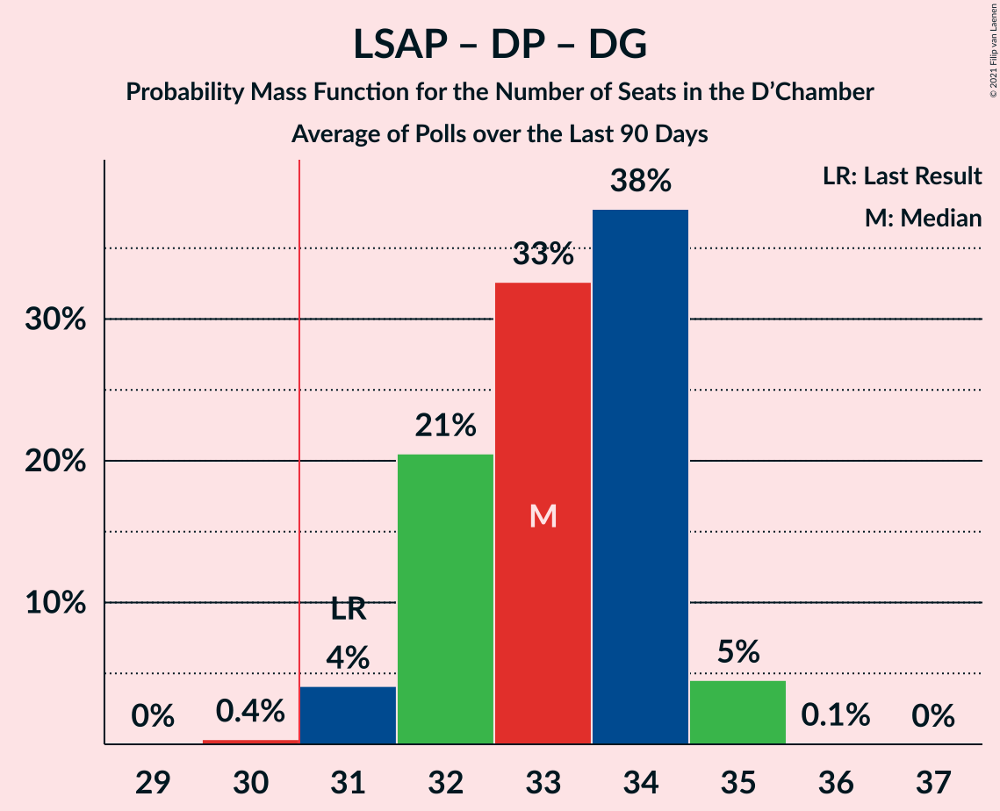

# Poll Average

<a href="#voting-intentions">Voting Intentions</a> | <a href="#seats">Seats</a> | <a href="#coalitions">Coalitions</a> | <a href="#technical-information">Technical Information</a>

## Summary

The table below lists the polls on which the average is based. They are the most recent polls (less than 90 days old) registered and analyzed so far.

| Period     | Polling firm/Commissioner(s) | CSV | LSAP | DP | DG | ADR | DL | PPLU | KPL | PID |
|:----------:|:----------------------------:|:--:|:--:|:--:|:--:|:--:|:--:|:--:|:--:|:--:|
| 14 October 2018 | General Election | 28.3%   21 | 17.6%   10 | 16.9%   12 | 15.1%   9 | 8.3%   4 | 5.5%   2 | 6.4%   2 | 1.3%   0 | 0.0%   0 |
| N/A | Poll Average | 26–30%   17–21 | 15–18%   9–12 | 19–22%   13–16 | 12–15%   8–9 | 7–10%   4–5 | 6–9%   2–4 | 4–6%   1–2 | N/A   N/A | N/A   N/A |
| [8–24 June 2020](2020-06-24-Kantar.html) | Kantar   Luxemburger Wort and RTL | 25–30%   17–21 | 15–18%   9–12 | 19–23%   13–16 | 12–15%   8–9 | 7–10%   4–5 | 6–9%   2–4 | 4–6%   1–2 | N/A   N/A | N/A   N/A |
| 14 October 2018 | General Election | 28.3%   21 | 17.6%   10 | 16.9%   12 | 15.1%   9 | 8.3%   4 | 5.5%   2 | 6.4%   2 | 1.3%   0 | 0.0%   0 |

Only polls for which at least the sample size has been published are included in the table above.

**Legend:**
+ **Top half of each row:** Voting intentions (95% confidence interval)
+ **Bottom half of each row:** Seat projections for the D’Chamber (95% confidence interval)
+ **CSV:** Chrëschtlech-Sozial Vollekspartei
+ **LSAP:** Lëtzebuerger Sozialistesch Aarbechterpartei
+ **DP:** Demokratesch Partei
+ **DG:** déi gréng
+ **ADR:** Alternativ Demokratesch Reformpartei
+ **DL:** déi Lénk
+ **PPLU:** Piratepartei Lëtzebuerg
+ **KPL:** Kommunistesch Partei Lëtzebuerg
+ **PID:** Partei fir Integral Demokratie
+ **N/A (single party):** Party not included the published results
+ **N/A (entire row):** Calculation for this opinion poll not started yet

## Voting Intentions

### Confidence Intervals

| Party | Last Result | Median | 80% Confidence Interval | 90% Confidence Interval | 95% Confidence Interval | 99% Confidence Interval |
|:-----:|:-----------:|:------:|:-----------------------:|:-----------------------:|:-----------------------:|:-----------------------:|
| <a href="#chrëschtlech-sozial-vollekspartei">Chrëschtlech-Sozial Vollekspartei</a> | 28.3% | 27.5% | 26.2–28.9% |25.8–29.3% | 25.5–29.6% | 24.9–30.3% |
| <a href="#lëtzebuerger-sozialistesch-aarbechterpartei">Lëtzebuerger Sozialistesch Aarbechterpartei</a> | 17.6% | 16.4% | 15.3–17.6% |15.0–17.9% | 14.8–18.2% | 14.3–18.7% |
| <a href="#demokratesch-partei">Demokratesch Partei</a> | 16.9% | 20.6% | 19.4–21.8% |19.1–22.2% | 18.8–22.5% | 18.3–23.1% |
| <a href="#déi-gréng">déi gréng</a> | 15.1% | 13.5% | 12.4–14.5% |12.2–14.8% | 11.9–15.1% | 11.5–15.6% |
| <a href="#alternativ-demokratesch-reformpartei">Alternativ Demokratesch Reformpartei</a> | 8.3% | 8.3% | 7.5–9.1% |7.2–9.4% | 7.0–9.6% | 6.7–10.0% |
| <a href="#piratepartei-lëtzebuerg">Piratepartei Lëtzebuerg</a> | 6.4% | 4.8% | 4.2–5.5% |4.0–5.7% | 3.9–5.9% | 3.7–6.2% |
| <a href="#déi-lénk">déi Lénk</a> | 5.5% | 7.3% | 6.6–8.1% |6.4–8.4% | 6.2–8.6% | 5.8–9.0% |
| <a href="#kommunistesch-partei-lëtzebuerg">Kommunistesch Partei Lëtzebuerg</a> | 1.3% | N/A | N/A |N/A | N/A | N/A |
| <a href="#partei-fir-integral-demokratie">Partei fir Integral Demokratie</a> | 0.0% | N/A | N/A |N/A | N/A | N/A |

### Chrëschtlech-Sozial Vollekspartei

*For a full overview of the results for this party, see the [Chrëschtlech-Sozial Vollekspartei](party-chrëschtlech-sozialvollekspartei.html) page.*

| Voting Intentions | Probability | Accumulated | Special Marks |
|:-----------------:|:-----------:|:-----------:|:-------------:|
| 22.5–23.5% | 0% | 100% |  |
| 23.5–24.5% | 0.2% | 100% |  |
| 24.5–25.5% | 3% | 99.8% |  |
| 25.5–26.5% | 15% | 97% |  |
| 26.5–27.5% | 34% | 82% |  |
| 27.5–28.5% | 32% | 48% | Last Result, Median |
| 28.5–29.5% | 14% | 16% |  |
| 29.5–30.5% | 3% | 3% |  |
| 30.5–31.5% | 0.2% | 0.2% |  |
| 31.5–32.5% | 0% | 0% |  |

### Lëtzebuerger Sozialistesch Aarbechterpartei

*For a full overview of the results for this party, see the [Lëtzebuerger Sozialistesch Aarbechterpartei](party-lëtzebuergersozialisteschaarbechterpartei.html) page.*

| Voting Intentions | Probability | Accumulated | Special Marks |
|:-----------------:|:-----------:|:-----------:|:-------------:|
| 12.5–13.5% | 0% | 100% |  |
| 13.5–14.5% | 1.3% | 100% |  |
| 14.5–15.5% | 14% | 98.7% |  |
| 15.5–16.5% | 41% | 85% | Median |
| 16.5–17.5% | 34% | 44% |  |
| 17.5–18.5% | 9% | 10% | Last Result |
| 18.5–19.5% | 0.9% | 0.9% |  |
| 19.5–20.5% | 0% | 0% |  |

### Demokratesch Partei

*For a full overview of the results for this party, see the [Demokratesch Partei](party-demokrateschpartei.html) page.*

| Voting Intentions | Probability | Accumulated | Special Marks |
|:-----------------:|:-----------:|:-----------:|:-------------:|
| 16.5–17.5% | 0% | 100% | Last Result |
| 17.5–18.5% | 1.2% | 100% |  |
| 18.5–19.5% | 12% | 98.7% |  |
| 19.5–20.5% | 34% | 87% |  |
| 20.5–21.5% | 36% | 53% | Median |
| 21.5–22.5% | 14% | 17% |  |
| 22.5–23.5% | 2% | 2% |  |
| 23.5–24.5% | 0.1% | 0.1% |  |
| 24.5–25.5% | 0% | 0% |  |

### déi gréng

*For a full overview of the results for this party, see the [déi gréng](party-déigréng.html) page.*

| Voting Intentions | Probability | Accumulated | Special Marks |
|:-----------------:|:-----------:|:-----------:|:-------------:|
| 9.5–10.5% | 0% | 100% |  |
| 10.5–11.5% | 0.7% | 100% |  |
| 11.5–12.5% | 12% | 99.3% |  |
| 12.5–13.5% | 43% | 87% | Median |
| 13.5–14.5% | 36% | 45% |  |
| 14.5–15.5% | 8% | 9% | Last Result |
| 15.5–16.5% | 0.6% | 0.6% |  |
| 16.5–17.5% | 0% | 0% |  |

### Alternativ Demokratesch Reformpartei

*For a full overview of the results for this party, see the [Alternativ Demokratesch Reformpartei](party-alternativdemokrateschreformpartei.html) page.*

| Voting Intentions | Probability | Accumulated | Special Marks |
|:-----------------:|:-----------:|:-----------:|:-------------:|
| 4.5–5.5% | 0% | 100% |  |
| 5.5–6.5% | 0.2% | 100% |  |
| 6.5–7.5% | 13% | 99.8% |  |
| 7.5–8.5% | 54% | 87% | Last Result, Median |
| 8.5–9.5% | 30% | 33% |  |
| 9.5–10.5% | 3% | 3% |  |
| 10.5–11.5% | 0.1% | 0.1% |  |
| 11.5–12.5% | 0% | 0% |  |

### Piratepartei Lëtzebuerg

*For a full overview of the results for this party, see the [Piratepartei Lëtzebuerg](party-pirateparteilëtzebuerg.html) page.*

| Voting Intentions | Probability | Accumulated | Special Marks |
|:-----------------:|:-----------:|:-----------:|:-------------:|
| 1.5–2.5% | 0% | 100% |  |
| 2.5–3.5% | 0.2% | 100% |  |
| 3.5–4.5% | 28% | 99.8% |  |
| 4.5–5.5% | 63% | 71% | Median |
| 5.5–6.5% | 9% | 9% | Last Result |
| 6.5–7.5% | 0.1% | 0.1% |  |
| 7.5–8.5% | 0% | 0% |  |

### déi Lénk

*For a full overview of the results for this party, see the [déi Lénk](party-déilénk.html) page.*

| Voting Intentions | Probability | Accumulated | Special Marks |
|:-----------------:|:-----------:|:-----------:|:-------------:|
| 4.5–5.5% | 0.1% | 100% | Last Result |
| 5.5–6.5% | 10% | 99.9% |  |
| 6.5–7.5% | 54% | 90% | Median |
| 7.5–8.5% | 33% | 36% |  |
| 8.5–9.5% | 3% | 3% |  |
| 9.5–10.5% | 0% | 0% |  |
| 10.5–11.5% | 0% | 0% |  |

## Seats

### Confidence Intervals

| Party | Last Result | Median | 80% Confidence Interval | 90% Confidence Interval | 95% Confidence Interval | 99% Confidence Interval |
|:-----:|:-----------:|:------:|:-----------------------:|:-----------------------:|:-----------------------:|:-----------------------:|
| <a href="#chrëschtlech-sozial-vollekspartei">Chrëschtlech-Sozial Vollekspartei</a> | 21 | 20 | 17–21 |17–21 | 17–21 | 17–21 |
| <a href="#lëtzebuerger-sozialistesch-aarbechterpartei">Lëtzebuerger Sozialistesch Aarbechterpartei</a> | 10 | 9 | 9–11 |9–11 | 9–12 | 8–12 |
| <a href="#demokratesch-partei">Demokratesch Partei</a> | 12 | 14 | 13–15 |13–15 | 13–16 | 13–17 |
| <a href="#déi-gréng">déi gréng</a> | 9 | 8 | 8 |8 | 8–9 | 7–10 |
| <a href="#alternativ-demokratesch-reformpartei">Alternativ Demokratesch Reformpartei</a> | 4 | 5 | 4–5 |4–5 | 4–5 | 3–6 |
| <a href="#piratepartei-lëtzebuerg">Piratepartei Lëtzebuerg</a> | 2 | 1 | 1–2 |1–2 | 1–2 | 1–2 |
| <a href="#déi-lénk">déi Lénk</a> | 2 | 3 | 2–4 |2–4 | 2–4 | 2–4 |
| <a href="#kommunistesch-partei-lëtzebuerg">Kommunistesch Partei Lëtzebuerg</a> | 0 | N/A | N/A |N/A | N/A | N/A |
| <a href="#partei-fir-integral-demokratie">Partei fir Integral Demokratie</a> | 0 | N/A | N/A |N/A | N/A | N/A |

### Chrëschtlech-Sozial Vollekspartei

*For a full overview of the results for this party, see the [Chrëschtlech-Sozial Vollekspartei](party-chrëschtlech-sozialvollekspartei.html) page.*

| Number of Seats | Probability | Accumulated | Special Marks |
|:---------------:|:-----------:|:-----------:|:-------------:|
| 16 | 0.1% | 100% |  |
| 17 | 12% | 99.9% |  |
| 18 | 12% | 88% |  |
| 19 | 19% | 75% |  |
| 20 | 29% | 56% | Median |
| 21 | 27% | 27% | Last Result |
| 22 | 0.4% | 0.4% |  |
| 23 | 0% | 0% |  |

### Lëtzebuerger Sozialistesch Aarbechterpartei

*For a full overview of the results for this party, see the [Lëtzebuerger Sozialistesch Aarbechterpartei](party-lëtzebuergersozialisteschaarbechterpartei.html) page.*

| Number of Seats | Probability | Accumulated | Special Marks |
|:---------------:|:-----------:|:-----------:|:-------------:|
| 8 | 1.3% | 100% |  |
| 9 | 75% | 98.7% | Median |
| 10 | 13% | 24% | Last Result |
| 11 | 8% | 12% |  |
| 12 | 3% | 3% |  |
| 13 | 0% | 0% |  |

### Demokratesch Partei

*For a full overview of the results for this party, see the [Demokratesch Partei](party-demokrateschpartei.html) page.*

| Number of Seats | Probability | Accumulated | Special Marks |
|:---------------:|:-----------:|:-----------:|:-------------:|
| 12 | 0% | 100% | Last Result |
| 13 | 17% | 100% |  |
| 14 | 53% | 83% | Median |
| 15 | 27% | 31% |  |
| 16 | 2% | 4% |  |
| 17 | 0.9% | 1.3% |  |
| 18 | 0.4% | 0.4% |  |
| 19 | 0% | 0% |  |

### déi gréng

*For a full overview of the results for this party, see the [déi gréng](party-déigréng.html) page.*

| Number of Seats | Probability | Accumulated | Special Marks |
|:---------------:|:-----------:|:-----------:|:-------------:|
| 6 | 0.3% | 100% |  |
| 7 | 0.5% | 99.7% |  |
| 8 | 95% | 99.3% | Median |
| 9 | 3% | 4% | Last Result |
| 10 | 2% | 2% |  |
| 11 | 0% | 0% |  |

### Alternativ Demokratesch Reformpartei

*For a full overview of the results for this party, see the [Alternativ Demokratesch Reformpartei](party-alternativdemokrateschreformpartei.html) page.*

| Number of Seats | Probability | Accumulated | Special Marks |
|:---------------:|:-----------:|:-----------:|:-------------:|
| 2 | 0.1% | 100% |  |
| 3 | 1.4% | 99.9% |  |
| 4 | 48% | 98% | Last Result |
| 5 | 49% | 50% | Median |
| 6 | 1.4% | 2% |  |
| 7 | 0.2% | 0.2% |  |
| 8 | 0% | 0% |  |

### Piratepartei Lëtzebuerg

*For a full overview of the results for this party, see the [Piratepartei Lëtzebuerg](party-pirateparteilëtzebuerg.html) page.*

| Number of Seats | Probability | Accumulated | Special Marks |
|:---------------:|:-----------:|:-----------:|:-------------:|
| 0 | 0.1% | 100% |  |
| 1 | 69% | 99.9% | Median |
| 2 | 30% | 30% | Last Result |
| 3 | 0.2% | 0.2% |  |
| 4 | 0% | 0% |  |

### déi Lénk

*For a full overview of the results for this party, see the [déi Lénk](party-déilénk.html) page.*

| Number of Seats | Probability | Accumulated | Special Marks |
|:---------------:|:-----------:|:-----------:|:-------------:|
| 2 | 15% | 100% | Last Result |
| 3 | 62% | 85% | Median |
| 4 | 24% | 24% |  |
| 5 | 0% | 0% |  |

### Kommunistesch Partei Lëtzebuerg

*For a full overview of the results for this party, see the [Kommunistesch Partei Lëtzebuerg](party-kommunisteschparteilëtzebuerg.html) page.*

### Partei fir Integral Demokratie

*For a full overview of the results for this party, see the [Partei fir Integral Demokratie](party-parteifirintegraldemokratie.html) page.*

## Coalitions

### Confidence Intervals

| Coalition | Last Result | Median | Majority? | 80% Confidence Interval | 90% Confidence Interval | 95% Confidence Interval | 99% Confidence Interval |
|:---------:|:-----------:|:------:|:---------:|:-----------------------:|:-----------------------:|:-----------------------:|:-----------------------:|
| Chrëschtlech-Sozial Vollekspartei – Demokratesch Partei | 33 | 34 | 98.9% | 32–35 | 31–35 | 31–36 | 30–36 |
| Lëtzebuerger Sozialistesch Aarbechterpartei – Demokratesch Partei – déi gréng | 31 | 31 | 88% | 30–33 | 30–34 | 30–34 | 30–35 |
| Chrëschtlech-Sozial Vollekspartei – Lëtzebuerger Sozialistesch Aarbechterpartei | 31 | 29 | 2% | 27–30 | 27–30 | 27–30 | 26–31 |
| Chrëschtlech-Sozial Vollekspartei | 21 | 20 | 0% | 17–21 | 17–21 | 17–21 | 17–21 |

### Chrëschtlech-Sozial Vollekspartei – Demokratesch Partei

| Number of Seats | Probability | Accumulated | Special Marks |
|:---------------:|:-----------:|:-----------:|:-------------:|
| 30 | 1.1% | 100% |  |
| 31 | 5% | 98.9% | Majority |
| 32 | 11% | 94% |  |
| 33 | 24% | 82% | Last Result |
| 34 | 28% | 58% | Median |
| 35 | 27% | 30% |  |
| 36 | 3% | 3% |  |
| 37 | 0% | 0% |  |

### Lëtzebuerger Sozialistesch Aarbechterpartei – Demokratesch Partei – déi gréng

| Number of Seats | Probability | Accumulated | Special Marks |
|:---------------:|:-----------:|:-----------:|:-------------:|
| 30 | 12% | 100% |  |
| 31 | 42% | 88% | Last Result, Median, Majority |
| 32 | 26% | 46% |  |
| 33 | 14% | 20% |  |
| 34 | 5% | 6% |  |
| 35 | 1.0% | 1.0% |  |
| 36 | 0.1% | 0.1% |  |
| 37 | 0% | 0% |  |

### Chrëschtlech-Sozial Vollekspartei – Lëtzebuerger Sozialistesch Aarbechterpartei

| Number of Seats | Probability | Accumulated | Special Marks |
|:---------------:|:-----------:|:-----------:|:-------------:|
| 26 | 2% | 100% |  |
| 27 | 11% | 98% |  |
| 28 | 23% | 87% |  |
| 29 | 31% | 64% | Median |
| 30 | 31% | 33% |  |
| 31 | 2% | 2% | Last Result, Majority |
| 32 | 0.3% | 0.3% |  |
| 33 | 0% | 0% |  |

### Chrëschtlech-Sozial Vollekspartei

| Number of Seats | Probability | Accumulated | Special Marks |
|:---------------:|:-----------:|:-----------:|:-------------:|
| 16 | 0.1% | 100% |  |
| 17 | 12% | 99.9% |  |
| 18 | 12% | 88% |  |
| 19 | 19% | 75% |  |
| 20 | 29% | 56% | Median |
| 21 | 27% | 27% | Last Result |
| 22 | 0.4% | 0.4% |  |
| 23 | 0% | 0% |  |

## Technical Information

+ **Number of polls included in this average:** 1
+ **Lowest number of simulations done in a poll included in this average:** 1,048,576
+ **Total number of simulations done in the polls included in this average:** 1,048,576
+ **Error estimate:** 0.41%
