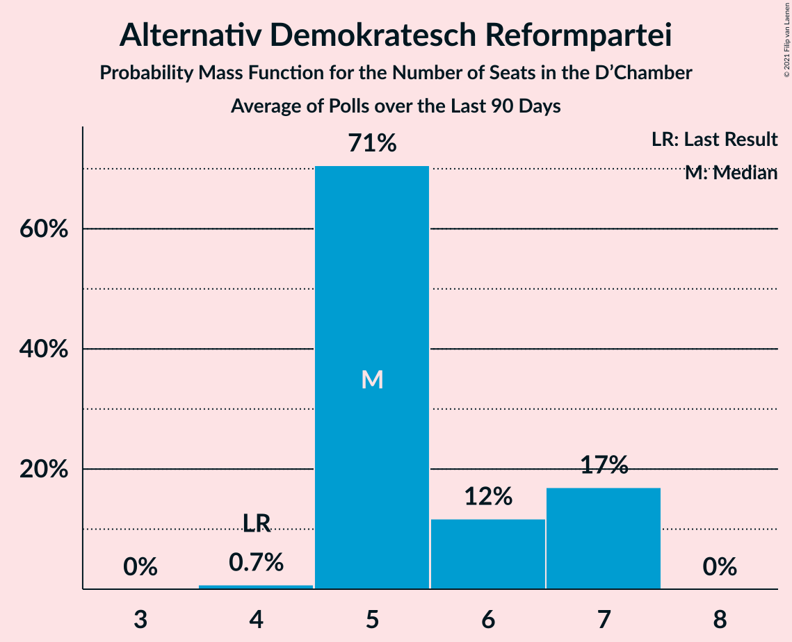

# Poll Average

<a href="#voting-intentions">Voting Intentions</a> | <a href="#seats">Seats</a> | <a href="#coalitions">Coalitions</a> | <a href="#technical-information">Technical Information</a>

## Summary

The table below lists the polls on which the average is based. They are the most recent polls (less than 90 days old) registered and analyzed so far.

| Period     | Polling firm/Commissioner(s) | CSV | LSAP | DP | DG | ADR | DL | PPLU | KPL | PID |
|:----------:|:----------------------------:|:--:|:--:|:--:|:--:|:--:|:--:|:--:|:--:|:--:|
| 20 October 2013 | General Election | 33.7%   23 | 20.3%   13 | 18.2%   13 | 10.1%   6 | 6.6%   3 | 4.9%   2 | 2.9%   0 | 1.6%   0 | 1.5%   0 |
| N/A | Poll Average | 42–49%   29–35 | 12–17%   7–9 | 19–25%   12–17 | 7–11%   2–6 | 2–4%   0–1 | 2–4%   0–1 | 1–3%   0 | N/A   N/A | N/A   N/A |
| [26 September–1 October 2018](2018-10-01-TNS.html) | TNS   Luxemburger Wort and RTL | 42–49%   29–35 | 12–17%   7–9 | 19–25%   12–17 | 7–11%   2–6 | 2–4%   0–1 | 2–4%   0–1 | 1–3%   0 | N/A   N/A | N/A   N/A |
| 20 October 2013 | General Election | 33.7%   23 | 20.3%   13 | 18.2%   13 | 10.1%   6 | 6.6%   3 | 4.9%   2 | 2.9%   0 | 1.6%   0 | 1.5%   0 |

Only polls for which at least the sample size has been published are included in the table above.

**Legend:**
+ **Top half of each row:** Voting intentions (95% confidence interval)
+ **Bottom half of each row:** Seat projections for the D’Chamber (95% confidence interval)
+ **CSV:** Chrëschtlech-Sozial Vollekspartei
+ **LSAP:** Lëtzebuerger Sozialistesch Aarbechterpartei
+ **DP:** Demokratesch Partei
+ **DG:** déi gréng
+ **ADR:** Alternativ Demokratesch Reformpartei
+ **DL:** Déi Lénk
+ **PPLU:** Piratepartei Lëtzebuerg
+ **KPL:** Kommunistesch Partei Lëtzebuerg
+ **PID:** Partei fir Integral Demokratie
+ **N/A (single party):** Party not included the published results
+ **N/A (entire row):** Calculation for this opinion poll not started yet

## Voting Intentions

### Confidence Intervals

| Party | Last Result | Median | 80% Confidence Interval | 90% Confidence Interval | 95% Confidence Interval | 99% Confidence Interval |
|:-----:|:-----------:|:------:|:-----------------------:|:-----------------------:|:-----------------------:|:-----------------------:|
| <a href="#chrëschtlech-sozial-vollekspartei">Chrëschtlech-Sozial Vollekspartei</a> | 33.7% | 45.7% | 43.3–48.0% |42.7–48.7% | 42.1–49.3% | 41.0–50.4% |
| <a href="#lëtzebuerger-sozialistesch-aarbechterpartei">Lëtzebuerger Sozialistesch Aarbechterpartei</a> | 20.3% | 14.3% | 12.7–16.0% |12.3–16.5% | 11.9–17.0% | 11.2–17.9% |
| <a href="#demokratesch-partei">Demokratesch Partei</a> | 18.2% | 21.5% | 19.6–23.5% |19.1–24.1% | 18.6–24.6% | 17.8–25.6% |
| <a href="#déi-gréng">déi gréng</a> | 10.1% | 8.6% | 7.4–10.0% |7.0–10.4% | 6.7–10.8% | 6.2–11.5% |
| <a href="#alternativ-demokratesch-reformpartei">Alternativ Demokratesch Reformpartei</a> | 6.6% | 2.9% | 2.2–3.8% |2.0–4.1% | 1.9–4.3% | 1.6–4.8% |
| <a href="#déi-lénk">Déi Lénk</a> | 4.9% | 2.9% | 2.2–3.8% |2.0–4.1% | 1.9–4.3% | 1.6–4.8% |
| <a href="#piratepartei-lëtzebuerg">Piratepartei Lëtzebuerg</a> | 2.9% | 1.6% | 1.1–2.2% |0.9–2.5% | 0.8–2.7% | 0.7–3.1% |
| <a href="#kommunistesch-partei-lëtzebuerg">Kommunistesch Partei Lëtzebuerg</a> | 1.6% | N/A | N/A |N/A | N/A | N/A |
| <a href="#partei-fir-integral-demokratie">Partei fir Integral Demokratie</a> | 1.5% | N/A | N/A |N/A | N/A | N/A |

### Chrëschtlech-Sozial Vollekspartei

*For a full overview of the results for this party, see the [Chrëschtlech-Sozial Vollekspartei](party-chrëschtlech-sozialvollekspartei.html) page.*

| Voting Intentions | Probability | Accumulated | Special Marks |
|:-----------------:|:-----------:|:-----------:|:-------------:|
| 33.5–34.5% | 0% | 100% | Last Result |
| 34.5–35.5% | 0% | 100% |  |
| 35.5–36.5% | 0% | 100% |  |
| 36.5–37.5% | 0% | 100% |  |
| 37.5–38.5% | 0% | 100% |  |
| 38.5–39.5% | 0% | 100% |  |
| 39.5–40.5% | 0.2% | 100% |  |
| 40.5–41.5% | 1.0% | 99.8% |  |
| 41.5–42.5% | 3% | 98.8% |  |
| 42.5–43.5% | 8% | 96% |  |
| 43.5–44.5% | 15% | 88% |  |
| 44.5–45.5% | 21% | 73% |  |
| 45.5–46.5% | 21% | 52% | Median |
| 46.5–47.5% | 16% | 31% |  |
| 47.5–48.5% | 9% | 15% |  |
| 48.5–49.5% | 4% | 6% |  |
| 49.5–50.5% | 1.3% | 2% |  |
| 50.5–51.5% | 0.3% | 0.4% |  |
| 51.5–52.5% | 0.1% | 0.1% |  |
| 52.5–53.5% | 0% | 0% |  |

### Lëtzebuerger Sozialistesch Aarbechterpartei

*For a full overview of the results for this party, see the [Lëtzebuerger Sozialistesch Aarbechterpartei](party-lëtzebuergersozialisteschaarbechterpartei.html) page.*

| Voting Intentions | Probability | Accumulated | Special Marks |
|:-----------------:|:-----------:|:-----------:|:-------------:|
| 8.5–9.5% | 0% | 100% |  |
| 9.5–10.5% | 0.1% | 100% |  |
| 10.5–11.5% | 1.0% | 99.9% |  |
| 11.5–12.5% | 6% | 98.9% |  |
| 12.5–13.5% | 19% | 92% |  |
| 13.5–14.5% | 30% | 73% | Median |
| 14.5–15.5% | 25% | 43% |  |
| 15.5–16.5% | 13% | 18% |  |
| 16.5–17.5% | 4% | 5% |  |
| 17.5–18.5% | 0.8% | 0.9% |  |
| 18.5–19.5% | 0.1% | 0.1% |  |
| 19.5–20.5% | 0% | 0% | Last Result |

### Demokratesch Partei

*For a full overview of the results for this party, see the [Demokratesch Partei](party-demokrateschpartei.html) page.*

| Voting Intentions | Probability | Accumulated | Special Marks |
|:-----------------:|:-----------:|:-----------:|:-------------:|
| 15.5–16.5% | 0% | 100% |  |
| 16.5–17.5% | 0.3% | 100% |  |
| 17.5–18.5% | 2% | 99.7% | Last Result |
| 18.5–19.5% | 7% | 98% |  |
| 19.5–20.5% | 17% | 91% |  |
| 20.5–21.5% | 25% | 74% |  |
| 21.5–22.5% | 24% | 49% | Median |
| 22.5–23.5% | 15% | 25% |  |
| 23.5–24.5% | 7% | 9% |  |
| 24.5–25.5% | 2% | 3% |  |
| 25.5–26.5% | 0.5% | 0.5% |  |
| 26.5–27.5% | 0.1% | 0.1% |  |
| 27.5–28.5% | 0% | 0% |  |

### déi gréng

*For a full overview of the results for this party, see the [déi gréng](party-déigréng.html) page.*

| Voting Intentions | Probability | Accumulated | Special Marks |
|:-----------------:|:-----------:|:-----------:|:-------------:|
| 4.5–5.5% | 0% | 100% |  |
| 5.5–6.5% | 1.4% | 100% |  |
| 6.5–7.5% | 12% | 98.6% |  |
| 7.5–8.5% | 33% | 86% |  |
| 8.5–9.5% | 34% | 53% | Median |
| 9.5–10.5% | 15% | 19% | Last Result |
| 10.5–11.5% | 4% | 4% |  |
| 11.5–12.5% | 0.5% | 0.5% |  |
| 12.5–13.5% | 0% | 0% |  |

### Alternativ Demokratesch Reformpartei

*For a full overview of the results for this party, see the [Alternativ Demokratesch Reformpartei](party-alternativdemokrateschreformpartei.html) page.*

| Voting Intentions | Probability | Accumulated | Special Marks |
|:-----------------:|:-----------:|:-----------:|:-------------:|
| 0.0–0.5% | 0% | 100% |  |
| 0.5–1.5% | 0.3% | 100% |  |
| 1.5–2.5% | 25% | 99.7% |  |
| 2.5–3.5% | 57% | 75% | Median |
| 3.5–4.5% | 16% | 18% |  |
| 4.5–5.5% | 1.2% | 1.2% |  |
| 5.5–6.5% | 0% | 0% |  |
| 6.5–7.5% | 0% | 0% | Last Result |

### Déi Lénk

*For a full overview of the results for this party, see the [Déi Lénk](party-déilénk.html) page.*

| Voting Intentions | Probability | Accumulated | Special Marks |
|:-----------------:|:-----------:|:-----------:|:-------------:|
| 0.0–0.5% | 0% | 100% |  |
| 0.5–1.5% | 0.3% | 100% |  |
| 1.5–2.5% | 25% | 99.7% |  |
| 2.5–3.5% | 57% | 75% | Median |
| 3.5–4.5% | 16% | 18% |  |
| 4.5–5.5% | 1.2% | 1.2% | Last Result |
| 5.5–6.5% | 0% | 0% |  |

### Piratepartei Lëtzebuerg

*For a full overview of the results for this party, see the [Piratepartei Lëtzebuerg](party-pirateparteilëtzebuerg.html) page.*

| Voting Intentions | Probability | Accumulated | Special Marks |
|:-----------------:|:-----------:|:-----------:|:-------------:|
| 0.0–0.5% | 0.1% | 100% |  |
| 0.5–1.5% | 47% | 99.9% |  |
| 1.5–2.5% | 49% | 52% | Median |
| 2.5–3.5% | 4% | 4% | Last Result |
| 3.5–4.5% | 0.1% | 0.1% |  |
| 4.5–5.5% | 0% | 0% |  |

## Seats

### Confidence Intervals

| Party | Last Result | Median | 80% Confidence Interval | 90% Confidence Interval | 95% Confidence Interval | 99% Confidence Interval |
|:-----:|:-----------:|:------:|:-----------------------:|:-----------------------:|:-----------------------:|:-----------------------:|
| <a href="#chrëschtlech-sozial-vollekspartei">Chrëschtlech-Sozial Vollekspartei</a> | 23 | 32 | 30–34 |29–34 | 29–35 | 28–36 |
| <a href="#lëtzebuerger-sozialistesch-aarbechterpartei">Lëtzebuerger Sozialistesch Aarbechterpartei</a> | 13 | 8 | 7–9 |7–9 | 7–9 | 5–11 |
| <a href="#demokratesch-partei">Demokratesch Partei</a> | 13 | 15 | 13–16 |12–16 | 12–17 | 11–18 |
| <a href="#déi-gréng">déi gréng</a> | 6 | 5 | 2–6 |2–6 | 2–6 | 2–7 |
| <a href="#alternativ-demokratesch-reformpartei">Alternativ Demokratesch Reformpartei</a> | 3 | 0 | 0–1 |0–1 | 0–1 | 0–1 |
| <a href="#déi-lénk">Déi Lénk</a> | 2 | 0 | 0–1 |0–1 | 0–1 | 0–2 |
| <a href="#piratepartei-lëtzebuerg">Piratepartei Lëtzebuerg</a> | 0 | 0 | 0 |0 | 0 | 0 |
| <a href="#kommunistesch-partei-lëtzebuerg">Kommunistesch Partei Lëtzebuerg</a> | 0 | N/A | N/A |N/A | N/A | N/A |
| <a href="#partei-fir-integral-demokratie">Partei fir Integral Demokratie</a> | 0 | N/A | N/A |N/A | N/A | N/A |

### Chrëschtlech-Sozial Vollekspartei

*For a full overview of the results for this party, see the [Chrëschtlech-Sozial Vollekspartei](party-chrëschtlech-sozialvollekspartei.html) page.*

| Number of Seats | Probability | Accumulated | Special Marks |
|:---------------:|:-----------:|:-----------:|:-------------:|
| 23 | 0% | 100% | Last Result |
| 24 | 0% | 100% |  |
| 25 | 0% | 100% |  |
| 26 | 0% | 100% |  |
| 27 | 0.1% | 100% |  |
| 28 | 0.5% | 99.8% |  |
| 29 | 5% | 99.3% |  |
| 30 | 10% | 94% |  |
| 31 | 14% | 84% | Majority |
| 32 | 41% | 70% | Median |
| 33 | 16% | 29% |  |
| 34 | 9% | 13% |  |
| 35 | 4% | 5% |  |
| 36 | 0.6% | 0.8% |  |
| 37 | 0.2% | 0.2% |  |
| 38 | 0% | 0% |  |

### Lëtzebuerger Sozialistesch Aarbechterpartei

*For a full overview of the results for this party, see the [Lëtzebuerger Sozialistesch Aarbechterpartei](party-lëtzebuergersozialisteschaarbechterpartei.html) page.*

| Number of Seats | Probability | Accumulated | Special Marks |
|:---------------:|:-----------:|:-----------:|:-------------:|
| 5 | 0.6% | 100% |  |
| 6 | 2% | 99.4% |  |
| 7 | 43% | 98% |  |
| 8 | 18% | 55% | Median |
| 9 | 35% | 37% |  |
| 10 | 1.2% | 2% |  |
| 11 | 1.1% | 1.1% |  |
| 12 | 0% | 0% |  |
| 13 | 0% | 0% | Last Result |

### Demokratesch Partei

*For a full overview of the results for this party, see the [Demokratesch Partei](party-demokrateschpartei.html) page.*

| Number of Seats | Probability | Accumulated | Special Marks |
|:---------------:|:-----------:|:-----------:|:-------------:|
| 11 | 1.5% | 100% |  |
| 12 | 4% | 98.5% |  |
| 13 | 12% | 94% | Last Result |
| 14 | 11% | 82% |  |
| 15 | 26% | 71% | Median |
| 16 | 42% | 45% |  |
| 17 | 2% | 3% |  |
| 18 | 0.7% | 0.8% |  |
| 19 | 0.1% | 0.1% |  |
| 20 | 0% | 0% |  |

### déi gréng

*For a full overview of the results for this party, see the [déi gréng](party-déigréng.html) page.*

| Number of Seats | Probability | Accumulated | Special Marks |
|:---------------:|:-----------:|:-----------:|:-------------:|
| 2 | 11% | 100% |  |
| 3 | 18% | 89% |  |
| 4 | 11% | 72% |  |
| 5 | 46% | 60% | Median |
| 6 | 11% | 14% | Last Result |
| 7 | 2% | 2% |  |
| 8 | 0.1% | 0.1% |  |
| 9 | 0% | 0% |  |

### Alternativ Demokratesch Reformpartei

*For a full overview of the results for this party, see the [Alternativ Demokratesch Reformpartei](party-alternativdemokrateschreformpartei.html) page.*

| Number of Seats | Probability | Accumulated | Special Marks |
|:---------------:|:-----------:|:-----------:|:-------------:|
| 0 | 65% | 100% | Median |
| 1 | 35% | 35% |  |
| 2 | 0% | 0% |  |
| 3 | 0% | 0% | Last Result |

### Déi Lénk

*For a full overview of the results for this party, see the [Déi Lénk](party-déilénk.html) page.*

| Number of Seats | Probability | Accumulated | Special Marks |
|:---------------:|:-----------:|:-----------:|:-------------:|
| 0 | 57% | 100% | Median |
| 1 | 41% | 43% |  |
| 2 | 2% | 2% | Last Result |
| 3 | 0% | 0% |  |

### Piratepartei Lëtzebuerg

*For a full overview of the results for this party, see the [Piratepartei Lëtzebuerg](party-pirateparteilëtzebuerg.html) page.*

| Number of Seats | Probability | Accumulated | Special Marks |
|:---------------:|:-----------:|:-----------:|:-------------:|
| 0 | 99.9% | 100% | Last Result, Median |
| 1 | 0.1% | 0.1% |  |
| 2 | 0% | 0% |  |

## Coalitions

### Confidence Intervals

| Coalition | Last Result | Median | Majority? | 80% Confidence Interval | 90% Confidence Interval | 95% Confidence Interval | 99% Confidence Interval |
|:---------:|:-----------:|:------:|:---------:|:-----------------------:|:-----------------------:|:-----------------------:|:-----------------------:|
| Chrëschtlech-Sozial Vollekspartei – Demokratesch Partei | 36 | 47 | 100% | 45–49 | 44–49 | 44–49 | 43–50 |
| Chrëschtlech-Sozial Vollekspartei – Lëtzebuerger Sozialistesch Aarbechterpartei | 36 | 40 | 100% | 38–42 | 37–42 | 37–43 | 36–44 |
| Chrëschtlech-Sozial Vollekspartei | 23 | 32 | 84% | 30–34 | 29–34 | 29–35 | 28–36 |
| Lëtzebuerger Sozialistesch Aarbechterpartei – Demokratesch Partei – déi gréng | 32 | 27 | 0.9% | 25–29 | 25–30 | 24–30 | 23–31 |

### Chrëschtlech-Sozial Vollekspartei – Demokratesch Partei

| Number of Seats | Probability | Accumulated | Special Marks |
|:---------------:|:-----------:|:-----------:|:-------------:|
| 36 | 0% | 100% | Last Result |
| 37 | 0% | 100% |  |
| 38 | 0% | 100% |  |
| 39 | 0% | 100% |  |
| 40 | 0% | 100% |  |
| 41 | 0% | 100% |  |
| 42 | 0.2% | 100% |  |
| 43 | 1.4% | 99.8% |  |
| 44 | 5% | 98% |  |
| 45 | 12% | 94% |  |
| 46 | 18% | 82% |  |
| 47 | 26% | 64% | Median |
| 48 | 28% | 39% |  |
| 49 | 9% | 11% |  |
| 50 | 2% | 2% |  |
| 51 | 0.2% | 0.3% |  |
| 52 | 0% | 0% |  |

### Chrëschtlech-Sozial Vollekspartei – Lëtzebuerger Sozialistesch Aarbechterpartei

| Number of Seats | Probability | Accumulated | Special Marks |
|:---------------:|:-----------:|:-----------:|:-------------:|
| 35 | 0.1% | 100% |  |
| 36 | 1.4% | 99.8% | Last Result |
| 37 | 6% | 98% |  |
| 38 | 11% | 93% |  |
| 39 | 21% | 82% |  |
| 40 | 24% | 61% | Median |
| 41 | 26% | 37% |  |
| 42 | 6% | 11% |  |
| 43 | 3% | 4% |  |
| 44 | 2% | 2% |  |
| 45 | 0.2% | 0.2% |  |
| 46 | 0.1% | 0.1% |  |
| 47 | 0% | 0% |  |

### Chrëschtlech-Sozial Vollekspartei

| Number of Seats | Probability | Accumulated | Special Marks |
|:---------------:|:-----------:|:-----------:|:-------------:|
| 23 | 0% | 100% | Last Result |
| 24 | 0% | 100% |  |
| 25 | 0% | 100% |  |
| 26 | 0% | 100% |  |
| 27 | 0.1% | 100% |  |
| 28 | 0.5% | 99.8% |  |
| 29 | 5% | 99.3% |  |
| 30 | 10% | 94% |  |
| 31 | 14% | 84% | Majority |
| 32 | 41% | 70% | Median |
| 33 | 16% | 29% |  |
| 34 | 9% | 13% |  |
| 35 | 4% | 5% |  |
| 36 | 0.6% | 0.8% |  |
| 37 | 0.2% | 0.2% |  |
| 38 | 0% | 0% |  |

### Lëtzebuerger Sozialistesch Aarbechterpartei – Demokratesch Partei – déi gréng

| Number of Seats | Probability | Accumulated | Special Marks |
|:---------------:|:-----------:|:-----------:|:-------------:|
| 22 | 0.1% | 100% |  |
| 23 | 0.8% | 99.9% |  |
| 24 | 3% | 99.1% |  |
| 25 | 9% | 96% |  |
| 26 | 10% | 87% |  |
| 27 | 35% | 77% |  |
| 28 | 25% | 42% | Median |
| 29 | 11% | 17% |  |
| 30 | 5% | 6% |  |
| 31 | 0.7% | 0.9% | Majority |
| 32 | 0.2% | 0.2% | Last Result |
| 33 | 0% | 0% |  |

## Technical Information

+ **Number of polls included in this average:** 1
+ **Lowest number of simulations done in a poll included in this average:** 1,048,576
+ **Total number of simulations done in the polls included in this average:** 1,048,576
+ **Error estimate:** 1.40%
