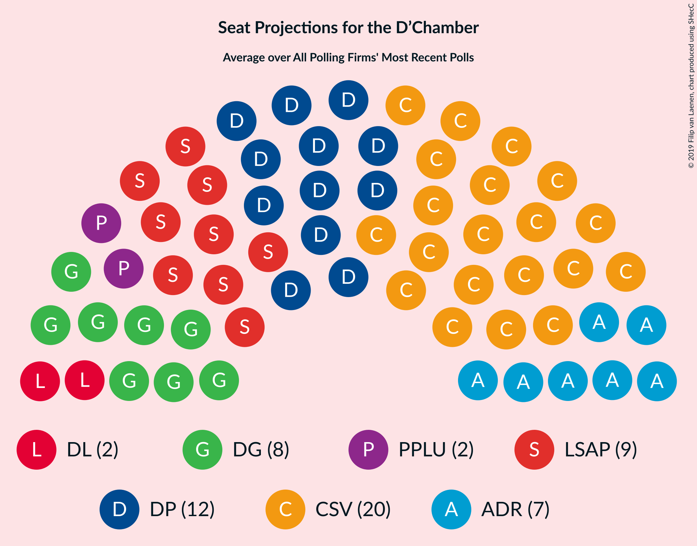

# Overview

The table below lists the most recent polls (less than 90 days old) registered and analyzed so far.

| Period     | Polling firm/Commissioner(s) | CSV | LSAP | DP | DG | ADR | DL | PPLU | KPL | PID |
|:----------:|:----------------------------:|:--:|:--:|:--:|:--:|:--:|:--:|:--:|:--:|:--:|
| 14 October 2018 | General Election | 28.3%   21 | 17.6%   10 | 16.9%   12 | 15.1%   9 | 8.3%   4 | 5.5%   2 | 6.4%   2 | 1.3%   0 | 0.0%   0 |
| N/A | [Poll Average](average.html) | 24–28%   16–19 | 18–22%   11–13 | 18–22%   13–15 | 10–13%   6–8 | 8–11%   5–7 | 5–7%   2–3 | 5–7%   1–3 | 1%   0 | N/A   N/A |
| [10–24 November 2020](2020-11-24-TNSIlresandKantarPublic.html) | TNS Ilres and Kantar Public   Luxemburger Wort and RTL | 24–28%   16–19 | 18–22%   11–13 | 18–22%   13–15 | 10–13%   6–8 | 8–11%   5–7 | 5–7%   2–3 | 5–7%   1–3 | 1%   0 | N/A   N/A |
| 14 October 2018 | General Election | 28.3%   21 | 17.6%   10 | 16.9%   12 | 15.1%   9 | 8.3%   4 | 5.5%   2 | 6.4%   2 | 1.3%   0 | 0.0%   0 |

Only polls for which at least the sample size has been published are included in the table above.

**Legend:**
+ **Top half of each row:** Voting intentions (95% confidence interval)
+ **Bottom half of each row:** Seat projections for the D’Chamber (95% confidence interval)
+ **CSV:** Chrëschtlech-Sozial Vollekspartei
+ **LSAP:** Lëtzebuerger Sozialistesch Aarbechterpartei
+ **DP:** Demokratesch Partei
+ **DG:** déi gréng
+ **ADR:** Alternativ Demokratesch Reformpartei
+ **DL:** déi Lénk
+ **PPLU:** Piratepartei Lëtzebuerg
+ **KPL:** Kommunistesch Partei Lëtzebuerg
+ **PID:** Partei fir Integral Demokratie
+ **N/A (single party):** Party not included the published results
+ **N/A (entire row):** Calculation for this opinion poll not started yet

