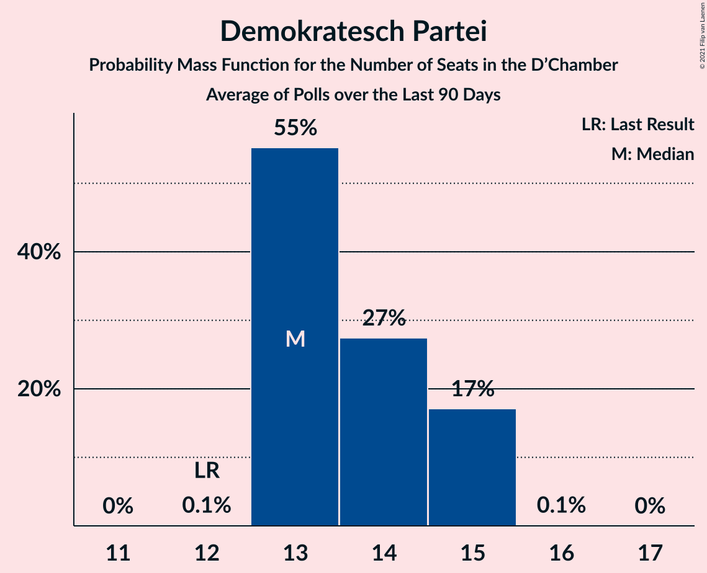

# Demokratesch Partei

<a href="#voting-intentions">Voting Intentions</a> | <a href="#seats">Seats</a>

## Voting Intentions

Last result: **18.2%** (General Election of 20 October 2013)

### Confidence Intervals

| Period     | Polling firm/Commissioner(s) | Median | 80% Confidence Interval | 90% Confidence Interval | 95% Confidence Interval | 99% Confidence Interval |
|:----------:|:----------------:|:-----------:|:-----------------------:|:-----------------------:|:-----------------------:|:-----------------------:|
| N/A | [Poll Average](average.html) | 21.5% | 19.6–23.5% | 19.1–24.1% | 18.6–24.6% | 17.8–25.6% |
| [26 September–1 October 2018](2018-10-01-TNS.html) | TNS   Luxemburger Wort and RTL | 21.5% | 19.6–23.5% | 19.1–24.1% | 18.6–24.6% | 17.8–25.6% |
| [1 December 2017–31 May 2018](2018-05-31-TNS.html) | TNS   Luxemburger Wort and RTL | 17.0% | 16.2–17.8% | 16.0–18.1% | 15.8–18.3% | 15.4–18.7% |
| [1 December 2017](2017-12-01-TNS.html) | TNS   Luxemburger Wort and RTL | 10.0% | 9.2–11.0% | 8.9–11.2% | 8.7–11.5% | 8.3–12.0% |
| [9–19 October 2017](2017-10-19-Ifop.html) | Ifop   Tageblatt | 13.1% | 11.7–14.7% | 11.3–15.1% | 10.9–15.5% | 10.3–16.3% |

### Probability Mass Function

The following table shows the probability mass function per percentage block of voting intentions for the [poll average](average.html) for Demokratesch Partei.

| Voting Intentions | Probability | Accumulated | Special Marks |
|:-----------------:|:-----------:|:-----------:|:-------------:|
| 15.5–16.5% | 0% | 100% |  |
| 16.5–17.5% | 0.3% | 100% |  |
| 17.5–18.5% | 2% | 99.7% | Last Result |
| 18.5–19.5% | 7% | 98% |  |
| 19.5–20.5% | 17% | 91% |  |
| 20.5–21.5% | 25% | 74% |  |
| 21.5–22.5% | 24% | 49% | Median |
| 22.5–23.5% | 15% | 25% |  |
| 23.5–24.5% | 7% | 9% |  |
| 24.5–25.5% | 2% | 3% |  |
| 25.5–26.5% | 0.5% | 0.5% |  |
| 26.5–27.5% | 0.1% | 0.1% |  |
| 27.5–28.5% | 0% | 0% |  |

## Seats

Last result: **13** seats (General Election of 20 October 2013)

### Confidence Intervals

| Period     | Polling firm/Commissioner(s) | Median | 80% Confidence Interval | 90% Confidence Interval | 95% Confidence Interval | 99% Confidence Interval |
|:----------:|:----------------:|:------:|:-----------------------:|:-----------------------:|:-----------------------:|:-----------------------:|
| N/A | [Poll Average](average.html) | 15 | 13–16 | 12–16 | 12–17 | 11–18 |
| [26 September–1 October 2018](2018-10-01-TNS.html) | TNS   Luxemburger Wort and RTL | 15 | 13–16 | 12–16 | 12–17 | 11–18 |
| [1 December 2017–31 May 2018](2018-05-31-TNS.html) | TNS   Luxemburger Wort and RTL | 11 | 10–11 | 10–11 | 10–11 | 9–11 |
| [1 December 2017](2017-12-01-TNS.html) | TNS   Luxemburger Wort and RTL | 6 | 5–8 | 5–9 | 5–9 | 5–9 |
| [9–19 October 2017](2017-10-19-Ifop.html) | Ifop   Tageblatt | 9 | 8–10 | 7–10 | 7–11 | 6–11 |

### Probability Mass Function

The following table shows the probability mass function per seat for the [poll average](average.html) for Demokratesch Partei.

| Number of Seats | Probability | Accumulated | Special Marks |
|:---------------:|:-----------:|:-----------:|:-------------:|
| 11 | 1.5% | 100% |  |
| 12 | 4% | 98.5% |  |
| 13 | 12% | 94% | Last Result |
| 14 | 11% | 82% |  |
| 15 | 26% | 71% | Median |
| 16 | 42% | 45% |  |
| 17 | 2% | 3% |  |
| 18 | 0.7% | 0.8% |  |
| 19 | 0.1% | 0.1% |  |
| 20 | 0% | 0% |  |

