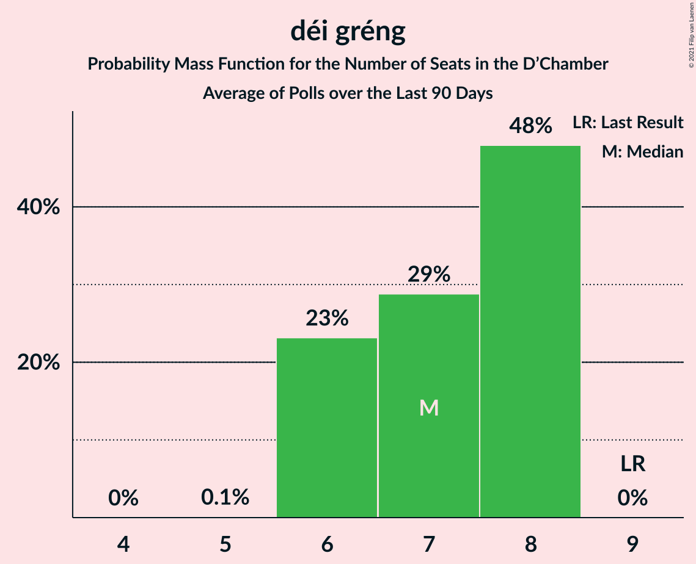

# déi gréng

<a href="#voting-intentions">Voting Intentions</a> | <a href="#seats">Seats</a>

## Voting Intentions

Last result: **15.1%** (General Election of 14 October 2018)

### Confidence Intervals

| Period     | Polling firm/Commissioner(s) | Median | 80% Confidence Interval | 90% Confidence Interval | 95% Confidence Interval | 99% Confidence Interval |
|:----------:|:----------------:|:-----------:|:-----------------------:|:-----------------------:|:-----------------------:|:-----------------------:|
| N/A | [Poll Average](average.html) | 16.0% | 14.9–17.0% | 14.6–17.4% | 14.3–17.7% | 13.8–18.2% |
| [14–23 November 2019](2019-11-23-Kantar.html) | Kantar   Luxemburger Wort and RTL | 15.9% | 14.9–17.1% | 14.6–17.4% | 14.3–17.7% | 13.8–18.2% |

### Probability Mass Function

The following table shows the probability mass function per percentage block of voting intentions for the [poll average](average.html) for déi gréng.

| Voting Intentions | Probability | Accumulated | Special Marks |
|:-----------------:|:-----------:|:-----------:|:-------------:|
| 11.5–12.5% | 0% | 100% |  |
| 12.5–13.5% | 0.2% | 100% |  |
| 13.5–14.5% | 4% | 99.8% |  |
| 14.5–15.5% | 27% | 95% | Last Result |
| 15.5–16.5% | 44% | 68% | Median |
| 16.5–17.5% | 21% | 24% |  |
| 17.5–18.5% | 3% | 3% |  |
| 18.5–19.5% | 0.2% | 0.2% |  |
| 19.5–20.5% | 0% | 0% |  |

## Seats

Last result: **9** seats (General Election of 14 October 2018)

### Confidence Intervals

| Period     | Polling firm/Commissioner(s) | Median | 80% Confidence Interval | 90% Confidence Interval | 95% Confidence Interval | 99% Confidence Interval |
|:----------:|:----------------:|:------:|:-----------------------:|:-----------------------:|:-----------------------:|:-----------------------:|
| N/A | [Poll Average](average.html) | 10 | 8–10 | 8–10 | 8–10 | 8–11 |
| [14–23 November 2019](2019-11-23-Kantar.html) | Kantar   Luxemburger Wort and RTL | 10 | 8–10 | 8–10 | 8–10 | 8–11 |

### Probability Mass Function

The following table shows the probability mass function per seat for the [poll average](average.html) for déi gréng.

| Number of Seats | Probability | Accumulated | Special Marks |
|:---------------:|:-----------:|:-----------:|:-------------:|
| 8 | 12% | 100% |  |
| 9 | 22% | 88% | Last Result |
| 10 | 65% | 66% | Median |
| 11 | 0.5% | 0.7% |  |
| 12 | 0.1% | 0.1% |  |
| 13 | 0% | 0% |  |

