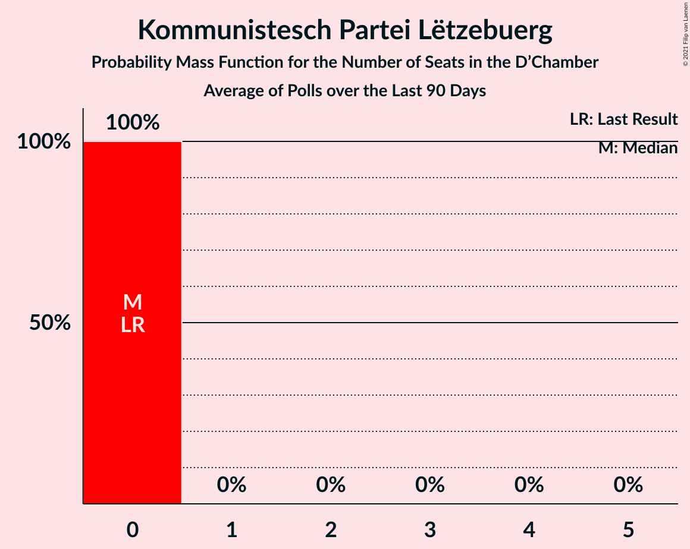

# Kommunistesch Partei Lëtzebuerg

<a href="#voting-intentions">Voting Intentions</a> | <a href="#seats">Seats</a>

## Voting Intentions

Last result: **1.3%** (General Election of 14 October 2018)

### Confidence Intervals

| Period     | Polling firm/Commissioner(s) | Median | 80% Confidence Interval | 90% Confidence Interval | 95% Confidence Interval | 99% Confidence Interval |
|:----------:|:----------------:|:-----------:|:-----------------------:|:-----------------------:|:-----------------------:|:-----------------------:|
| N/A | [Poll Average](average.html) | 0.9% | 0.7–1.3% | 0.6–1.3% | 0.6–1.4% | 0.5–1.6% |
| [10–24 November 2020](2020-11-24-TNSIlresandKantarPublic.html) | TNS Ilres and Kantar Public   Luxemburger Wort and RTL | 0.9% | 0.7–1.3% | 0.6–1.4% | 0.6–1.4% | 0.5–1.6% |
| [8–24 June 2020](2020-06-24-Kantar.html) | Kantar   Luxemburger Wort and RTL | 0.0% | N/A | N/A | N/A | N/A |
| [14–23 November 2019](2019-11-23-Kantar.html) | Kantar   Luxemburger Wort and RTL | 0.0% | N/A | N/A | N/A | N/A |

### Probability Mass Function

The following table shows the probability mass function per percentage block of voting intentions for the [poll average](average.html) for Kommunistesch Partei Lëtzebuerg.

| Voting Intentions | Probability | Accumulated | Special Marks |
|:-----------------:|:-----------:|:-----------:|:-------------:|
| 0.0–0.5% | 2% | 100% |  |
| 0.5–1.5% | 97% | 98% | Last Result, Median |
| 1.5–2.5% | 1.0% | 1.0% |  |
| 2.5–3.5% | 0% | 0% |  |

## Seats

Last result: **0** seats (General Election of 14 October 2018)

### Confidence Intervals

| Period     | Polling firm/Commissioner(s) | Median | 80% Confidence Interval | 90% Confidence Interval | 95% Confidence Interval | 99% Confidence Interval |
|:----------:|:----------------:|:------:|:-----------------------:|:-----------------------:|:-----------------------:|:-----------------------:|
| N/A | [Poll Average](average.html) | 0 | 0 | 0 | 0 | 0 |
| [10–24 November 2020](2020-11-24-TNSIlresandKantarPublic.html) | TNS Ilres and Kantar Public   Luxemburger Wort and RTL | 0 | 0 | 0 | 0 | 0 |
| [8–24 June 2020](2020-06-24-Kantar.html) | Kantar   Luxemburger Wort and RTL |  |  |  |  |  |
| [14–23 November 2019](2019-11-23-Kantar.html) | Kantar   Luxemburger Wort and RTL |  |  |  |  |  |

### Probability Mass Function

The following table shows the probability mass function per seat for the [poll average](average.html) for Kommunistesch Partei Lëtzebuerg.

| Number of Seats | Probability | Accumulated | Special Marks |
|:---------------:|:-----------:|:-----------:|:-------------:|
| 0 | 100% | 100% | Last Result, Median |

