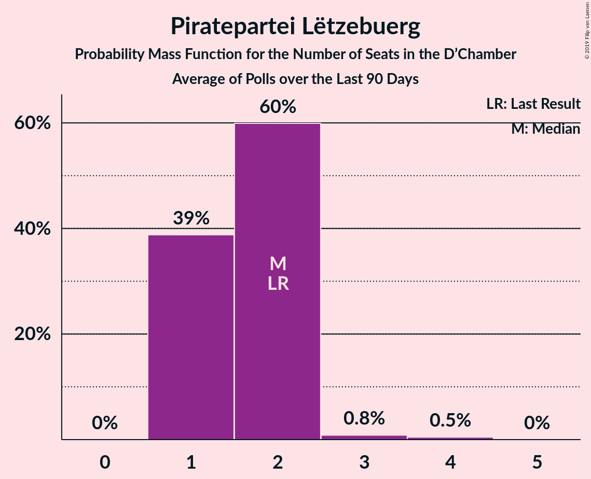

# Piratepartei Lëtzebuerg

<a href="#voting-intentions">Voting Intentions</a> | <a href="#seats">Seats</a>

## Voting Intentions

Last result: **2.9%** (General Election of 20 October 2013)

### Confidence Intervals

| Period     | Polling firm/Commissioner(s) | Median | 80% Confidence Interval | 90% Confidence Interval | 95% Confidence Interval | 99% Confidence Interval |
|:----------:|:----------------:|:-----------:|:-----------------------:|:-----------------------:|:-----------------------:|:-----------------------:|
| N/A | [Poll Average](average.html) | 1.6% | 1.1–2.2% | 0.9–2.5% | 0.8–2.7% | 0.7–3.1% |
| [26 September–1 October 2018](2018-10-01-TNS.html) | TNS   Luxemburger Wort and RTL | 1.5% | 1.1–2.3% | 0.9–2.5% | 0.8–2.7% | 0.7–3.1% |
| [1 December 2017–31 May 2018](2018-05-31-TNS.html) | TNS   Luxemburger Wort and RTL | 0.0% | N/A | N/A | N/A | N/A |
| [1 December 2017](2017-12-01-TNS.html) | TNS   Luxemburger Wort and RTL | 3.0% | 2.5–3.6% | 2.4–3.7% | 2.3–3.9% | 2.1–4.2% |
| [9–19 October 2017](2017-10-19-Ifop.html) | Ifop   Tageblatt | 3.0% | 2.4–3.9% | 2.2–4.2% | 2.1–4.4% | 1.8–4.9% |

### Probability Mass Function

The following table shows the probability mass function per percentage block of voting intentions for the [poll average](average.html) for Piratepartei Lëtzebuerg.

| Voting Intentions | Probability | Accumulated | Special Marks |
|:-----------------:|:-----------:|:-----------:|:-------------:|
| 0.0–0.5% | 0.1% | 100% |  |
| 0.5–1.5% | 47% | 99.9% |  |
| 1.5–2.5% | 49% | 52% | Median |
| 2.5–3.5% | 4% | 4% | Last Result |
| 3.5–4.5% | 0.1% | 0.1% |  |
| 4.5–5.5% | 0% | 0% |  |

## Seats

Last result: **0** seats (General Election of 20 October 2013)

### Confidence Intervals

| Period     | Polling firm/Commissioner(s) | Median | 80% Confidence Interval | 90% Confidence Interval | 95% Confidence Interval | 99% Confidence Interval |
|:----------:|:----------------:|:------:|:-----------------------:|:-----------------------:|:-----------------------:|:-----------------------:|
| N/A | [Poll Average](average.html) | 0 | 0 | 0 | 0 | 0 |
| [26 September–1 October 2018](2018-10-01-TNS.html) | TNS   Luxemburger Wort and RTL | 0 | 0 | 0 | 0 | 0 |
| [1 December 2017–31 May 2018](2018-05-31-TNS.html) | TNS   Luxemburger Wort and RTL |  |  |  |  |  |
| [1 December 2017](2017-12-01-TNS.html) | TNS   Luxemburger Wort and RTL | 0 | 0 | 0 | 0–1 | 0–2 |
| [9–19 October 2017](2017-10-19-Ifop.html) | Ifop   Tageblatt | 0 | 0–1 | 0–1 | 0–2 | 0–2 |

### Probability Mass Function

The following table shows the probability mass function per seat for the [poll average](average.html) for Piratepartei Lëtzebuerg.

| Number of Seats | Probability | Accumulated | Special Marks |
|:---------------:|:-----------:|:-----------:|:-------------:|
| 0 | 99.9% | 100% | Last Result, Median |
| 1 | 0.1% | 0.1% |  |
| 2 | 0% | 0% |  |

